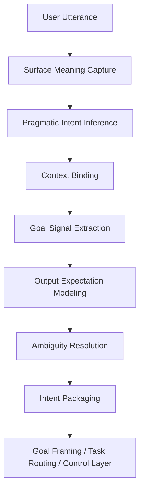
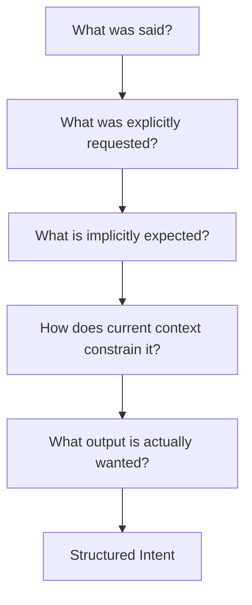

# Intent Interpretation

Intent Interpretation は、ユーザー入力の表層的な文言の背後にある **実際の依頼意図・達成したい目的・期待される応答形** を読み取る構造である。  
ここで重要なのは、言葉を字面どおりに受け取ることではなく、**この発話によって何をしてほしいのか、どの形式で、どの粒度で、どこまで進めることを期待しているのか** を実行可能な形に変換することである。

この構造は system 層の入口に位置し、後続の [[Goal Framing]]、[[Task Routing]]、[[02_zettelkasten/00_system/Mode Selection]] に処理可能な意図表現を渡す。

---

# 要点

- 入力文の意味は、語句だけでなく文脈・省略・前提・会話履歴で決まる
- 同じ表現でも、実際の要求は複数ありうる
- 意図解釈は、タスク分類よりも前に行うべきである
- 出力の長さ、形式、完成度への期待も意図の一部である
- 継続依頼、修正依頼、比較依頼、成果物依頼を取り違えないことが重要である
- この段階がずれると、その後の routing・mode・output がすべてずれる

---

# この構造が必要な理由

自然言語の依頼は、しばしば不完全である。

たとえば次のような入力は、そのままでは曖昧である。

- 作ってください
- 続けてください
- 見てください
- どう思いますか
- これでいいですか
- 貼れる形でください
- 前の形式でお願いします

これらは短いが、実際には次のような含意を持ちうる。

- 直前のフォーマットを維持する
- 既出部分を繰り返さない
- 完成物を出す
- 説明より本文を優先する
- 評価や改善案も含める
- 余計な前置きを省く

LLM が実務的に有用になるためには、入力をただ読むだけでなく、  
**会話行為として何を依頼されているか** を把握する必要がある。  
それを担うのが Intent Interpretation である。

---

# 役割

Intent Interpretation の役割は、次の5つにまとめられる。

## 1. 発話の字面を読む
何が明示的に書かれているかを把握する。

## 2. 暗黙要求を読む
書かれていないが高確率で含意されている要求を補う。

## 3. 会話文脈につなぐ
単独では曖昧な入力を、現在の作業状態に接続する。

## 4. 出力期待を読む
何を、どの形式で、どこまで完成させるべきかを推定する。

## 5. 構造化意図へ変換する
後続層が扱えるように、意図を整理して受け渡す。

---

# 中核機能

## 1. Surface Meaning Capture
まず、入力文の表面意味を把握する。

対象:
- 依頼動詞
- 対象物
- 条件句
- 否定
- 形式指定
- 範囲指定
- 継続指示
- 修正指示

例:
- 「コードブロックで出してください」
- 「貼り付ける部分だけ」
- 「続けてください」
- 「今の粒度で」

この段階は出発点だが、これだけでは不十分である。

---

## 2. Pragmatic Intent Inference
表面には書かれていないが、会話上ほぼ当然に期待されている要求を推定する。

例:
- 「見てください」
  - 読むだけではなく、要点把握・評価・反応を期待している可能性が高い

- 「作ってください」
  - 解説ではなく、使える完成物を期待している可能性が高い

- 「どう思いますか」
  - 単なる感想ではなく、論理評価や妥当性判定を求めていることがある

- 「続けてください」
  - 直前の形式・粒度・トーン・範囲を踏襲することを含意する場合が多い

この機能は、**会話の行為目的** を読む機能である。

---

## 3. Context Binding
現在の発話を、会話の流れ・既出成果物・進行中タスクに接続する。

参照対象:
- 直前に生成したノート
- 直前に確定したフォーマット
- 「まだ未作成のもの」の一覧
- 今どのHubやLayerを作っているか
- ユーザーがすでに否定した方向性
- 会話内で定着したルール

これにより、単独では曖昧な発話も具体化できる。

例:
- 「続けてください」
  - 新規作成ではなく、今の系列の続き
- 「それも追加してください」
  - 直前の一覧に対する追加
- 「こういうのではないです」
  - 方向修正の指示

---

## 4. Goal Signal Extraction
発話の背後にある最終目的を抽出する。

例:
- 「一覧にしてください」
  - 俯瞰可能性の向上

- 「コードブロックにしてください」
  - そのまま貼れる状態にする

- 「内容を濃くしてください」
  - 密度と具体性を上げる

- 「一つずつ作ってください」
  - 分割提示と逐次確定を優先する

つまり Intent Interpretation は、  
**表面上の要求を、処理目的の信号へ変換する**。

---

## 5. Output Expectation Modeling
ユーザーがどのような出力を期待しているかを推定する。

対象:
- 長さ
- 粒度
- 形式
- 完成度
- 丁寧さ
- 実用性
- コピペ可能性
- 説明量と本体量の比率

たとえば「貼り付ける部分だけ」とあれば、
- 前置き最小
- 本体優先
- 余計な説明を削る

という期待を意味する。

---

## 6. Ambiguity Resolution
複数の解釈がありうる場合、最も整合的なものを選ぶ。

判断基準:
- 会話文脈との整合
- 直前の出力形式との一致
- ユーザーの進行中タスクとの一致
- 既出指示との整合
- 最小驚愕性
- 成果物としての有用性

必要なら曖昧さを一部保持しつつ、最も自然な解釈で進む。

---

## 7. Intent Packaging
後続層に渡せるように、解釈結果を構造化する。

典型項目:
- 主要求
- 副要求
- 明示条件
- 暗黙期待
- 出力形式
- 継続条件
- 修正点
- 望ましい完成度
- 会話文脈上の依存関係

---

# 主要な意図類型

## A. Explicit Request
明示的に書かれた要求。

例:
- 「Tool Orchestration を作ってください」
- 「コードブロックで出してください」

---

## B. Implicit Request
書かれていないが、会話上強く含意される要求。

例:
- 直前形式の踏襲
- 既出内容の再出力回避
- 貼り付け可能性の確保

---

## C. Continuation Intent
進行中作業の続きとしての意図。

例:
- 続けてください
- 順に作ってください
- 次を作ってください

---

## D. Correction Intent
誤り修正・方向修正の意図。

例:
- こうではないです
- 閉じ忘れがあります
- 以前のものはもういいです

---

## E. Evaluation Intent
感想よりも判定・検証・評価を求める意図。

例:
- これでいいですか
- 妥当ですか
- どう思いますか

---

## F. Artifact Intent
説明ではなく、完成物を求める意図。

例:
- ノートを作ってください
- 完成版をください
- 貼り付ける部分だけ

---

# 下位構造

## A. Surface Parser
文面上の依頼内容を抽出する部分。

## B. Pragmatic Interpreter
発話行為の実際の目的を推定する部分。

## C. Context Linker
発話を会話履歴・作業状態へ接続する部分。

## D. Expectation Estimator
出力粒度・形式・完成度への期待を読む部分。

## E. Ambiguity Resolver
複数解釈の中から最も妥当なものを選ぶ部分。

## F. Intent Packager
後続層へ渡せる構造化意図に変換する部分。

---

# 全体構造

---

# 意図解釈の処理フロー

---

# 入出力イメージ

|入力文|解釈される意図|
|---|---|
|続けてください|直前の系列を同じ形式で継続|
|作ってください|説明ではなく完成物を生成|
|見てください|読解 + 必要に応じて評価や整理|
|これでいいですか|妥当性判定 + 改善点提示|
|貼り付ける部分だけ|余計な説明を省き、本体のみ提示|
|順に作ってください|一括ではなく逐次生成|
|以前のものはもういいです|再出力を避け、未作成分のみ対象にする|

---

# 他構造との関係

## [[Goal Framing]] との関係

Intent Interpretation は「何を求めているか」を読む。  
Goal Framing は「それをどのような達成目標として定義するか」を決める。

---

## [[Task Routing]] との関係

Intent Interpretation は意図を構造化する。  
Task Routing はそれをどの処理ラインへ送るか決める。

---

## [[02_zettelkasten/00_system/Mode Selection]] との関係

Intent Interpretation は要求の性質を読む。  
Mode Selection はそれに適した運転形態を選ぶ。

---

## [[Constraint Monitor]] との関係

Intent Interpretation は依頼内容を読む。  
Constraint Monitor はそれが許容範囲内か監視する。

---

## [[LLM Output Layer]] との関係

Intent Interpretation は期待される出力像を先読みする。  
Output Layer は実際の最終形式へ整える。

---

# よくある失敗

## 1. 字面どおりにしか読まない

暗黙要求を拾えず、期待外れになる。

## 2. 文脈を切って読む

「続けてください」を新規依頼として扱ってしまう。

## 3. 出力期待を見落とす

内容は合っていても、形式や密度がずれる。

## 4. 補助要求を主要求と取り違える

説明補足ばかり出して、本体が弱くなる。

## 5. 修正意図を見逃す

同じ失敗形式を繰り返す。

## 6. 暗黙要求を盛りすぎる

ユーザーが求めていない方向へ広げすぎる。

---

# 設計原則

- 字面と含意を分けて読む    
- 文脈を必ず接続する    
- 依頼を目的レベルへ引き上げる    
- 出力期待も意図の一部として扱う    
- 継続・修正・完成物依頼を特に重視する    
- 曖昧さは最も整合的な形で処理する    
- 後続層が扱える構造化意図へ変換する    

---

# 位置づけ

Intent Interpretation は、  
**自然言語入力を、実行可能な依頼意図へ翻訳する system 層の入口構造** である。

これが弱いと、

- 言われたことをやっているのに満足されない    
- 形式や粒度がずれる    
- 継続作業で文脈が切れる    
- 修正要求に追従できない    
- routing や mode も誤る    

したがってこの構造は、単なる意味解析ではなく、  
**会話を運転可能な処理要求へ変換する最初の統制機構**として扱うべきである。

---

# 関連ノート

- [[LLM System Hub]]    
- [[LLM Control Layer]]    
- [[Goal Framing]]    
- [[Task Routing]]    
- [[02_zettelkasten/00_system/Mode Selection]]    
- [[Constraint Monitor]]    
- [[LLM Output Layer]] [[02_zettelkasten/00_system/Task Routing]]    
- [[02_zettelkasten/00_system/Mode Selection]]    
- [[Constraint Monitor]]    
- [[LLM Output Layer]]]]