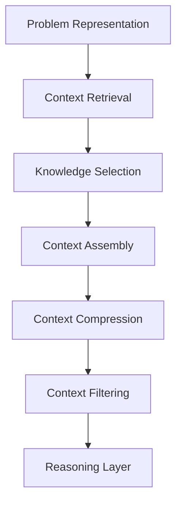
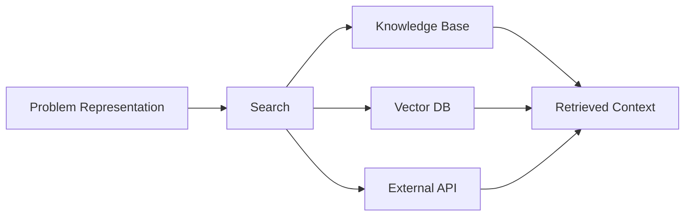
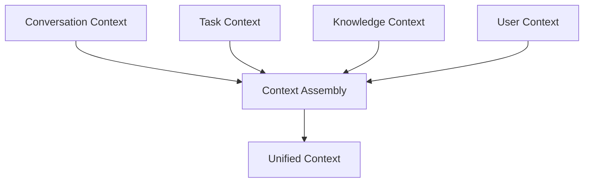
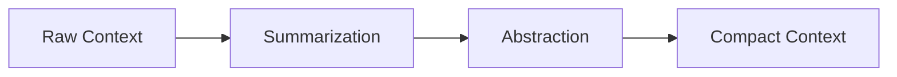

# LLM Context Layer

LLM Context Layer は、推論に必要な **情報環境（Context）を構築する層**である。

LLMは入力されたテキストしか見えないため、  
適切な推論を行うには **必要な情報をまとめて提示する必要がある**。

この層では次の処理を行う。

- 関連情報の検索
- 知識の参照
- 文脈の整理
- 情報の圧縮
- ノイズ除去

Input Layer が **問題を作る層**なら、  
Context Layer は **思考環境を作る層**である。

---

# 1 全体構造

---

# 2 Context の種類

Context は一種類ではない。

主に次の5種類がある。

|種類|内容|
|---|---|
|Conversation Context|会話履歴|
|Task Context|現在のタスク|
|Knowledge Context|知識|
|User Context|ユーザー固有情報|
|System Context|システム制約|

---

# 3 Context Retrieval

Context Retrieval は  
**推論に必要な情報を取得する処理**である。

---

## 情報源

- 会話履歴    
- vaultノート    
- 知識ベース    
- 外部検索    
- API    
- DB    

---

## 構造

---

---

# 4 Knowledge Selection

取得された情報のすべてが必要とは限らない。

Knowledge Selection は  
**関連性の高い情報だけを選択する処理**である。

---

## 選択基準

- relevance    
- novelty    
- importance    
- reliability    
- recency    

---

## 例

質問
- 人格OSを作る

取得情報
- 心理モデル  
- 意思決定モデル  
- 学習モデル  
- 人格理論

---

# 5 Context Assembly

Context Assembly は  
**選択された情報を1つの推論環境へ統合する処理**である。

---

## 構造

---

# 6 Context Compression

LLMには **コンテキスト長の制限**がある。

そのため Context Compression が必要になる。

---

## 圧縮方法

- 要約    
- 抽象化    
- 情報選択    
- 冗長削除    
- 構造化    

---

## 構造

---

# 7 Context Filtering

Context Filtering は  
**推論の邪魔になる情報を除去する処理**である。

---

## 除去対象

- irrelevant information    
- outdated knowledge    
- conflicting data    
- noise    

---

# 8 Context の最終形

Reasoning Layer に渡される Context は次の構造になる。

context:  
  
problem  
knowledge  
constraints  
definitions  
examples  
relevant_cases

---

# 9 Context Layer が弱いと起こる問題

---

## 問題1

知識不足

LLM hallucination

---

## 問題2

ノイズ過多

推論が拡散

---

## 問題3

情報不足

推論停止

---

# 10 Reasoning Layer への入力

Context Layer の最終出力

reasoning_input:  
  
problem_definition  
relevant_knowledge  
constraints  
context_information

これが **Reasoning Layer の入力**になる。

---

# 11 関連ノート

上位

- [[LLM Reasoning Architecture]]    

前

- [[LLM Input Layer]]    

次

- [[LLM Reasoning Layer]]    

関連

- [[RAG Architecture]]    
- [[Context Engineering]]    
- [[Knowledge Retrieval]]