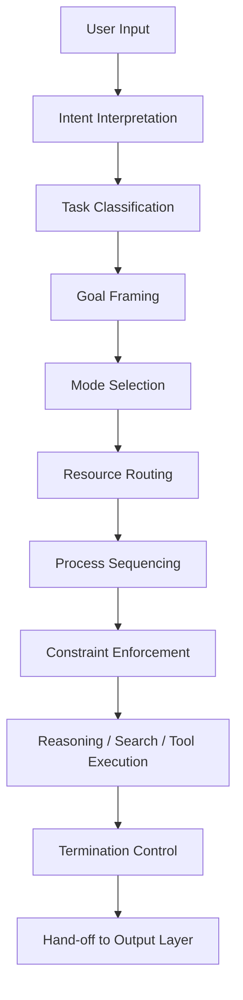
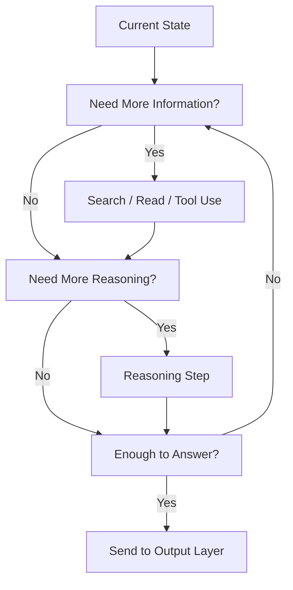

# LLM Control Layer

LLM Control Layer は、LLM システム全体の処理進行を統制する層である。  
この層は、入力を受けたあとに、

- 何を目標とするか
- どの処理モードを使うか
- どの順序で進めるか
- どのツールや知識源を呼ぶか
- どこで止めるか
- 何を出力段階へ渡すか

を決定する。

言い換えると、Control Layer は **「考える前に進行を設計し、考えている途中も流れを監督する層」** である。

---

# 要点

- 入力を見て、タスクの種類を判定する
- 必要なモジュールだけを起動する
- 深さ・順序・ツール使用・反復回数を制御する
- 制約時間・安全性・形式要求を監視する
- 推論を無限に伸ばさず、十分条件で打ち切る
- 最終的に Output Layer へ渡す内容を確定する

---

# この層が必要な理由

LLM は、入力さえあれば自動で何かしらの文章を生成できる。  
しかし、実務的に有用なシステムにするには、単純な逐語生成では足りない。

なぜなら実際のタスクは以下のように多様だからである。

- 一問一答
- 比較検討
- 調査
- 要約
- 設計
- コード生成
- ツール利用
- ファイル作成
- 拒否と代替提案
- 段階的な問題解決

これらを同じ流れで処理すると、
- 必要ない深掘りをする
- 必要な検索をしない
- ツールを呼ぶべき場面で呼ばない
- 出力形式を誤る
- 安全制約を見落とす
- 長すぎるか浅すぎる応答になる

そこで、処理全体の交通整理を行う制御層が必要になる。  
それが LLM Control Layer である。

---

# 中核機能

## 1. Task Classification
入力がどの種類の仕事かを判定する。

代表分類:
- 質問応答
- 分析
- 比較
- 要約
- 設計
- 生成
- 実行支援
- 検索
- 編集
- スケジューリング
- 拒否判定付き案件

この分類により、後続の推論・検索・出力モードが決まる。

---

## 2. Goal Framing
ユーザーの表層的な言葉を、その奥にある処理目標へ変換する。

例:
- 「これどう思う？」  
  → 評価・論点整理・不確実性提示

- 「作ってください」  
  → 成果物生成・テンプレート化・貼り付け可能整形

- 「調べてください」  
  → 情報検索・根拠取得・比較整理

つまり Control Layer は、発話を**実行可能な目的記述**へ変換する。

---

## 3. Mode Selection
どの認知モードで処理するかを決める。

代表モード:
- Direct Answer Mode
- Search-Augmented Mode
- File-Grounded Mode
- Stepwise Reasoning Mode
- Comparative Analysis Mode
- Drafting Mode
- Tool Execution Mode
- Safety Refusal Mode

同じ質問でも、モードが違えば処理は大きく変わる。

---

## 4. Resource Routing
必要な知識源・ツール・記憶へ処理を振り分ける。

対象:
- 内部知識
- Web 検索
- ファイル検索
- カレンダー
- メール
- 連絡先
- Python
- ドキュメント生成
- 画像生成

この機能により、LLM は単体生成器ではなく、**多資源統合オーケストレータ**として働ける。

---

## 5. Process Sequencing
処理の順序を決める。

例:
1. 意図理解
2. タスク分類
3. 制約確認
4. 追加情報取得
5. 推論
6. 出力整形

あるいは

1. ファイルを読む
2. 必要箇所を抽出
3. 比較する
4. まとめる

Control Layer は、処理の順番を誤らないようにする。

---

## 6. Budget Management
時間・トークン・注意資源・応答長などの上限を管理する。

管理対象:
- どこまで深掘りするか
- 何件まで検索するか
- 何段階まで比較するか
- どこで打ち切るか
- 長文にするか簡潔にするか

これは、実用上きわめて重要である。  
良いシステムは「どこまでやるか」も設計している。

---

## 7. Termination Control
十分な根拠や成果が得られた時点で、処理を止める。

停止条件の例:
- ユーザー要求を満たした
- 必要情報がそろった
- 追加探索の利得が小さい
- 安全上これ以上進めない
- 指定形式の成果物が完成した

Control Layer が弱いと、推論が冗長化しやすい。

---

## 8. Constraint Enforcement
各種制約を、実行全体に対して強制する。

対象:
- 安全制約
- 形式制約
- ツール使用規則
- 最新性確認要件
- 引用要件
- ユーザー指示
- ファイル形式指定
- 言語指定

これは「あとで直す」のではなく、最初から進行全体に効かせる必要がある。

---

# 下位構造

## A. Intent Interpreter
発話の意味と要求を読み取る部分。

役割:
- 明示要求の抽出
- 暗黙要求の推定
- 成果物要求の検出
- 形式指定の検出

---

## B. Task Router
タスクタイプに応じて、適切な処理ラインへ振り分ける部分。

役割:
- QA か生成かの分岐
- 検索が必要かの判定
- ツールが必要かの判定
- 単発応答か多段処理かの判定

---

## C. Tool Orchestrator
使用可能ツール群の起動順・利用条件を管理する部分。

役割:
- 適切なツール選択
- 入出力接続
- 結果再利用
- 不要なツール呼び出しの回避

---

## D. Reasoning Scheduler
どの程度の推論を、どの順序で走らせるかを決める部分。

役割:
- 仮説先行か検索先行か
- 比較から入るか直答から入るか
- 分割統治するか一括処理するか

---

## E. Constraint Monitor
安全・形式・最新性などの制約を監視する部分。

役割:
- web 必須条件の確認
- 引用必要条件の確認
- 禁止事項の検知
- 出力フォーマット違反の防止

---

## F. Stop Controller
いつ処理を終了し、出力段階へ渡すかを決める部分。

役割:
- 十分条件判定
- 探索打ち切り
- 残課題の明示
- 未達部分の説明

---

# 全体構造

---

# 制御ループ

---

# Control Layer の代表判断

|状況|Control Layer の判断|
|---|---|
|最新情報が必要|web 検索を先行させる|
|添付ファイルが主対象|file 読解を先行させる|
|単純質問|直答モードにする|
|複雑比較|比較モード + 構造化出力にする|
|形式が指定されている|format-first で処理する|
|安全リスクあり|拒否または安全代替へ切り替える|
|時間や長さ制約が厳しい|深掘りを制限し要点優先にする|
|成果物要求|出力テンプレート生成を優先する|

---

# 典型サブモード

## Direct Answer Mode

検索不要で、内部知識と軽い推論だけで返す。

## Search-Augmented Mode

外部情報取得を前提に動く。

## File-Grounded Mode

アップロードファイルや接続ソースを根拠にする。

## Artifact Generation Mode

文書・表・コード・スライド・設計書などの完成物を作る。

## Tool Execution Mode

メール送信、予定作成、分析実行など、ツール操作が中心。

## Safety Refusal Mode

禁止領域に入るため、拒否 + 代替案提示へ切り替える。

---

# 他層との関係

## Input Layer との関係

Input Layer が入力を受け取り正規化し、  
Control Layer がそれを **処理計画** に変える。

---

## Reasoning Layer との関係

Reasoning Layer は中身を考える。  
Control Layer は、**いつ・どれだけ・どの順序で考えさせるか**を決める。

したがって、

- Reasoning は内容生成    
- Control は進行統制    

である。

---

## Output Layer との関係

Control Layer は処理が終わった時点で、

- 何を渡すか    
- どの形式要求を守るべきか    
- どの程度確定しているか    

を Output Layer に引き継ぐ。

Output Layer はその結果を、最終表現へ変換する。

---

# よくある失敗

## 1. 直答してはいけないのに直答する

本当は検索が必要なのに、記憶だけで答える。

## 2. 検索しすぎる

安定知識なのに探索コストを無駄に払う。

## 3. ツール選択を誤る

ファイル検索すべき場面で web を使うなど。

## 4. 制約を後付けで処理する

最後に整形すればよいと思い、途中でルール違反が起こる。

## 5. 打ち切れない

十分な答えがあるのに、処理を延々続けて冗長化する。

## 6. ユーザーの真要求を誤る

説明が欲しいのに成果物を出す、またはその逆。

---

# 設計原則

- まずタスク種別を見極める    
- 最新性・安全性・形式制約を先に確認する    
- 不要な処理は起動しない    
- 必要な外部資源は早めに取りに行く    
- 深さより適合を優先する    
- 十分条件で止める    
- 出力層へ渡す前に状態を整理する    

---

# 位置づけ

LLM Control Layer は、  
**LLM 全体の実行計画・進行管理・資源配分を担う統制中枢**である。

この層が弱いと、

- 検索の要否を誤り    
- 推論の深さを誤り    
- ツール利用を誤り    
- 出力形式も崩れやすくなる    

したがって Control Layer は、単なる補助機能ではなく、  
**LLM を実用システムにするための運転席**として理解すべきである。

---

# 関連ノート

- [[LLM Output Layer]]    
- [[Input Layer]]    
- [[Reasoning Layer]]    
- [[Decision Layer]]    
- [[Tool Orchestration]]    
- [[Constraint Monitor]]    
- [[Task Routing]]    
- [[Termination Control]]