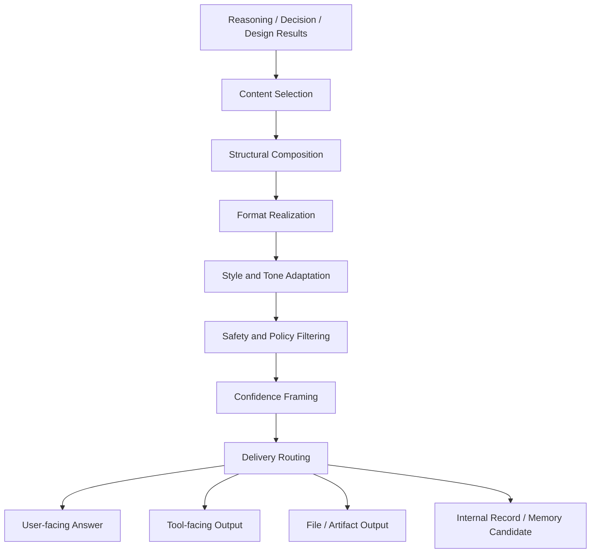
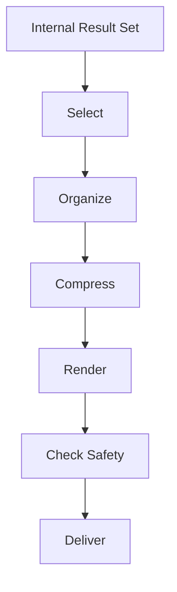

# LLM Output Layer

LLM Output Layer は、内部で生成された推論・判断・設計結果を、外部に提示可能な形へ変換する層である。  
この層は「考えたことをそのまま出す」のではなく、**目的に応じて整形・圧縮・翻訳・安全化し、ユーザーや下位システムに受け渡す**役割を担う。

---

# 要点

- 推論結果をそのまま露出させず、**出力可能な表現**へ変換する
- 内容を、**正確性・可読性・安全性・形式適合性**の観点で整える
- 出力先に応じて、文章・表・箇条書き・JSON・コード・命令列などへ再構成する
- ユーザー向け出力と、ツール向け出力と、内部記録向け出力を分ける
- 「何を答えるか」だけでなく、**どの粒度・どの順序・どのトーンで出すか**を決める

---

# この層が必要な理由

LLM の内部では、観察・検索・仮説・比較・評価・選択などが複合的に進む。  
しかし、その内部状態はそのままでは冗長で不安定であり、また相手の要求形式にも合わない。

たとえば内部では以下が混在する。

- 未確定の仮説
- 途中計算
- 分岐した比較案
- 参照した根拠
- 安全上そのままは出せない記述
- ユーザーが求めていない補助推論

そのため、最終提示の直前に、

1. 残すべき内容を選び、
2. 順序を整え、
3. 表現形式へ落とし込み、
4. 不要・危険・冗長なものを除く

という変換層が必要になる。  
それが LLM Output Layer である。

---

# 中核機能

## 1. Content Selection
内部で得られた候補のうち、何を最終出力に載せるかを決める。

対象:
- 結論
- 根拠
- 但し書き
- 不確実性
- 次の行動
- 補足情報

判断基準:
- ユーザー要求との適合
- タスク達成への寄与
- 認知負荷
- 安全性
- 冗長性

---

## 2. Structural Composition
選ばれた内容を、伝わる順序に並べる。

典型順序:
1. 結論
2. 根拠
3. 補足
4. 注意点
5. 次アクション

ただし、用途によって順序は変わる。

- 説明タスク: 定義 → 分解 → 具体例 → 注意点
- 提案タスク: 結論 → 比較 → 推奨案 → 実行手順
- デバッグ: 症状 → 原因候補 → 切り分け → 修正案
- 生成物: 完成物 → 使い方 → 変更点

---

## 3. Format Realization
構造化済み内容を、具体的な出力形式へ変換する。

代表形式:
- 通常文章
- Markdown
- 箇条書き
- 表
- JSON
- YAML
- コード
- Mermaid
- tool call payload
- schema-constrained output

この変換では、**意味の正確さ**と**形式妥当性**の両方が必要となる。

---

## 4. Style and Tone Adaptation
同じ内容でも、受け手や用途に応じて言い方を変える。

調整対象:
- 丁寧さ
- 専門性
- 簡潔さ
- 断定度
- 抽象度
- 説明密度

例:
- 初学者向け: 用語説明を入れる
- 実務者向け: 先に結論と手順を出す
- API向け: 人間向け説明を削り schema 優先にする

---

## 5. Safety and Policy Filtering
出力内容が安全・規約・公開範囲の条件を満たすよう調整する。

対象:
- 危険情報の制限
- 個人情報の除去
- 内部思考の露出抑制
- 根拠不十分な断定の緩和
- 不適切表現の抑制

この機能は、単なる削除ではなく、**安全な代替表現への置換**も含む。

---

## 6. Confidence Framing
不確実な内容を、確実な内容と同じ調子で出さないようにする。

方法:
- 確定的事実
- 高確率推定
- 仮説
- 未検証案
- 要確認項目

を区別し、表現を変える。

例:
- 「〜です」
- 「〜の可能性が高いです」
- 「現時点では仮説です」
- 「確認が必要です」

---

## 7. Delivery Routing
整形した出力を、どこへ送るかを決める。

出力先:
- ユーザー表示
- ツール呼び出し
- ファイル生成
- メモリ保存候補
- 内部ログ
- 他モジュールへの受け渡し

つまり Output Layer は、**書く層**であると同時に**配る層**でもある。

---

# 下位構造

## A. Answer Constructor
最終回答本文を作る部分。

役割:
- 問いへの直接回答
- 根拠の簡潔な統合
- 補足と注意点の配置
- 体裁の最終調整

---

## B. Evidence Presenter
根拠・出典・引用・観測結果を提示可能な形にする部分。

役割:
- 根拠の要約
- 出典対応付け
- どの主張が何に支えられているかの明示
- 過剰引用の抑制

---

## C. Format Emitter
特定フォーマットへ厳密に落とし込む部分。

対象:
- JSON 出力
- CSV 断片
- Markdown テンプレート
- Mermaid
- コードファイル
- 表形式

---

## D. Safety Rewriter
危険・過剰・不適切な表現を、安全な形に再記述する部分。

役割:
- 直接手順の抽象化
- 個人情報の伏せ字化
- 有害意図への拒否文生成
- 安全代替案の追加

---

## E. Response Compressor
冗長な内部結果を、要求に見合う長さへ圧縮する部分。

役割:
- 要約
- 重複削除
- 低優先情報の削減
- 長文から短文への縮約

---

# 全体構造

---

# 出力変換の基本フロー

---

# 入出力の対応

|入力状態|Output Layer の処理|出力形|
|---|---|---|
|推論が複雑で長い|要点抽出と順序再構成|簡潔な説明文|
|比較案が複数ある|比較軸で整列|比較表 / 推奨文|
|不確実性が高い|断定度調整|仮説的回答|
|根拠が多数ある|根拠を束ねる|引用付き要約|
|strict format が必要|schema 準拠整形|JSON / YAML / code|
|危険内容を含む|再記述・制限|安全化された応答|

---

# 他層との関係

## LLM Control Layer との関係

Control Layer は、

- 何をするか    
- どのモードで動くか    
- どのツールを使うか    
- どこで止めるか    

を決める。

Output Layer は、

- 得られた結果をどう出すか    
- どの形式で渡すか    
- どの程度圧縮するか    

を決める。

つまり、

- Control Layer = 実行統制    
- Output Layer = 表出統制    

である。

---

## Reasoning Layer との関係

Reasoning Layer が意味内容を生成し、  
Output Layer がその意味内容を外部向け表現へ変換する。

Reasoning が弱ければ Output は空疎になり、  
Output が弱ければ Reasoning は伝達不能になる。

---

## Memory / Record Layer との関係

最終出力と内部保存内容は一致しないことがある。  
Output Layer は、

- ユーザーへ見せる版    
- 将来参照用に残す版    

を分けうる。

---

# よくある失敗

## 1. 内部推論の垂れ流し

思考途中の内容をそのまま出して冗長になる。

## 2. 結論が遅い

前置きが長く、ユーザーが欲しい答えが後ろに埋もれる。

## 3. 形式不一致

JSON を求められているのに説明文を混ぜるなど、出力仕様を破る。

## 4. 不確実性の隠蔽

推定や仮説を事実のように出す。

## 5. 安全化しすぎ

有用性まで失って、空疎な一般論になる。

## 6. ユーザー粒度との不一致

初学者に専門家向け説明を出す、またはその逆。

---

# 設計原則

- まず答える    
- 必要な根拠だけ添える    
- 形式要件を優先する    
- 不確実性を明示する    
- 危険情報は安全化して代替する    
- 出力先ごとに別物として設計する    
- 内部の豊かさと外部の簡潔さを両立する    

---

# 位置づけ

LLM Output Layer は、  
**推論結果を人間・ツール・記録へ橋渡しする最終変換層**である。

この層が弱いと、

- 良い推論も伝わらず    
- 良い判断も使われず    
- 良い設計も実装へつながらない    

したがってこの層は、単なる「文章整形」ではなく、  
**意味を成果物へ変換する実用化層**として理解すべきである。

---

# 関連ノート

- [[LLM Control Layer]]    
- [[Reasoning Layer]]    
- [[Decision Layer]]    
- [[Solution Design Layer]]    
- [[Evidence Integration]]    
- [[Response Formatting]]    
- [[Safety Filter]]
- [[Confidence Calibration]]