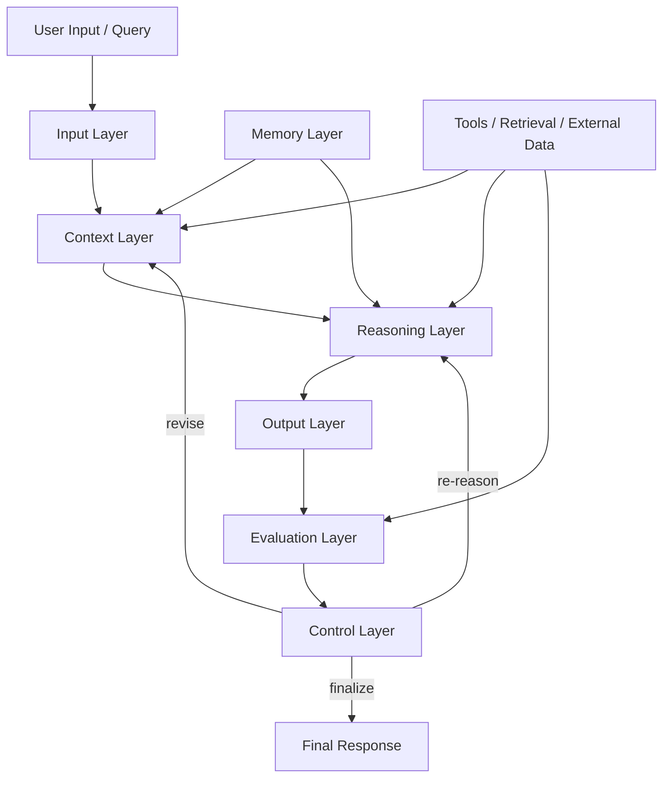
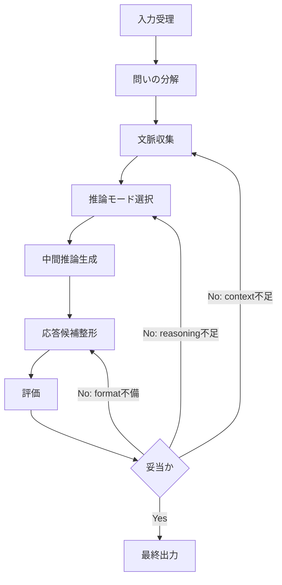
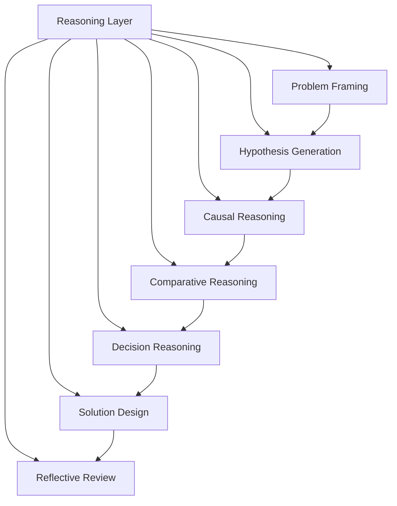

# LLM Reasoning Architecture

LLM Reasoning Architecture は、LLM が入力を受け取り、文脈を参照し、推論し、出力し、評価し、必要に応じて再推論するまでの全体構造を整理するための上位ノートである。

これは単なる「推論手順」ではなく、**入力処理・文脈構成・思考過程・記憶参照・出力整形・制御・評価**を含む統合アーキテクチャである。  
Zettelkasten や業務OSに接続する場合も、この構造を起点に各モジュールを分離して設計すると安定する。

---

# 1. このアーキテクチャの目的

LLM は単体では「次の単語を予測する装置」に近いが、実運用では以下が必要になる。

1. **何を問題として受け取るか**
2. **どの文脈を読むか**
3. **どの推論形式で考えるか**
4. **どの知識を参照するか**
5. **どの粒度で答えるか**
6. **答えが妥当かをどう検査するか**
7. **必要なら再思考するか**

したがって、LLM を単なる生成器ではなく、  
**「入力→文脈化→推論→出力→評価→制御」から成る思考システム**として扱う必要がある。

---

# 2. 全体構造

---

# 3. 構成要素

## 3-1. Input Layer

Input Layer は、ユーザー入力をそのまま受け取るのではなく、  
**問いとして整形可能な単位へ分解する層**である。

### 主な役割

- 指示の抽出    
- 質問の型判定    
- 対象の特定    
- 制約条件の抽出    
- 出力形式の抽出    
- 暗黙要件の補完    

### 典型的な処理

- 「何をしてほしいか」    
- 「対象は何か」    
- 「どこまで深くやるか」    
- 「コードブロックが必要か」    
- 「既存の vault 構造に合わせる必要があるか」    

### 入る下位ノート

- [[LLM Input Layer]]    
- [[Task Parsing]]    
- [[Intent Detection]]    
- [[Constraint Extraction]]    
- [[Output Format Recognition]]
    
---

## 3-2. Context Layer

Context Layer は、問いを理解するために必要な文脈を構成する層である。

LLM は与えられた文字列しか見えないため、  
実用上はこの層で**適切な前提・関連ノート・履歴・定義**を集める必要がある。

### 主な役割

- 会話履歴参照    
- 関連ノート選択    
- 定義の参照    
- 前提条件の確定    
- 文脈の圧縮    
- ノイズ除去    

### 文脈の種類

- 会話文脈    
- タスク文脈    
- ドメイン文脈    
- ユーザー固有文脈    
- システム制約文脈    
- 外部データ文脈    

### 入る下位ノート

- [[LLM Context Layer]]    
- [[Context Assembly]]    
- [[Context Compression]]    
- [[Relevant Context Selection]]    
- [[Prompt State Management]]    

---

## 3-3. Reasoning Layer

Reasoning Layer は、このアーキテクチャの中心である。  
ここでは文脈をもとに、問いに対する中間的思考を形成する。

この層は単一ではなく、複数の推論モードを持つ。

### 主な推論モード

- 演繹推論    
- 帰納推論    
- 仮説推論    
- 因果推論    
- 比較推論    
- 構造推論    
- 診断推論    
- 設計推論    
- 反証推論    
- 分岐推論    

### 役割

- 問題の再定義    
- 論点の分解    
- 仮説生成    
- 選択肢設計    
- 因果連鎖の整理    
- 抽象化と具体化の往復    
- 結論候補の生成    

### 入る下位ノート

- [[LLM Reasoning Layer]]    
- [[Causal Reasoning]]    
- [[Hypothesis Generation]]    
- [[Comparative Reasoning]]    
- [[Decision Reasoning]]    
- [[Solution Design Reasoning]]    
- [[Abductive Reasoning]]    
- [[Reflective Reasoning]
    

---

## 3-4. Memory Layer

Memory Layer は、現在の推論に必要な知識や過去情報を供給する層である。

LLM 単体の内部知識だけに依存すると、  
更新不能・曖昧・再利用困難になるため、外部記憶との接続が重要になる。

### 主な役割

- 長期知識の保持    
- ノート・DB 参照    
- 過去会話の再利用    
- ユーザー固有設定の保持    
- 定義と用語体系の維持    
- 推論資源の再利用

### 記憶の種類

- Semantic Memory    
- Episodic Memory    
- Procedural Memory    
- Working Memory    
- Externalized Memory    

### 入る下位ノート

- [[LLM Memory Layer]]    
- [[Semantic Memory]]    
- [[Working Memory]]    
- [[External Knowledge Interface]]    
- [[User Preference Memory]]    
- [[Reasoning State Memory]]    

---

## 3-5. Output Layer

Output Layer は、推論結果を人間が使える形へ整形する層である。

ここでは「何を答えるか」だけでなく、  
**どう並べるか・どの粒度で見せるか・どの記法で出すか**が重要になる。

### 主な役割

- 結論の明示    
- 論理展開の整形    
- コードブロック化    
- markdown 化    
- 表や箇条書きへの整形    
- ノート形式への変換
- Mermaid 図への変換    

### 出力形式の例

- 通常回答    
- Obsidian ノート    
- Hub ノート    
- Structure ノート    
- Mermaid 図    
- テーブル    
- テンプレート    
- 手順書    

### 入る下位ノート

- [[LLM Output Layer]]    
- [[Response Structuring]]    
- [[Markdown Rendering]]    
- [[Note Generation]]    
- [[Mermaid Generation]]    
- [[Format Adaptation]]    

---

## 3-6. Evaluation Layer

Evaluation Layer は、出力候補が妥当かどうかを検査する層である。  
ここがないと、LLM は「それらしく見える誤答」をそのまま出しやすい。

### 主な役割

- 一貫性検査    
- 制約適合性検査    
- 網羅性検査    
- 論理飛躍の検査    
- 形式不備の検査
- 事実性の検査    
- ユーザー要求との整合確認    

### 典型的な観点

- 質問に答えているか    
- 指示形式を守っているか    
- 前提がずれていないか    
- Mermaid が閉じているか    
- 必要なノート名が揃っているか    
- 構造が重複していないか    

### 入る下位ノート

- [[LLM Evaluation Layer]]    
- [[Consistency Check]]    
- [[Constraint Check]]    
- [[Coverage Check]]    
- [[Format Validation]]    
- [[Reasoning Quality Review]]    

---

## 3-7. Control Layer

Control Layer は、全体の流れを管理する層である。  
いわば **メタ思考・実行制御・再試行判断** を担う。

### 主な役割

- 推論深度の調整    
- モード切替    
- 再推論判断    
- 打ち切り判断    
- ツール利用判断    
- 文脈再収集判断    
- 出力粒度の制御    

### 制御対象

- どの推論モードを使うか    
- どこまで詳細に答えるか    
- 再検索が必要か    
- 既存ノートに合わせるか    
- 新規設計か整理・統合か    
- 回答を一括で出すか分割するか    

### 入る下位ノート

- [[LLM Control Layer]]    
- [[Reasoning Orchestration]]    
- [[Mode Switching]]    
- [[Depth Control]]    
- [[Retry Strategy]]    
- [[Tool Use Policy]]    

---

# 4. 中核フロー

---

# 5. 推論層の内部構造

---

# 6. 実運用での読み方

このノートは「LLM の仕組み説明」で終わるものではない。  
実際には次のように使う。

## 用途1: vault の上位設計

- 00_system に置く    
- 各下位ノートへの入口にする    
- system 全体の基準ノートにする    

## 用途2: 自作AI設計の骨格

- Input/Context/Reasoning/Output を分離する    
- RAG や Memory をどこに差し込むか決める    
- 評価器や再試行器の設計に使う    

## 用途3: プロンプト設計の基準

- いま不足しているのは入力定義か    
- 文脈不足か    
- 推論不足か    
- 出力整形不足か    
- 評価不足か  
を切り分ける
## 用途4: Zettelkasten との接続

- concept としては「推論アーキテクチャ」    
- structure としては「入力→文脈→推論→出力→評価→制御構造」    
- method としては「LLM運用設計法」    
- tool としては「AIアシスタント実装骨格」  
として接続できる

---

# 7. 関連ノート

## 上位

- [[00_system]]    

## 下位

- [[LLM Input Layer]]    
- [[LLM Context Layer]]    
- [[LLM Reasoning Layer]]    
- [[LLM Memory Layer]]    
- [[LLM Output Layer]]    
- [[LLM Control Layer]]    
- [[LLM Evaluation Layer]]    

## 関連

- [[Prompt Architecture]]    
- [[Reasoning Engine]]    
- [[Context Engineering]]    
- [[Memory Architecture]]    
- [[Evaluation Loop]]    
- [[Tool-Augmented Reasoning]]    
- [[Human-in-the-Loop Reasoning]]    

---

# 8. 要約

LLM Reasoning Architecture とは、  
LLM を単なる応答生成器ではなく、**入力処理・文脈構成・推論・記憶参照・出力整形・評価・制御**を備えた思考システムとして整理するための全体構造である。

中心は Reasoning Layer だが、実運用で安定性を決めるのはむしろ以下である。

- Input Layer の問いの切り方    
- Context Layer の文脈構成    
- Memory Layer の知識参照    
- Evaluation Layer の検査    
- Control Layer の再推論制御    

したがって、LLM を強くするとは、モデル本体だけでなく、  
**その周辺構造を設計すること**でもある。