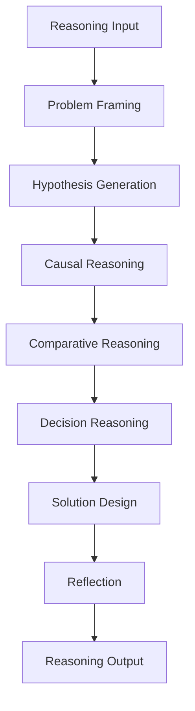
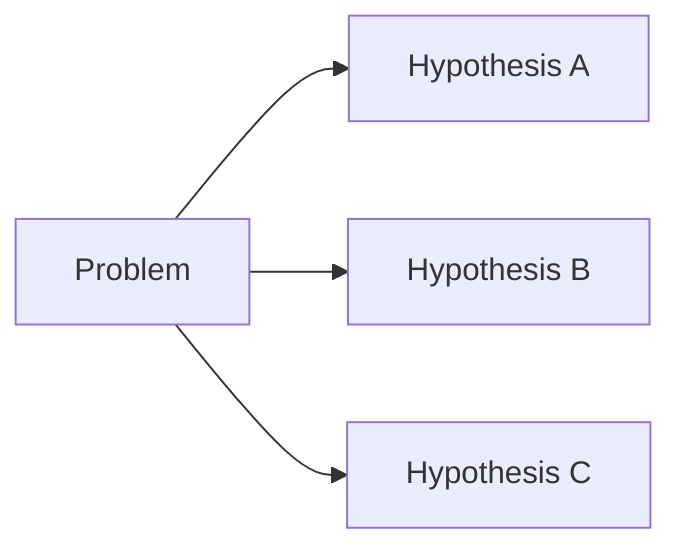
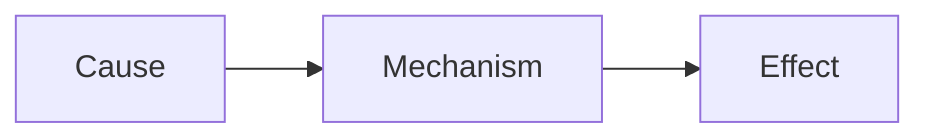
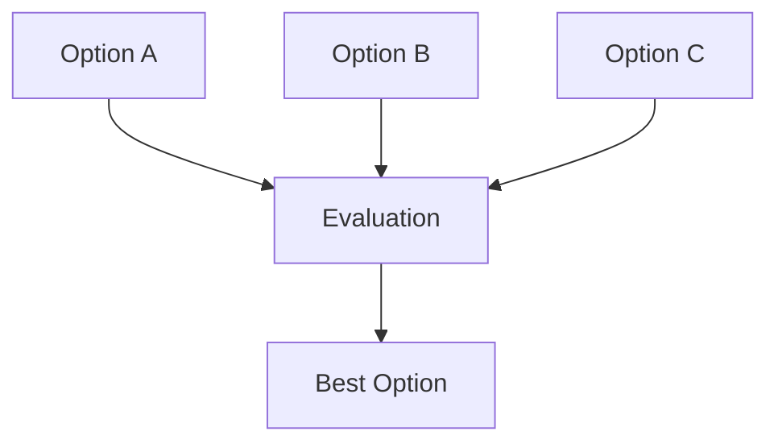
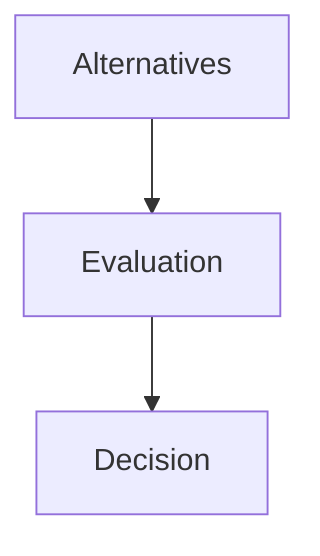
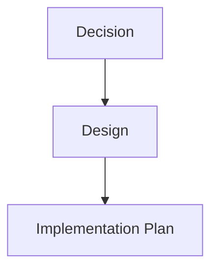
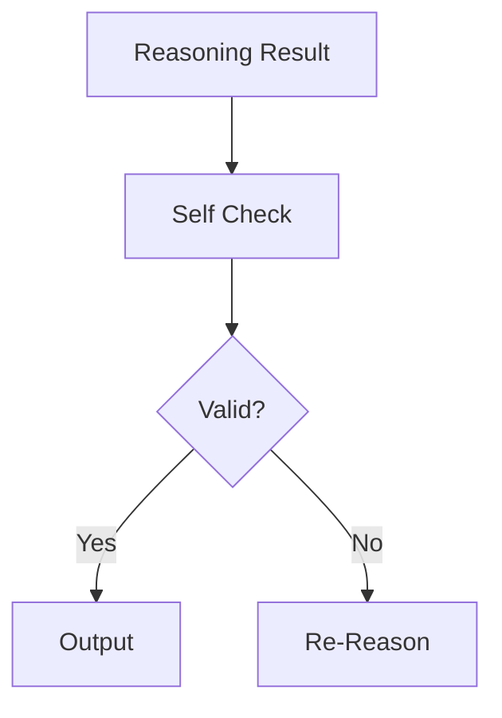

# LLM Reasoning Layer

LLM Reasoning Layer は、Context Layer で準備された情報を使い、  
**実際の推論を行う中核層**である。

この層では次の処理が行われる。

- 問題の再定義
- 仮説生成
- 因果推論
- 比較検討
- 意思決定
- 解決策設計
- 自己検証

Input Layer が **問題を作る層**、  
Context Layer が **思考環境を作る層**なら、  

Reasoning Layer は **思考そのものを行う層**である。

---

# 1 全体構造

---

# 2 Problem Framing

Problem Framing は  
**問題の構造を明確化する処理**である。

多くの場合、入力された問題は曖昧であるため、  
推論前に問題を整理する必要がある。

---

## 例

入力

観光地評価OSを作りたい

Problem Framing

goal: 観光地評価システム設計  
domain: tourism  
object: 観光資源  
evaluation_method: structure

---

# 3 Hypothesis Generation

Hypothesis Generation は  
**仮説を生成する処理**である。

推論では1つの答えを直接求めるのではなく、  
**複数の仮説を作る**ことで思考の探索空間を広げる。

---

## 構造

---

# 4 Causal Reasoning

Causal Reasoning は  
**因果関係を推論する処理**である。

---

## 例

原因 → 結果

---

## 構造

---

# 5 Comparative Reasoning

Comparative Reasoning は  
**複数の選択肢を比較する推論**である。

---

## 比較軸

- cost    
- risk    
- efficiency    
- scalability    
- feasibility    

---

## 構造

---

# 6 Decision Reasoning

Decision Reasoning は  
**比較結果をもとに意思決定する処理**である。

---

## 決定基準

- expected value    
- risk    
- constraints    
- goal alignment    

---

## 構造

---

# 7 Solution Design

Solution Design は  
**実際の解決策を設計する処理**である。

---

## 構造

---

# 8 Reflection

Reflection は  
**推論結果を自己検証する処理**である。

---

## 検証内容

- 論理整合性    
- 制約違反    
- 不完全推論    
- 誤前提    

---

## 構造

---

# 9 Reasoning Output

Reasoning Layer の出力は次の構造になる。

reasoning_result:  
  
problem_definition  
hypotheses  
causal_analysis  
comparative_evaluation  
decision  
solution_design

これが **Output Layer** に渡される。

---

# 10 Reasoning Layer の特徴

Reasoning Layer は **単一の推論ではなく複数推論の連鎖**である。

problem framing  
↓  
hypothesis  
↓  
causal reasoning  
↓  
comparison  
↓  
decision  
↓  
solution design

---

# 11 関連ノート

上位

- [[LLM Reasoning Architecture]]    

前

- [[LLM Context Layer]]    

次

- [[LLM Output Layer]]    

関連

- [[Causal Reasoning]]    
- [[Hypothesis Generation]]    
- [[Decision Reasoning]]
- [[Solution Design]]