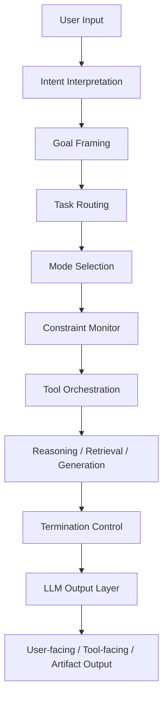
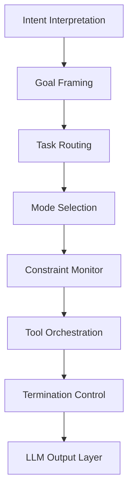
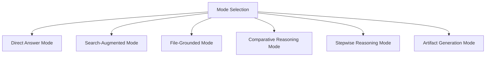

# LLM System Hub

LLM System Hub は、LLM Reasoning Architecture における **system 層の中核ハブ**である。  
このハブは、各層・各モジュール・各運転モードを一覧可能にし、**どの構造が何を担当し、どの順で接続され、どこで分岐し、どこで成果物へ至るか**を俯瞰するための入口となる。

system 層は、個別の推論内容そのものではなく、**推論を成立させる全体構造・統制機構・出力接続・運転モード群**を扱う。  
したがってこのハブは、ノート群の単なる索引ではなく、**LLM 全体を運転席から見た構造地図**として機能する。

---

# このハブの目的

- system 層に属するノート群の位置づけを整理する
- Control / Mode / Output / Tool の接続関係を明示する
- どのノートから読めばよいかの導線を与える
- 重複しやすい概念の境界を切る
- hub から各ノートへ自然に辿れる構造を作る

---

# system 層の考え方

system 層は、主に次の問いに答える。

- LLM は入力をどう解釈するのか
- どのタスクとして扱うのか
- どのモードで運転するのか
- いつ検索し、いつファイルを読むのか
- いつ止め、何を出力するのか
- 外部ツールをどう編成するのか
- 制約や安全性をどこで監視するのか

つまり system 層は、**「何を知っているか」ではなく「どう動くか」** を扱う層である。

---

# 全体地図

---

# system 層の基本構造

## 1. Input Understanding

入力を読み、意図と目標を解釈する領域。

主ノート:

- [[Intent Interpretation]]    
- [[Goal Framing]]    

役割:

- 発話の背後にある要求を読む    
- 主目的と副目的を分ける    
- 成功条件を定義する    
- 出力期待を先取りする    

---

## 2. Control and Routing

依頼を処理ラインへ振り分ける領域。

主ノート:

- [[LLM Control Layer]]
- [[Task Routing]]    
- [[Mode Selection]]    

役割:

- タスク型を判定する    
- 適切な処理ラインを選ぶ    
- 運転モードを決める    
- 深さ・速度・探索要否を調整する    

---

## 3. Constraint and Safety Governance

処理全体に制約をかける領域。

主ノート:

- [[Constraint Monitor]]    

役割:

- 安全制約の監視    
- 形式制約の監視    
- 最新性要件の監視    
- 引用・権限・言語・範囲の監視    
- 違反時の進路修正    

---

## 4. External Action and Retrieval

外部ツールや外部資源を使う領域。

主ノート:

- [[Tool Orchestration]]    
- [[Search-Augmented Mode]]    
- [[File-Grounded Mode]]    

役割:

- ツール要否の判定    
- 外部検索の起動    
- 文書根拠の取得    
- 複数ツールの連鎖    
- 外部結果の統合    

---

## 5. Reasoning Modes

具体的な思考運転形態を切り替える領域。

主ノート:

- [[Direct Answer Mode]]    
- [[Search-Augmented Mode]]    
- [[File-Grounded Mode]]    
- [[Comparative Reasoning Mode]]    
- [[Stepwise Reasoning Mode]]    
- [[Artifact Generation Mode]]

役割:

- 直答    
- 検索拡張    
- 文書根拠読解    
- 比較整理    
- 多段推論    
- 成果物生成    

---

## 6. Completion and Delivery

処理を終え、出力へつなぐ領域。

主ノート:

- [[Termination Control]]    
- [[LLM Output Layer]] 
- [[LLM System Prompt]]
    

役割:

- どこで止めるか決める    
- 部分達成を扱う    
- 出力形式に整える    
- ユーザー向け・ツール向け・成果物向けへ分配する    

---

# system 層の主要ノート一覧

## 中核制御

- [[LLM Control Layer]]    
- [[Task Routing]]    
- [[Goal Framing]]    
- [[Intent Interpretation]]    
- [[Mode Selection]]    

## 制約監視

- [[Constraint Monitor]]
    

## 外部実行・接続

- [[Tool Orchestration]]    

## 運転モード

- [[Direct Answer Mode]]    
- [[Search-Augmented Mode]]    
- [[File-Grounded Mode]]    
- [[Comparative Reasoning Mode]]    
- [[Stepwise Reasoning Mode]]    
- [[Artifact Generation Mode]]    

## 終了と出力

- [[Termination Control]]    
- [[LLM Output Layer]]    

---

# 依存関係マップ

---

# モード群マップ

---

# system 層の読み順

## 入口から理解したい場合

1. [[Intent Interpretation]]    
2. [[Goal Framing]]    
3. [[Task Routing]]    
4. [[Mode Selection]]    
5. [[LLM Control Layer]]    

この順で読むと、入力がどのように処理方針へ変換されるかが分かる。

---

## 運転モードを整理したい場合

1. [[Mode Selection]]    
2. [[Direct Answer Mode]]    
3. [[Search-Augmented Mode]]    
4. [[File-Grounded Mode]]    
5. [[Comparative Reasoning Mode]]    
6. [[Stepwise Reasoning Mode]]    
7. [[Artifact Generation Mode]]    

この順で読むと、状況ごとの運転形態の違いが見える。

---

## 実務運用から理解したい場合

1. [[Constraint Monitor]]    
2. [[Tool Orchestration]]    
3. [[Termination Control]]    
4. [[LLM Output Layer]]    

この順で読むと、実際の運用・停止・成果物化の流れが見える。

---

# system 層で区別すべき概念

## Intent Interpretation と Goal Framing の違い

- Intent Interpretation は「何を求めているか」を読む    
- Goal Framing は「それを何として達成するか」を定義する    

---

## Task Routing と Mode Selection の違い

- Task Routing は「どの処理ラインへ送るか」    
- Mode Selection は「そのライン上でどう運転するか」    

---

## Constraint Monitor と Termination Control の違い

- Constraint Monitor は「越えてはいけない境界を監視する」    
- Termination Control は「どこで十分とみなして止めるかを決める」    

---

## Tool Orchestration と Search-Augmented Mode の違い

- Tool Orchestration はツール利用全般の編成    
- Search-Augmented Mode は検索を主軸とした運転形態    

---

## Artifact Generation Mode と LLM Output Layer の違い

- Artifact Generation Mode は成果物そのものを作るモード    
- LLM Output Layer は最終出力全般を整形・配布する層    

---

# system 層の設計原則

- 入力理解と出力整形を分ける    
- ルーティングとモード選択を分ける    
- 制約監視を後付けにしない    
- 外部接続は統制下で使う    
- 停止条件を必ず持つ    
- 回答と成果物を区別する    
- hub から全体の流れが一望できるようにする    

---

# system 層の位置づけ

system 層は、  
**LLM が何を知っているかではなく、どう運転されるかを記述する統制層**である。

この層が整っていると、

- 入力解釈が安定し    
- タスク処理がぶれず    
- モード切替が自然になり    
- 制約違反が減り    
- 出力品質が揃いやすくなる    

したがってこの層は、個別ノート群の上位にある  
**LLM 全体の運転原理と接続構造を束ねる設計層**として扱うべきである。

---

# 関連ノート

- [[LLM Control Layer]]    
- [[Intent Interpretation]]    
- [[Goal Framing]]    
- [[Task Routing]]    
- [[Mode Selection]]    
- [[Constraint Monitor]]
- [[Tool Orchestration]]    
- [[Direct Answer Mode]]    
- [[Search-Augmented Mode]]    
- [[File-Grounded Mode]]    
- [[Comparative Reasoning Mode]]    
- [[Stepwise Reasoning Mode]]    
- [[Artifact Generation Mode]]    
- [[Termination Control]]    
- [[LLM Output Layer]]