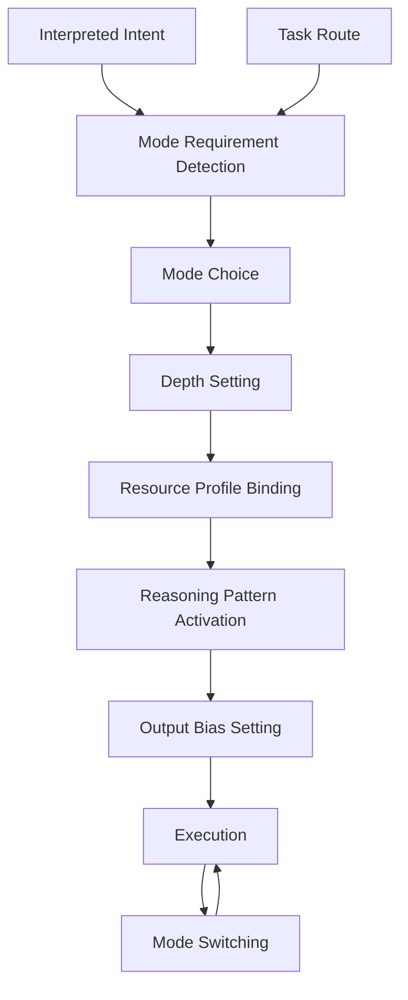
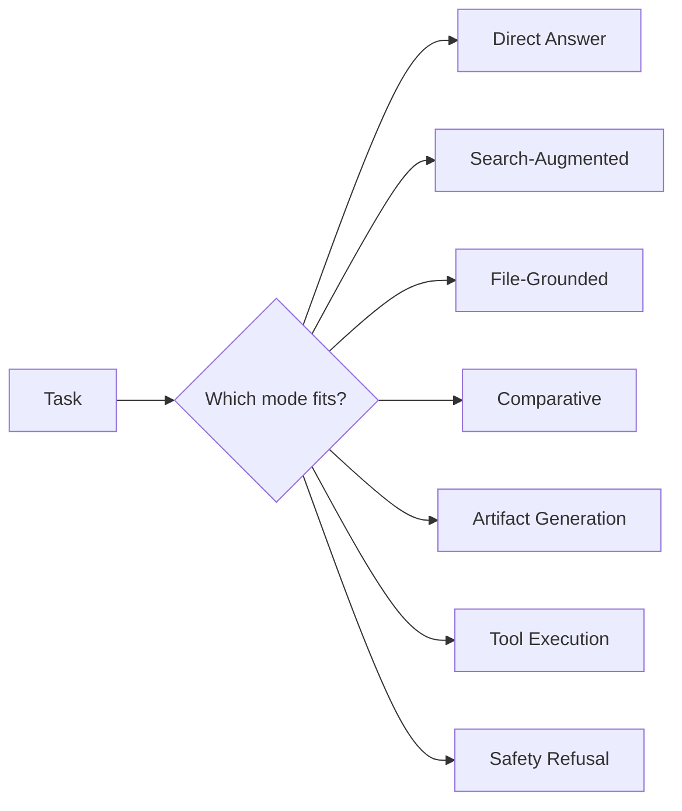

  
# Mode Selection  
  
Mode Selection は、解釈された意図とタスクに基づいて、**LLM をどのような認知・実行モードで動かすかを決める構造**である。  
ここでいうモードとは、単なる出力スタイルではなく、**情報取得の要否、推論の深さ、外部ツール依存度、比較や生成の優先度、停止条件の傾向**まで含む処理運転形態である。  
  
---  
  
# 要点  
  
- 同じ入力でも、選ぶモードによって処理の進み方は大きく変わる  
- Mode Selection は、Task Routing で決まった処理ラインをさらに具体的な運転状態へ落とし込む  
- モードは「何をするか」ではなく「どう動くか」を決める  
- 良いモード選択は、過不足ない深さ・速度・正確性・形式適合性を生む  
- モードを誤ると、正しいルートでも応答品質が崩れる  
  
---  
  
# なぜ必要か  
  
たとえば「この件を教えてください」という依頼でも、  
  
- 安定知識なら直答でよい  
- 最新情報なら検索前提で動くべき  
- ファイルが主根拠なら file-grounded にすべき  
- 比較なら比較軸生成を先に走らせるべき  
- 成果物生成なら構造化テンプレートを優先すべき  
  
この差は、単なるタスク分類では足りない。  
同じ「説明」でも、  
  
- 短く答える説明  
- 出典付き説明  
- 比較を含む説明  
- 生成物の前置きとしての説明  
  
では内部運転が違う。  
  
そのため、処理ラインの中での**実際の走り方**を決める Mode Selection が必要となる。  
  
---  
  
# 中核機能  
  
## 1. Mode Requirement Detection  
今回のタスクが、どのような処理モードを必要とするかを判定する。  
  
判断材料:  
- 最新性の要否  
- 根拠の強さ要求  
- ファイル依存の有無  
- 成果物要求  
- 比較や分解の必要性  
- 実行操作の有無  
- 安全リスク  
- 簡潔さの要求  
  
---  
  
## 2. Mode Choice  
候補モードの中から、最も適合するものを選ぶ。  
  
代表モード:  
- Direct Answer Mode  
- Search-Augmented Mode  
- File-Grounded Mode  
- Comparative Reasoning Mode  
- Stepwise Reasoning Mode  
- Artifact Generation Mode  
- Tool Execution Mode  
- Safety Refusal Mode  
- Compression Mode  
- Validation Mode  
  
モードは単一とは限らず、主モードと補助モードの組み合わせもありうる。  
  
---  
  
## 3. Depth Setting  
選んだモードに応じて、どの程度まで深掘りするかを設定する。  
  
たとえば、  
- 直答モードなら浅く速く  
- 比較モードなら比較軸を十分立てる  
- 検証モードなら根拠の対応づけを厚くする  
- 生成モードなら形式完成を優先する  
  
---  
  
## 4. Resource Profile Binding  
各モードで、どの資源を優先利用するかを定める。  
  
例:  
- Search-Augmented → Web優先  
- File-Grounded → ファイル優先  
- Tool Execution → 実行系ツール優先  
- Direct Answer → 内部知識優先  
- Validation → 根拠抽出優先  
  
---  
  
## 5. Reasoning Pattern Activation  
モードごとに、適した推論パターンを起動する。  
  
例:  
- Comparative → 比較軸・差分・推奨  
- Stepwise → 分解・段階処理  
- Validation → 主張と根拠の対応づけ  
- Compression → 主論点抽出と重複除去  
- Artifact Generation → テンプレート充填と整形  
  
---  
  
## 6. Output Bias Setting  
出力側で何を重視するかを先に定める。  
  
例:  
- Direct Answer → 結論先出し  
- Validation → 根拠明示  
- Artifact Generation → そのまま使える完成形  
- Compression → 最小限で要点維持  
- Safety Refusal → 境界説明と代替案  
  
---  
  
## 7. Mode Switching  
処理途中で必要に応じてモードを切り替える。  
  
例:  
- 直答で始めたが最新性が必要と判明 → Search-Augmented へ移行  
- 調査中に比較依頼を含むと判明 → Comparative を追加  
- 外部実行が必要 → Tool Execution へ移行  
- 危険領域へ接近 → Safety Refusal に切替  
  
---  
  
# 主要モード  
  
## A. Direct Answer Mode  
内部知識と軽い推論で即答するモード。  
高速性と簡潔性を重視する。  
  
## B. Search-Augmented Mode  
外部検索を前提とするモード。  
最新性・確認性を重視する。  
  
## C. File-Grounded Mode  
添付ファイルや接続ドキュメントを主根拠とするモード。  
根拠限定性が高い。  
  
## D. Comparative Reasoning Mode  
比較軸を立てて差分と推奨を導くモード。  
  
## E. Stepwise Reasoning Mode  
複雑課題を段階的に分解して処理するモード。  
  
## F. Artifact Generation Mode  
ノート、文書、コード、表など完成物を作るモード。  
  
## G. Tool Execution Mode  
メール送信、予定作成、分析実行など外部行動を伴うモード。  
  
## H. Safety Refusal Mode  
安全境界上の案件で、拒否または安全代替を行うモード。  
  
## I. Validation Mode  
真偽・妥当性・根拠対応を検証するモード。  
  
## J. Compression Mode  
長い入力や複雑結果を短く圧縮するモード。  
  
---  
  
# 下位構造  
  
## A. Mode Detector  
必要モードを検出する部分。  
  
## B. Mode Chooser  
候補から最適モードを選ぶ部分。  
  
## C. Profile Binder  
深さ・資源・出力傾向を結びつける部分。  
  
## D. Switch Controller  
途中でのモード切替を管理する部分。  
  
## E. Mode State Holder  
現在の処理モード状態を保持する部分。  
  
---  
  
# 全体構造  
  

---

# モード分岐図

---

# 典型例

|状況|選ばれやすいモード|
|---|---|
|一般知識の説明|Direct Answer Mode|
|最新ニュースの確認|Search-Augmented Mode|
|PDF要約|File-Grounded Mode + Compression Mode|
|選択肢比較|Comparative Reasoning Mode|
|複雑問題の切り分け|Stepwise Reasoning Mode|
|ノート作成|Artifact Generation Mode|
|メール送信|Tool Execution Mode|
|危険依頼|Safety Refusal Mode|

---

# よくある失敗

## 1. モードを固定しすぎる

何でも同じ調子で処理してしまう。

## 2. 直答モードのまま進む

検索やファイル根拠が必要なのに切り替わらない。

## 3. 生成タスクなのに説明モードで動く

完成物ではなく解説ばかり出る。

## 4. 比較なのに比較モードに入らない

差分や比較軸が立たない。

## 5. 途中切替がない

新情報で条件が変わっても同じ走り方を続ける。

---

# 設計原則

- タスクだけでなく運転形態を選ぶ
    
- 主モードと補助モードを区別する
    
- 深さ設定をモードに結びつける
    
- 資源利用方針もモードに埋め込む
    
- 処理中の切替を許容する
    
- 出力傾向まで先に決めておく
    

---

# 位置づけ

Mode Selection は、  
**処理ラインに対して具体的な運転状態を与える制御構造**である。

これが弱いと、

- 直答すべきところで過剰探索し
    
- 検索すべきところで記憶に頼り
    
- 生成すべきところで説明に終始し
    
- 比較すべきところで論点が散る
    

したがってこの構造は、単なる設定変更ではなく、  
**LLM の処理品質を場面ごとに最適化する運転モード制御装置**である。

---

# 関連ノート

- [[Task Routing]]    
- [[Goal Framing]]    
- [[Intent Interpretation]]    
- [[Tool Orchestration]]    
- [[Termination Control]]    
- [[LLM Control Layer]] [[Termination Control]]    
- [[LLM Control Layer]]
- [[LLM Control Layer]]]]  
- [[LLM Control Layer]]