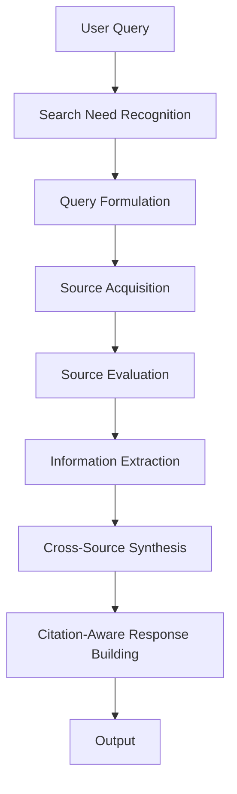
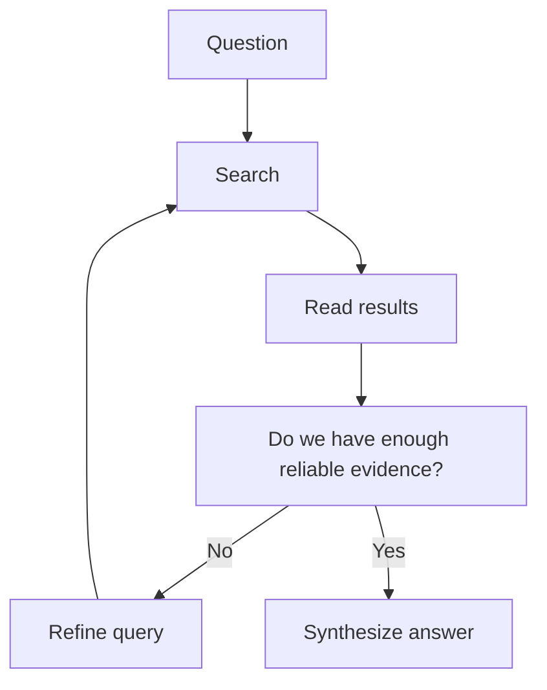

# Search-Augmented Mode

Search-Augmented Mode は、ユーザーの依頼に答えるために、**外部情報源から必要な情報を取得し、その結果を解釈・統合した上で応答する運転モード**である。  
このモードの本質は、検索結果を貼ることではなく、**外部世界に接続して得た情報を、問いに適合する知識へ変換すること**にある。

---

# 要点

- 最新性・変動性・確認性が必要な場面で使う
- 外部検索は手段であり、最終目標は信頼できる回答生成である
- 検索結果の量より、関連性と解釈品質が重要である
- 検索後には必ず、比較・統合・評価の工程が必要になる
- 検索しない誤りより、検索しただけで終わる誤りも危険である

---

# なぜ必要か

LLM の内部知識だけでは不十分な問いがある。たとえば、

- 最新ニュース
- 現在の価格
- 現行制度
- 直近の人事
- 最近のソフトウェア仕様
- 変化しうる統計
- 今起きている出来事

これらは、記憶に頼ると誤りやすい。  
そのため外部情報への接続が必要となる。

しかし、検索してもそのままでは答えにならない。  
複数情報源から、
- どれが関係あるか
- どれが信頼できるか
- 何が一致しているか
- 何が未確定か

を整理しなければならない。  
それを担うのが Search-Augmented Mode である。

---

# 適用場面

## 1. 最新性が必要な質問
例:
- 今日のニュース
- 現在の役職者
- 直近の出来事
- 現在の仕様や制度

## 2. 高変動情報
例:
- 価格
- 在庫
- スケジュール
- スポーツ結果
- 天気
- 相場

## 3. 検証要求
例:
- 本当にそうか調べて
- 出典を示して
- 最新情報で確認して

## 4. ニッチ・曖昧・不確かな語
例:
- 用語が不明
- 表記揺れがある
- 最近出てきた概念
- 誤記の可能性がある語

---

# 適用してはいけない場面

Search-Augmented Mode を使わなくてよい、あるいは使いすぎると逆効果な場面もある。

- 一般的で安定した概念説明
- ユーザーが与えたテキストの要約
- 純粋な文章生成や書き換え
- 会話上の軽い相談
- 内部知識だけで十分な原理解説

この場合は Direct Answer Mode などの方が適する。

---

# 中核機能

## 1. Search Need Recognition
検索が必要かどうかを判定する。

判定基準:
- 情報が変わりうるか
- 精度要求が高いか
- 出典が必要か
- 内部知識で足りるか
- ユーザーが確認を明示しているか

---

## 2. Query Formulation
問いを、検索可能なクエリへ変換する。

よいクエリは、
- 対象が明確
- 無駄が少ない
- 比較や検証に必要な語を含む
- 必要なら時間条件や領域条件を持つ

この段階で質が低いと、後続結果も崩れる。

---

## 3. Source Acquisition
外部情報源から候補情報を取得する。

対象:
- 検索結果
- 公式情報
- 一次情報
- 補助的報道
- 構造化データ

ここでは量より、信頼度と関連度が重要である。

---

## 4. Source Evaluation
取得した情報源を評価する。

評価観点:
- 信頼性
- 更新日時
- 一次性
- 関連性
- 一貫性
- 詳細度

---

## 5. Information Extraction
必要な事実・数値・主張・日付・差分を抽出する。

この時点で、
- 何が答えに必要か
- どの情報が荷重の高い根拠か
- 何が補助情報か

を分ける。

---

## 6. Cross-Source Synthesis
複数情報源を付き合わせ、答えに必要な形へ統合する。

内容:
- 一致点の抽出
- 差異の把握
- 時系列整理
- 強い根拠の優先
- 不一致の扱い
- 推定と事実の区別

---

## 7. Citation-Aware Response Building
出典を対応づけた形で回答を構築する。

ここでは、
- どの主張に何が根拠か
- どこが未確定か
- 何が最新時点の情報か

を明確にする必要がある。

---

# 検索拡張の処理段階

## A. Need to Search?
検索要否の判断。

## B. What to Search?
検索対象と検索語の設計。

## C. What Did We Find?
取得結果の整理。

## D. What Matters?
答えに必要な部分の選別。

## E. What Can We Safely Conclude?
結論可能な内容の確定。

---

# 下位構造

## A. Search Trigger
検索必要性を検出する部分。

## B. Query Builder
検索語を組み立てる部分。

## C. Source Filter
取得結果を信頼性・関連性で絞る部分。

## D. Evidence Synthesizer
複数情報源を統合する部分。

## E. Citation Binder
主張と出典を対応づける部分。

---

# 全体構造

---

# 検索統合ループ

---

# 典型例

|入力|Search-Augmented Mode の動き|
|---|---|
|最新のCEOは誰ですか|現在情報を検索して確認する|
|そのニュースは本当ですか|複数ソースで検証する|
|今日の天気を教えて|最新天気情報を取得する|
|この制度は今どうなっていますか|現行制度を確認する|
|その用語は何ですか|用語自体を検索して確認する|

---

# よくある失敗

## 1. 検索せずに答える

最新情報や不安定情報を記憶で済ませてしまう。

## 2. 検索しただけで終わる

結果を貼るだけで、統合や判断がない。

## 3. 情報源の質を見ない

低品質情報を重く扱ってしまう。

## 4. 古い情報を最新として扱う

時点の確認が甘い。

## 5. 引用対応が弱い

どの主張がどの情報源に支えられているか不明瞭になる。

---

# 設計原則

- 変動情報にはまず検索を当てる    
- クエリ設計を丁寧に行う    
- 一次情報や信頼源を優先する    
- 検索結果は比較・統合して使う    
- 日付と時点を明示する    
- 出典対応を明確にする    
- 十分な証拠が集まったら止める    

---

# 位置づけ

Search-Augmented Mode は、  
**LLM の内部知識を外部世界の最新情報で補強し、検証可能な回答へ変えるモード**である。

これが強いと、

- 変動情報に対応でき    
- 確認性が上がり    
- 引用付きの信頼可能な応答ができる    

一方で、検索に依存しすぎると冗長になる。  
したがってこのモードは、**必要な時にだけ起動し、外部情報を意味のある答えへ変換する確認駆動モード**である。

---

# 関連ノート

- [[Mode Selection]]    
- [[Direct Answer Mode]]    
- [[File-Grounded Mode]]    
- [[Tool Orchestration]]    
- [[Constraint Monitor]]    
- [[LLM Output Layer]][[02_zettelkasten/00_system/Tool Orchestration]]    
- [[02_zettelkasten/00_system/Constraint Monitor]]    
- [[LLM Output Layer]]