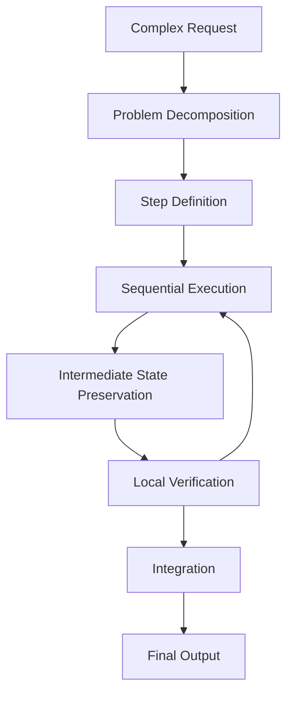
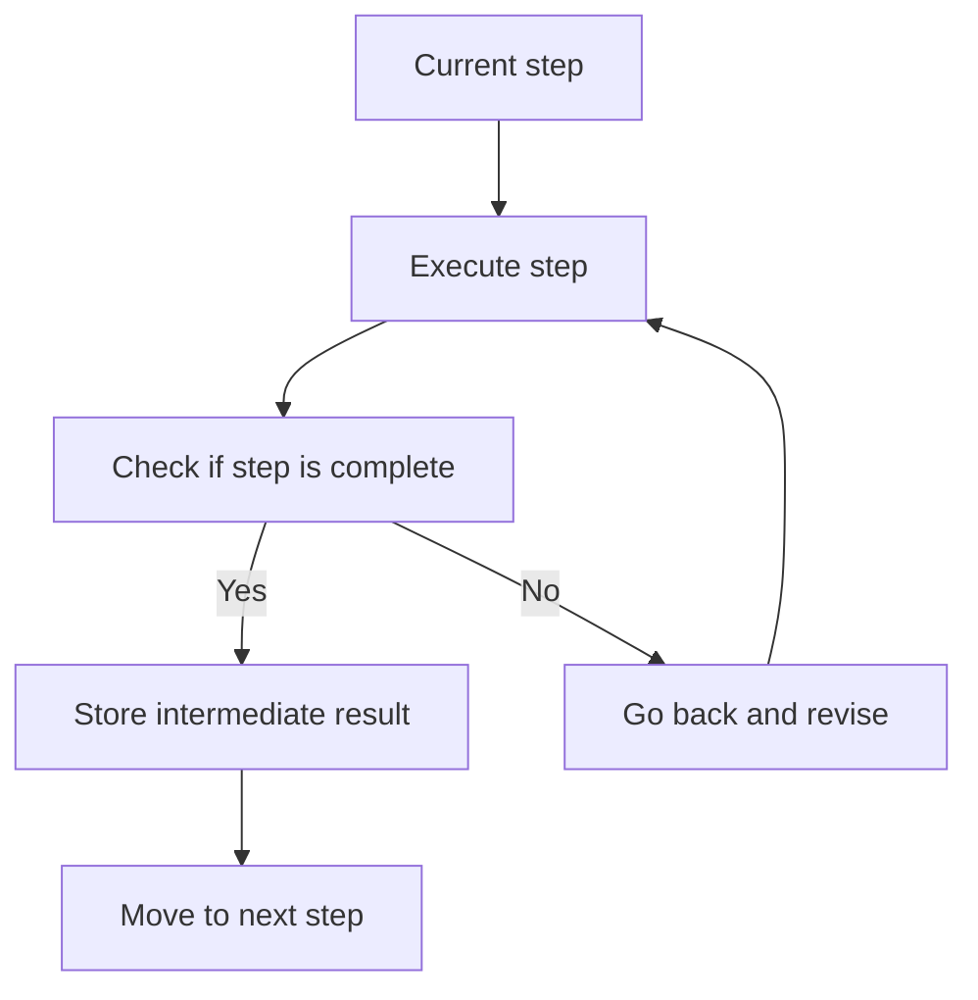

  
# Stepwise Reasoning Mode  
  
Stepwise Reasoning Mode は、複雑な問いや作業を**一度に処理せず、段階・部品・論点に分解して順番に解く運転モード**である。  
このモードの本質は、考える量を増やすことではなく、**問題を扱える単位へ切り分け、各段階で中間成果を確定しながら進むこと**にある。  
  
---  
  
# 要点  
  
- 複雑問題は、分解しないと処理精度が落ちる  
- 各段階には固有の目的と完了条件が必要である  
- 前段の出力を後段の入力として再利用する  
- 途中で方針修正や不足補完がしやすい  
- 最終的には、段階の列を一つの結論へ束ねる  
  
---  
  
# なぜ必要か  
  
LLM への依頼には、次のような複雑課題がある。  
  
- 論点が多い  
- 手順が複数ある  
- 前提整理が必要  
- 比較と提案が混在している  
- 調査・要約・生成が連なっている  
- 原因分析や設計が絡む  
  
このような依頼を一括で処理すると、  
- 論点漏れ  
- 順序混乱  
- 根拠不足  
- 結論の飛躍  
  
が起きやすい。  
  
そのため Stepwise Reasoning Mode は、**複雑依頼を工程化して安定的に処理するための多段推論モード**として必要になる。  
  
---  
  
# 適用場面  
  
## 1. 複雑問題の分解  
例:  
- どう整理すればよいか  
- 何から考えるべきか  
- 多面的に分析して  
  
## 2. 原因分析  
例:  
- なぜこうなったか  
- 要因を分解して  
- 真因を特定して  
  
## 3. 設計・構成作業  
例:  
- システム構造を設計して  
- 段階的にノートを組み立てて  
- 完成版まで順に作って  
  
## 4. 複合依頼  
例:  
- 調べて比較して提案して  
- 要約して、その後表にして  
- 読んで、評価して、改善案を出して  
  
---  
  
# 適用してはいけない場面  
  
- 単純な概念説明  
- 短い言い換え  
- 即答で十分な質問  
- 軽い雑談や一言助言  
  
この場合は Direct Answer Mode の方が適切である。  
  
---  
  
# 中核機能  
  
## 1. Problem Decomposition  
問題を、処理可能な小単位へ分解する。  
  
分解観点:  
- 時系列  
- 手順  
- 論点  
- 層  
- 因果段階  
- 成果物部品  
- 意思決定段階  
  
---  
  
## 2. Step Definition  
各段階で何を行うかを定義する。  
  
よい段階定義は、  
- 役割が明確  
- 前後関係が明確  
- 中間成果が明確  
- 完了判定が可能  
  
である。  
  
---  
  
## 3. Sequential Execution  
順番に段階を実行する。  
  
ここで重要なのは、  
- 前段の結果を踏まえる  
- 飛ばさない  
- 必要なら戻る  
- 各段階ごとに小さく確定する  
  
ということである。  
  
---  
  
## 4. Intermediate State Preservation  
各段階の結果を保持し、後続工程で再利用する。  
  
内容:  
- 論点一覧  
- 仮説  
- 比較軸  
- 要件整理  
- 中間結論  
- 制約条件  
  
---  
  
## 5. Local Verification  
各段階ごとに、小さな妥当性確認を行う。  
  
確認内容:  
- その段階の目的を満たしたか  
- 次へ進む材料がそろったか  
- 見落としがないか  
- 前提が崩れていないか  
  
---  
  
## 6. Integration  
各段階の成果を統合して、全体結論へまとめる。  
  
ここでは、単なる足し合わせではなく、  
- 整合性確認  
- 重複除去  
- 優先順位づけ  
- 結論化  
  
が必要となる。  
  
---  
  
## 7. Adaptive Re-entry  
途中で不足や矛盾が出た場合、前段へ戻って補正する。  
  
これにより、段階処理が機械的な一方向列に固定されず、柔軟性を持つ。  
  
---  
  
# 段階推論の基本形  
  
1. 問題を分ける  
2. 段階を定義する  
3. 順番に処理する  
4. 各段階を検証する  
5. 最後に束ねる  
  
---  
  
# 下位構造  
  
## A. Decomposer  
問題を分解する部分。  
  
## B. Step Planner  
処理段階を設計する部分。  
  
## C. Intermediate Memory  
中間成果を保持する部分。  
  
## D. Local Checker  
各段階の妥当性を確認する部分。  
  
## E. Integrator  
段階成果を全体結論へ束ねる部分。  
  
---  
  
# 全体構造  
  

---

# 段階処理ループ

---

# 典型例

|入力|Stepwise Reasoning Mode の動き|
|---|---|
|この問題を整理してください|論点を分解して順に整理する|
|原因分析してください|要因を段階分解して真因に近づく|
|完成版を順に作って|部品ごとに作成して統合する|
|比較して提案して|比較段階と提案段階に分ける|
|調べてまとめて生成して|検索・整理・生成を分離する|

---

# よくある失敗

## 1. 分解しすぎる

細かすぎて前進が遅くなる。

## 2. 分解が粗すぎる

結局一括処理と変わらなくなる。

## 3. 中間成果を使わない

段階化したのに、毎回考え直してしまう。

## 4. 統合が弱い

段階ごとの結果はあるが、全体結論が弱い。

## 5. 戻りがない

途中矛盾に気づいても前段修正が行われない。

---

# 設計原則

- 複雑問題はまず分解する    
- 各段階に役割と完了条件を置く    
- 中間成果を残す    
- 段階ごとに小さく検証する    
- 必要に応じて戻る    
- 最後に必ず統合する    

---

# 位置づけ

Stepwise Reasoning Mode は、  
**複雑課題を段階列へ変換し、中間成果を積み上げて安定的に結論へ到達する多段処理モード**である。

これが強いと、

- 論点漏れが減り    
- 工程が明確になり    
- 複合依頼にも対応しやすくなる    

したがってこのモードは、単に丁寧に考えるモードではなく、  
**複雑性を工程へ変換する構造化推論モード**である。

---

# 関連ノート

- [[Mode Selection]]    
- [[Comparative Reasoning Mode]]    
- [[Artifact Generation Mode]]    
- [[Termination Control]]    
- [[Goal Framing]]    
- [[LLM Output Layer]]/00_system/Goal Framing]]    
- [[LLM Output Layer]]