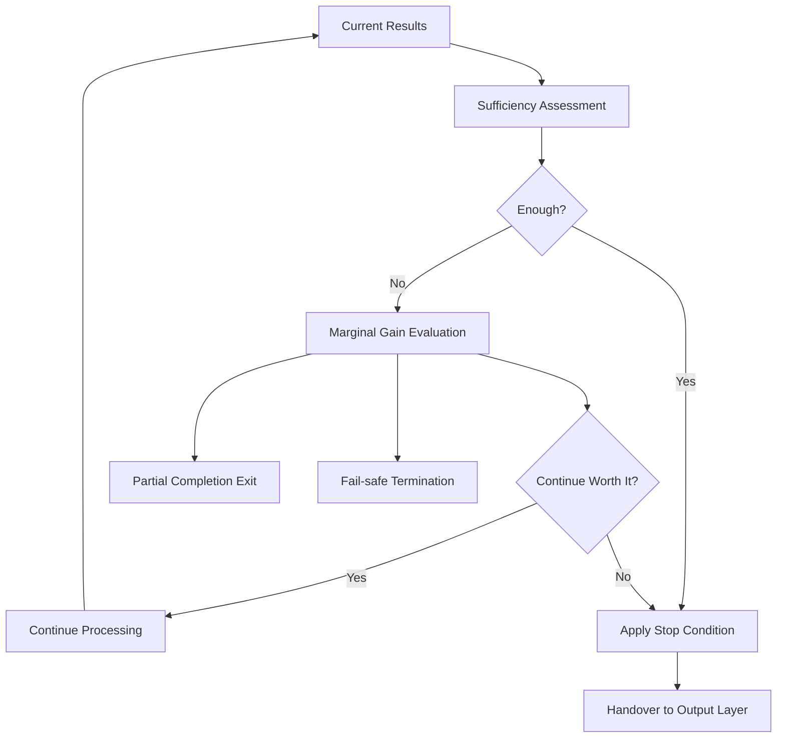
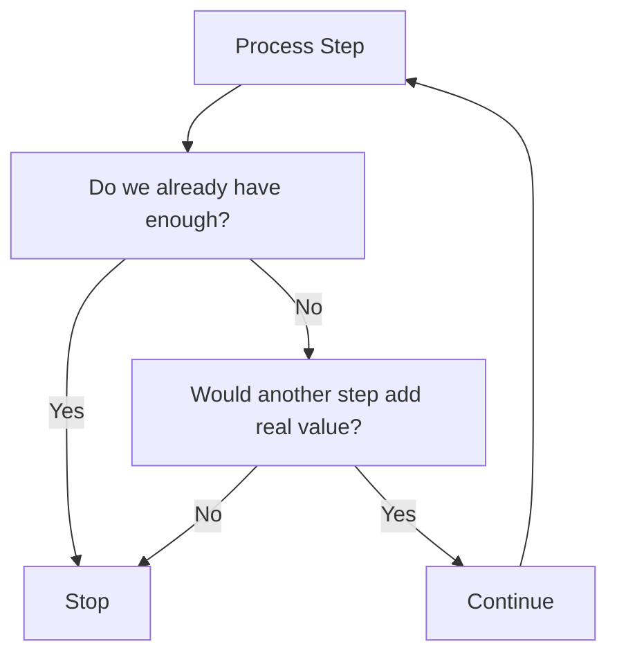

 
# Termination Control  
  
Termination Control は、LLM の処理を**どの時点で十分とみなし、探索・推論・ツール利用を打ち切って出力段階へ移るか**を決める構造である。  
これは単に処理を止める機能ではなく、**十分性・費用対効果・未達の許容範囲を見極めて、最適な停止点を選ぶ統制機構**である。  
  
---  
  
# 要点  
  
- 良い応答は、考え続けることではなく、適切な時点で止まることを含む  
- 停止条件は一律ではなく、タスク型ごとに異なる  
- 十分性とは「完璧」ではなく、「目的達成に必要な水準を満たした状態」である  
- 停止判断は、深掘り継続の利得とコストの比較で決まる  
- 未達部分がある場合でも、部分達成で止める方がよい場合がある  
  
---  
  
# なぜ必要か  
  
LLM は、与えられた入力から連続的に推論・検索・生成を続けられる。  
しかし、実務上は次の問題がある。  
  
- 考えすぎて冗長になる  
- 検索しすぎて遅くなる  
- 比較しすぎて結論が遅れる  
- 細部にこだわって主目的を逃す  
- 逆に、早く止まりすぎて不十分になる  
  
このバランスを調整するのが Termination Control である。  
つまりこれは、**処理の終点品質を決める構造**である。  
  
---  
  
# 中核機能  
  
## 1. Sufficiency Assessment  
現在の結果が、ユーザー要求に対して十分かを評価する。  
  
見る観点:  
- 質問に答えているか  
- 成果物が完成しているか  
- 必要根拠がそろっているか  
- 指定形式を満たしているか  
- 未解決部分が致命的でないか  
  
ここでの「十分」は、厳密完全性ではなく、**目的充足性**である。  
  
---  
  
## 2. Marginal Gain Evaluation  
これ以上続けた場合の追加利得があるかを見積もる。  
  
追加利得の例:  
- さらに正確になる  
- 比較が深まる  
- 不確実性が減る  
- 欠けていた根拠が埋まる  
  
一方でコスト:  
- 時間  
- 応答長  
- ツール呼び出し回数  
- 認知負荷  
- 冗長化リスク  
  
追加利得が小さければ、止めるべきである。  
  
---  
  
## 3. Stop Condition Matching  
タスク類型に応じた停止条件を適用する。  
  
例:  
- 質問応答: 問いに直接答え、最低限の根拠がある  
- 要約: 主要論点を落とさず圧縮できた  
- 比較: 比較軸・差分・結論が出た  
- 生成: 指定フォーマットの成果物が完成した  
- ツール実行: 必要な操作が完了し結果確認も取れた  
- 調査: 信頼できる根拠が十分集まった  
  
---  
  
## 4. Early Stop Decision  
必要以上の深掘りを防ぐため、早期停止を判断する。  
  
有効な場面:  
- ユーザーが簡潔さを求めている  
- 問いが単純  
- 高速回答が価値を持つ  
- 残り探索が重複的  
- 形式生成がすでに完了している  
  
---  
  
## 5. Partial Completion Exit  
完全達成は難しいが、部分達成なら可能な場合の停止を扱う。  
  
例:  
- 一部資料にアクセス不可  
- 検索結果が限定的  
- ツール障害  
- 外部変更はできないが草案は作れる  
  
この場合、  
- 何ができたか  
- 何が未達か  
- 何が原因か  
  
を明示して止める。  
  
---  
  
## 6. Fail-safe Termination  
危険・制約違反・無意味な反復が起きる前に停止する。  
  
対象:  
- 禁止領域への進入  
- 同じ失敗の反復  
- 根拠なき推測の拡大  
- ツールエラー連鎖  
- 形式崩壊  
  
---  
  
## 7. Handover to Output  
停止後、どの状態で Output Layer へ渡すかを整える。  
  
引継ぎ内容:  
- 最終結論  
- 確定事項  
- 未確定事項  
- 根拠の強さ  
- 省略した探索  
- 出力形式要件  
  
---  
  
# 停止条件の代表類型  
  
## A. Goal Reached  
目的が達成されたため止める。  
  
## B. Good Enough  
完全ではないが、実用上十分なので止める。  
  
## C. Diminishing Returns  
追加探索の価値が低いため止める。  
  
## D. Constraint Bound  
制約上、これ以上進めないため止める。  
  
## E. Partial Completion  
一部達成の形で止める。  
  
## F. Safety Stop  
安全上、ここで打ち切る。  
  
---  
  
# 下位構造  
  
## A. Sufficiency Judge  
結果が目的に足りているか判定する部分。  
  
## B. Gain Estimator  
続行による追加価値を見積もる部分。  
  
## C. Stop Rule Library  
タスクごとの停止条件を保持する部分。  
  
## D. Partial Exit Manager  
部分達成時の終了処理を担当する部分。  
  
## E. Finalizer  
出力層へ渡すために結果を確定させる部分。  
  
---  
  
# 全体構造  
  

---

# 停止判断ループ

---

# タスク別停止例

|タスク|十分条件|
|---|---|
|一般質問|結論 + 最低限の根拠|
|比較|比較軸 + 差分 + 推奨|
|要約|主要論点を保持した圧縮|
|ノート生成|指定形式で完成|
|検索|信頼できる情報が十分収集済み|
|メール草案|送信可能な本文完成|
|スケジュール確認|空き時間または候補が明示済み|

---

# よくある失敗

## 1. 止まるのが遅い

十分な答えがあるのに、さらに調べて冗長になる。

## 2. 止まるのが早い

結論だけ出して根拠や形式要件が足りない。

## 3. 完璧主義に陥る

実用上十分なのに、未達ゼロを目指して過剰探索する。

## 4. 部分達成を失敗とみなす

全部できないと何も返さない。

## 5. 停止理由が不明確

なぜここで止めたかが内部的にも不明で、一貫性が崩れる。

---

# 設計原則

- 完全性より目的達成を基準にする    
- 継続の利得とコストを比較する    
- タスクごとに停止条件を変える    
- 部分達成を正当に扱う    
- 無意味な反復は早めに止める    
- 停止後は未達部分を明示する    
- 出力層へ渡す状態を整理して終える    

---

# 位置づけ

Termination Control は、  
**LLM の処理を適切な完成点で閉じるための終端統制機構**である。

これが弱いと、

- 冗長で遅い応答になり    
- 逆に不十分な応答にもなり    
- 実用上の完成度が安定しない    

したがってこの構造は、単なる停止ボタンではなく、  
**十分性判断に基づいて成果物を確定させる完成管理機構**である。

---

# 関連ノート

- [[LLM Control Layer]]    
- [[Task Routing]]    
- [[Tool Orchestration]]    
- [[Constraint Monitor]]    
- [[LLM Output Layer]]    
- [[Confidence Calibration]]