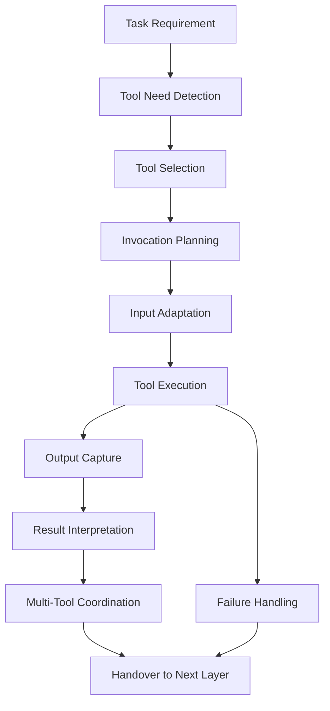
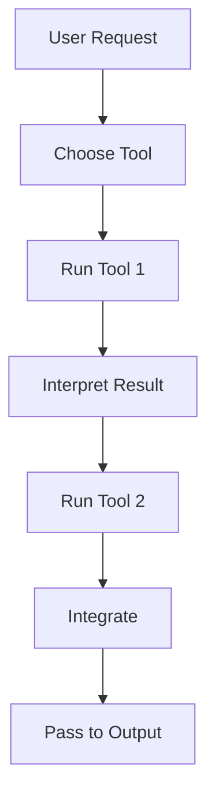

  
# Tool Orchestration  
  
Tool Orchestration は、LLM が利用可能な外部ツール群を、**目的に応じて選択し、順序づけ、接続し、結果を統合するための統制構造**である。  
単に「ツールを使う」ことではなく、**どのツールを、いつ、何のために、どの順で使い、どの結果を次へ渡すか**を設計する。  
  
---  
  
# 要点  
  
- ツール利用は単発呼び出しではなく、処理フローの一部として設計する  
- 適切なツール選択は、タスク適合性・信頼性・コスト・制約で決まる  
- ツールの出力はそのまま使わず、検証・要約・再接続する  
- 複数ツールを連鎖させる場合、前段の出力を後段の入力へ正しく変換する  
- ツール失敗時には代替経路・縮退運転・部分達成を考える  
  
---  
  
# このノートの対象  
  
このノートが扱うのは、たとえば次のような状況である。  
  
- Web検索で最新情報を取り、その結果を要約する  
- ファイルを読み、その内容に基づいて表や文書を作る  
- カレンダーを読んで空き時間を調べ、予定案を作る  
- メール内容を読み、返信草案を生成する  
- Python で計算し、その結果をレポートへ埋め込む  
- 画像生成や文書生成を最終成果物として出す  
  
つまり Tool Orchestration は、**LLM を単独推論器から、外部資源を使える実行システムへ拡張するための中心機構**である。  
  
---  
  
# 中核機能  
  
## 1. Tool Need Detection  
まず、そのタスクにツールが本当に必要かを判定する。  
  
判定観点:  
- 内部知識だけで足りるか  
- 最新情報が必要か  
- ユーザー固有データが必要か  
- ファイルや外部状態の参照が必要か  
- 実計算や変換処理が必要か  
- 外部システムを書き換える必要があるか  
  
ツールは便利だが、不要な呼び出しは遅延・複雑化・失敗点増加を招く。  
したがって最初に「使うべきか」を見極める必要がある。  
  
---  
  
## 2. Tool Selection  
必要であると判定した後、どのツールを使うかを決める。  
  
代表選択基準:  
- 問題との適合性  
- 情報の新しさ  
- 取得対象の種類  
- 書き込み権限の要否  
- 精度と再現性  
- 入出力形式の相性  
- コストと速度  
  
例:  
- 最新ニュース → Web  
- ユーザーのGoogle Drive資料 → File Search  
- スケジュール確認 → Calendar  
- 数値集計やファイル生成 → Python  
- 画像生成 → Image Tool  
  
---  
  
## 3. Invocation Planning  
選んだツールを、どの順番でどう呼ぶかを設計する。  
  
要素:  
- 前処理の有無  
- 1回で済むか、反復が必要か  
- 並列可能か、逐次依存か  
- どの結果を保持するか  
- エラー時の分岐  
- どの時点で停止するか  
  
ここでは「ツールの列」を作るだけではなく、**一連の実行計画**を組み立てる。  
  
---  
  
## 4. Input Adaptation  
自然言語の要求を、各ツールが理解できる形式へ変換する。  
  
例:  
- 調べてください → 検索クエリ  
- このPDFの要点 → ファイル参照 + 該当範囲取得  
- 明日空いてる時間 → 時間範囲指定付きカレンダー検索  
- この表を整形 → データフレーム操作指示  
  
この変換が甘いと、適切なツールを選んでも精度が落ちる。  
  
---  
  
## 5. Output Capture and Interpretation  
ツールの返した結果を受け取り、意味のある情報として再解釈する。  
  
処理:  
- 生データの抽出  
- 重要箇所の選別  
- 必要情報の正規化  
- ノイズ除去  
- 後続処理への受け渡し  
  
重要なのは、ツール結果をそのまま最終回答に貼るのではなく、**LLM の文脈理解に再接続する**ことである。  
  
---  
  
## 6. Multi-Tool Coordination  
複数ツールをまたぐ処理を調整する。  
  
例:  
- Webで情報取得 → Pythonで整理 → 文書生成  
- File Searchで資料取得 → 要点抽出 → メール草案生成  
- Contactsで相手を引く → Calendarで日程確認 → Event作成  
  
ここでは、  
- データ形式の橋渡し  
- 手順の依存管理  
- 中間結果の保持  
- 成功条件の定義  
  
が重要になる。  
  
---  
  
## 7. Failure Handling  
ツール失敗時の扱いを決める。  
  
失敗類型:  
- ツール未接続  
- 権限不足  
- 検索結果不足  
- APIエラー  
- フォーマット不一致  
- 出力が空  
- タイムアウト  
  
対応原則:  
- 代替ツールを探す  
- 内部知識で部分的に補う  
- できた部分まで返す  
- 不足部分を明示する  
- 同じ失敗を無限反復しない  
  
---  
  
## 8. Result Handover  
最終的に、ツール実行結果を次の処理層へ渡す。  
  
渡す先:  
- Reasoning Layer  
- Decision Layer  
- Output Layer  
- Artifact Generator  
- Memory Candidate Selector  
  
ここでは、生のツール出力ではなく、**次段が使いやすい中間表現**へ整えて渡すのが望ましい。  
  
---  
  
# ツール利用の基本原則  
  
## 原則1: 必要な時だけ使う  
ツールは能力を増やすが、複雑性も増やす。  
不要なら使わない方がよい。  
  
## 原則2: 最も直接的なツールを優先する  
遠回りな組み合わせより、問題に最も近い専用ツールを選ぶ。  
  
## 原則3: 結果を再評価する  
ツールの返した内容を盲信しない。  
不足・誤差・曖昧さを点検する。  
  
## 原則4: ツール結果は意味変換して使う  
生出力を貼るのではなく、文脈に沿って要約・比較・再構成する。  
  
## 原則5: 失敗しても全体を止めすぎない  
一部失敗しても、可能な範囲で成果を返す。  
  
---  
  
# 下位構造  
  
## A. Tool Registry View  
利用可能なツール群を把握し、その能力範囲を管理する部分。  
  
内容:  
- 何が読めるか  
- 何が書けるか  
- 何が計算できるか  
- 何が生成できるか  
  
---  
  
## B. Tool Matcher  
タスクとツール候補を対応づける部分。  
  
役割:  
- 問題タイプの認識  
- 適切なツール候補列挙  
- 優先順位づけ  
  
---  
  
## C. Tool Chain Planner  
複数ツールの呼び出し順を計画する部分。  
  
役割:  
- 順序設計  
- 入出力接続  
- 分岐設計  
- 終了条件設定  
  
---  
  
## D. Adapter  
自然言語とツール入出力の橋渡しを行う部分。  
  
役割:  
- クエリ生成  
- 引数成形  
- 出力正規化  
- 中間形式変換  
  
---  
  
## E. Recovery Path  
失敗時の代替経路を管理する部分。  
  
役割:  
- リトライ判断  
- 代替ツール選択  
- 部分応答化  
- 制約説明  
  
---  
  
# 全体構造  
  

---

# 連鎖実行の典型形

---

# 典型パターン

## 1. Search → Summarize

最新情報取得の基本形。

## 2. Read → Compare → Answer

複数資料比較の基本形。

## 3. Query → Compute → Report

数値処理や分析の基本形。

## 4. Read State → Propose Action

カレンダー・メール・在庫など外部状態を読んで提案する形。

## 5. Write Action → Confirm

メール送信や予定作成など、外部変更を伴う形。

---

# よくある失敗

## 1. ツールを使うべきなのに使わない

最新情報や外部状態が必要なのに、内部知識だけで答えてしまう。

## 2. ツールを使わなくてよいのに使う

簡単な説明まで外部検索して冗長になる。

## 3. ツール結果を読まずに流す

取得はしたが解釈が弱く、有用な答えにならない。

## 4. 複数ツールの接続が粗い

前段の出力が後段の入力形式に合わず、流れが崩れる。

## 5. 失敗時の代替がない

1つのツール失敗で全体が止まる。

---

# 設計原則

- 適合性の高いツールを優先する    
- ツール呼び出し前に目的を明確にする    
- 入力変換を丁寧に行う    
- 出力は必ず再解釈する    
- 複数ツールは依存関係を明示してつなぐ    
- 失敗時は部分達成を志向する    
- ツールは手段であって、答えそのものではない    

---

# 位置づけ

Tool Orchestration は、  
**LLM が外部世界に手を伸ばすための実行編成機構**である。

この構造が弱いと、

- 必要情報を取りに行けず    
- 取っても活かせず    
- 多段処理も安定しない    

したがってこれは、ツール利用の補助ではなく、  
**拡張知能としてのLLMを成立させる運用中枢**である。

---

# 関連ノート

- [[LLM Control Layer]]    
- [[Task Routing]]    
- [[Constraint Monitor]]    
- [[Termination Control]]    
- [[LLM Reasoning Layer]]    
- [[LLM Output Layer]]- [[LLM Reasoning Layer]]    
- [[LLM Output Layer]]