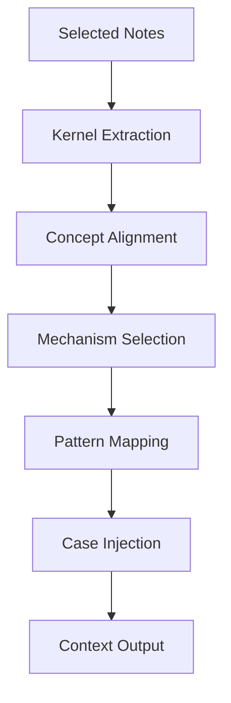

# Context Construction Rule

Context Construction Rule は  
Vault 内のノートを **LLMに渡すコンテキストとして組み立てる規則**である。

このルールの目的は次の4つ。

- Context Window最適化
- 推論精度向上
- ハルシネーション抑制
- 再現可能な推論

---

# Context Construction Pipeline



---

# Context Layer Structure

LLMに渡すコンテキストは **5層構造**とする。

```
Kernel
Concept
Mechanism
Pattern
Case
```

抽象 → 具体の順に並べる。

---

# Context Layout

LLMに渡すContextは以下の構造で構築する。

```
# Kernel

基本原理

# Concept

主要概念

# Mechanism

作用メカニズム

# Pattern

一般パターン

# Case

具体事例
```

この順序を崩さない。

---

# Kernel Extraction Rule

選択されたノートの中から  
**最も抽象的な原理を優先して抽出する。**

例

```
注意資源制約
限定合理性
社会的影響
```

Kernelは **最大3つまで**。

---

# Concept Alignment Rule

Conceptは

```
Kernelを説明する概念
```

を選ぶ。

例

```
認知
動機
権力
情報
```

Conceptは **最大5個**。

---

# Mechanism Selection Rule

Mechanismは

```
Kernel → Concept
```

を **因果的に接続するもの**を選ぶ。

例

```
Signaling Mechanism
Information Asymmetry
Coordination Mechanism
```

Mechanismは **最大5個**。

---

# Pattern Mapping Rule

Patternは

```
Mechanismの繰り返し構造
```

として選択する。

例

```
規範形成パターン
寡占パターン
炎上パターン
```

Patternは **最大5個**。

---

# Case Injection Rule

Caseは

```
Patternを説明する実例
```

として挿入する。

例

```
ドイツ革命1918
韓国併合
Twitter炎上事件
```

Caseは **最大3個**。

---

# Context Size Rule

Contextは次の範囲に制限する。

```
1500〜4000 tokens
```

超える場合は

1 Kernel優先  
2 Mechanism優先  
3 Case削減  

で削減する。

---

# Ordering Rule

Contextは必ず以下の順序で並べる。

```
Kernel
Concept
Mechanism
Pattern
Case
```

順序を変えると推論性能が低下する。

---

# Context Stability Rule

以下のルールを守る。

- Kernel優先
- Mechanism必須
- Caseは補助

つまり

```
Kernel > Mechanism > Pattern > Case
```

---

# Context Compression Rule

Context Window不足時は

```
Case削除
↓
Pattern要約
↓
Concept要約
```

の順で圧縮する。

Kernelは削除しない。

---

# Context Output Template

LLMに渡す最終形式。

```
# Kernel

...

# Concept

...

# Mechanism

...

# Pattern

...

# Case

...
```

---

# Related Notes

- [[LLM Runtime Rule]]
- [[System Prompt / Note Selection Rule]]
- [[Intent Interpretation]]
- [[Thinking Engine]]
- [[Constraint Monitor]]