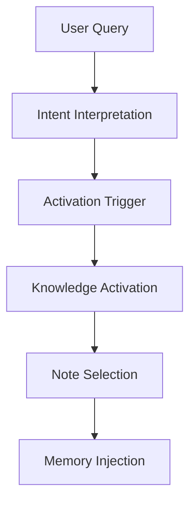
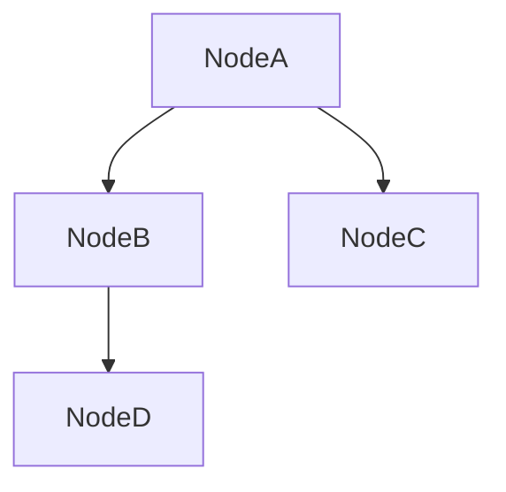

# Knowledge Activation Rule

Knowledge Activation Rule は  
Vault内の膨大なノートから **どの知識を起動するか**を決定する規則である。

Zettelkastenでは

```
全知識を読むことはできない
```

ため、LLMは **必要な知識だけを起動（activate）する。

この仕組みにより

- Context Window節約
- 推論速度向上
- 知識検索精度向上
- ハルシネーション抑制

を実現する。

---

# Knowledge Activation Pipeline



---

# Activation Trigger

知識起動は以下の **3種類のトリガー**によって開始される。

| Trigger | 内容 |
|---|---|
Concept Trigger | 概念一致 |
Mechanism Trigger | 原理一致 |
Pattern Trigger | 構造一致 |

---

# Concept Trigger

質問に含まれる **概念語**によってノートを起動する。

例

```
権力
認知
動機
都市
市場
```

この場合

```
Conceptノート
```

が起動する。

---

# Mechanism Trigger

質問が

```
なぜ
どうして
仕組み
メカニズム
```

を含む場合、Mechanismを起動する。

例

```
Signaling Mechanism
Coordination Mechanism
Information Asymmetry
```

---

# Pattern Trigger

質問が

```
繰り返し構造
歴史パターン
社会現象
```

を含む場合、Patternを起動する。

例

```
炎上パターン
寡占パターン
規範形成パターン
```

---

# Activation Priority

知識起動の優先順位。

```
Kernel
Mechanism
Pattern
Concept
Case
Structure
Method
Domain
```

---

# Activation Radius

1つのノートが起動した場合  
**リンクされたノートも探索する。**



ただし探索深度は

```
2リンクまで
```

とする。

---

# Activation Scope

LLMが同時に起動するノート数。

```
5〜12ノート
```

---

# Activation Types

知識起動には3種類ある。

| Type | 内容 |
|---|---|
Direct Activation | 直接一致 |
Semantic Activation | 意味一致 |
Structural Activation | 構造一致 |

---

# Direct Activation

質問語とノート名が一致。

例

```
韓国併合
限定合理性
寡占構造
```

---

# Semantic Activation

意味的に近い概念。

例

```
市場支配
→ 寡占
```

---

# Structural Activation

構造が一致。

例

```
権力集中
→ 寡占構造
```

---

# Activation Stop Rule

次の条件で探索停止する。

```
12ノート到達
```

または

```
Kernel + Mechanism + Pattern
```

が揃った時。

---

# Activation Output

Knowledge Activationの結果は

```
Activated Notes
```

として出力される。

```
Kernel
Mechanism
Pattern
Concept
Case
```

---

# Activation Stability Rule

知識起動は以下を守る。

- Kernel優先
- Mechanism必須
- Pattern優先

つまり

```
Kernel > Mechanism > Pattern
```

---

# Activation Template

LLM内部フォーマット。

```
Activated Kernel

Activated Mechanism

Activated Pattern

Activated Concept

Activated Case
```

---

# Related Notes

- [[Intent Interpretation]]
- [[Note Selection]]
- [[Memory Injection Rule]]
- [[Context Construction Rule]]
- [[Thinking Engine]]