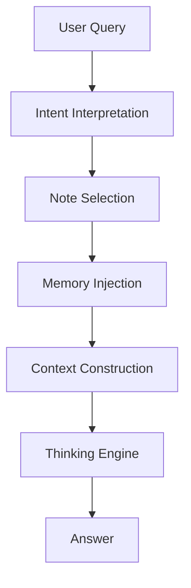
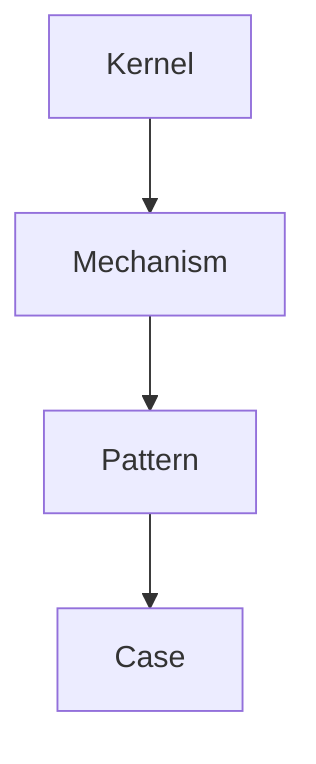

# Memory Injection Rule

Memory Injection Rule は  
Zettelkasten 内の知識を **LLM推論に注入する規則**である。

LLMは単体では長期記憶を持たないため  
Vaultの知識を **Runtime Memory として一時注入する**。

この仕組みにより

- 長期知識利用
- 推論精度向上
- ハルシネーション抑制
- 自動思考

が可能になる。

---

# Memory Injection Pipeline



---

# Memory Types

LLMに注入されるMemoryは4種類ある。

| Memory | 内容 |
|---|---|
Semantic Memory | 概念知識 |
Structural Memory | 構造知識 |
Mechanism Memory | 原理知識 |
Case Memory | 事例 |

---

# Memory Source

Memoryは以下のノートから取得する。

```
Kernel
Concept
Structure
Mechanism
Pattern
Case
Method
```

---

# Memory Priority

Memoryの優先順位は以下。

```
Kernel
Mechanism
Pattern
Concept
Case
Structure
Method
Domain
```

抽象度が高いものを優先する。

---

# Memory Injection Structure

LLMに渡すMemory構造。



この構造を **推論骨格**として使用する。

---

# Kernel Injection Rule

最初にKernelを注入する。

Kernelは

```
世界の基本原理
```

である。

例

```
限定合理性
注意資源制約
社会的影響
情報非対称
```

Kernelは最大3個。

---

# Mechanism Injection Rule

次にMechanismを注入する。

Mechanismは

```
Kernelが現実でどう作用するか
```

を説明する。

例

```
Signaling Mechanism
Coordination Mechanism
Free Rider Mechanism
```

最大5個。

---

# Pattern Injection Rule

Mechanismの **繰り返し構造**をPatternとして注入する。

例

```
寡占パターン
炎上パターン
規範形成パターン
```

最大5個。

---

# Case Injection Rule

Patternを説明する事例をCaseとして注入する。

例

```
ドイツ革命1918
韓国併合
Twitter炎上
```

最大3個。

---

# Memory Injection Depth

Memoryは最大 **4階層**まで。

```
Kernel
↓
Mechanism
↓
Pattern
↓
Case
```

これ以上深くすると推論が不安定になる。

---

# Memory Compression Rule

Context Window不足時の削減順。

```
Case削除
↓
Pattern要約
↓
Concept要約
```

Kernelは削除しない。

---

# Memory Stability Rule

LLMが推論するときは必ず

```
Kernel
↓
Mechanism
↓
Pattern
↓
Case
```

の順で思考する。

---

# Memory Consistency Rule

複数Memoryが矛盾する場合

```
Kernel優先
```

とする。

---

# Memory Injection Template

LLMに渡すMemoryテンプレート。

```
# Kernel

...

# Mechanism

...

# Pattern

...

# Case

...
```

---

# Related Notes

- [[LLM Runtime Rule]]
- [[System Prompt / Note Selection Rule]]
- [[Context Construction Rule]]
- [[Intent Interpretation]]
- [[Thinking Engine]]
- [[Constraint Monitor]]