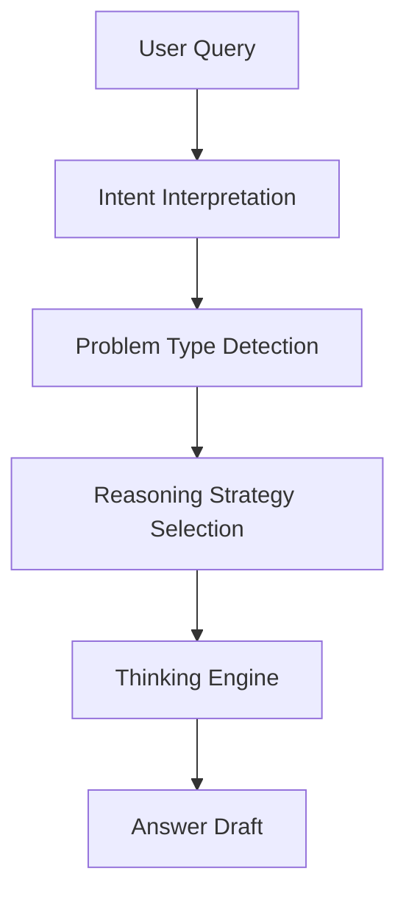
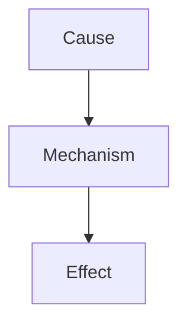
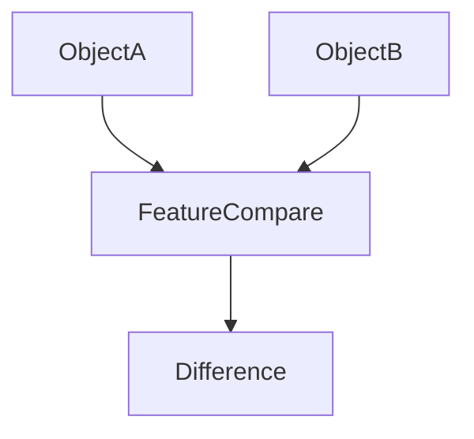
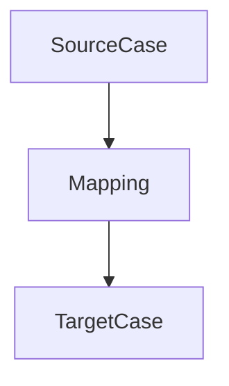
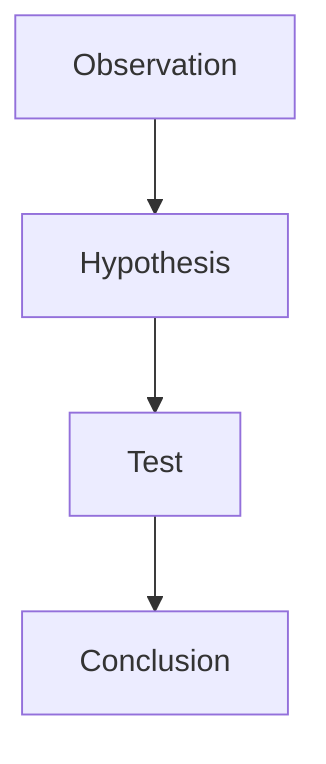
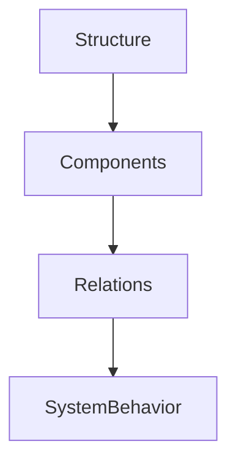

# Reasoning Strategy Rule

Reasoning Strategy Rule は  
LLMが問題を解くとき **どの推論戦略を使うかを決定する規則**である。

すべての問題は同じ推論方法で解けるわけではないため  
問題タイプに応じて **最適なReasoning Strategyを選択する。**

この仕組みにより

- 推論精度向上
- 推論速度向上
- ハルシネーション抑制
- Zettelkasten構造との整合

を実現する。

---

# Reasoning Strategy Pipeline



---

# Problem Types

問題は次のタイプに分類する。

| Type | 内容 |
|---|---|
Explanation | 原理説明 |
Causal | 原因分析 |
Comparison | 比較 |
Prediction | 予測 |
Design | 設計 |
Diagnosis | 問題特定 |

---

# Reasoning Strategies

LLMが使用する基本戦略。

| Strategy | 内容 |
|---|---|
Causal Reasoning | 因果推論 |
Comparative Reasoning | 比較推論 |
Analogical Reasoning | アナロジー |
Hypothesis Reasoning | 仮説推論 |
Structural Reasoning | 構造推論 |

---

# Strategy Selection Rule

問題タイプごとの戦略。

| Problem | Strategy |
|---|---|
Explanation | Structural Reasoning |
Causal | Causal Reasoning |
Comparison | Comparative Reasoning |
Prediction | Hypothesis Reasoning |
Design | Analogical Reasoning |
Diagnosis | Causal + Hypothesis |

---

# Causal Reasoning

因果関係を特定する。



使用ノート

```
Mechanism
Pattern
Case
```

---

# Comparative Reasoning

複数対象を比較する。



使用ノート

```
Concept
Structure
Pattern
```

---

# Analogical Reasoning

類似事例から推論する。



使用ノート

```
Pattern
Case
Mechanism
```

---

# Hypothesis Reasoning

仮説を生成して検証する。



使用ノート

```
Mechanism
Case
Method
```

---

# Structural Reasoning

構造を分析する。



使用ノート

```
Structure
Concept
Pattern
```

---

# Strategy Priority

複数戦略が必要な場合。

```
Causal
↓
Structural
↓
Comparative
↓
Analogical
↓
Hypothesis
```

---

# Strategy Depth

推論深度は最大

```
4 steps
```

とする。

例

```
Kernel
↓
Mechanism
↓
Pattern
↓
Case
```

---

# Strategy Stability Rule

推論は必ず

```
Mechanism説明
```

を含める。

Mechanismがない推論は

```
説明不足
```

と判断する。

---

# Strategy Output Structure

回答の基本構造。

```
結論
↓
構造
↓
メカニズム
↓
事例
```

---

# Related Notes

- [[Knowledge Activation Rule]]
- [[Memory Injection Rule]]
- [[Context Construction Rule]]
- [[Thinking Engine]]
- [[Self Reflection Rule]]