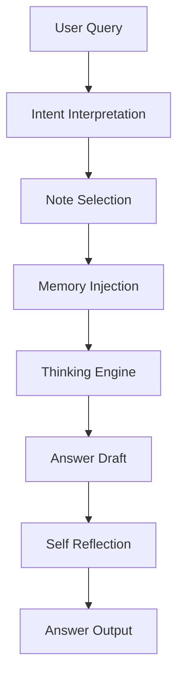
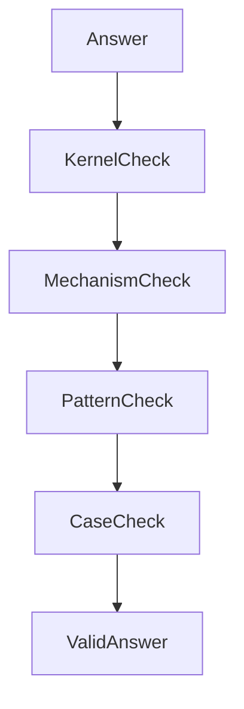
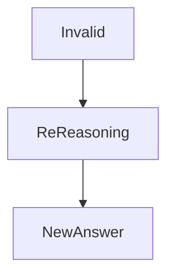

# Self-Reflection Rule

Self-Reflection Rule は  
LLMが生成した推論と回答を **自己検証する仕組み**を定義する。

LLMは生成時に誤推論・知識欠落・論理矛盾を起こす可能性があるため、  
回答前に **Reflection Phase** を挿入する。

この仕組みにより

- ハルシネーション抑制
- 推論品質向上
- 知識整合性確認
- Vault構造との整合

を実現する。

---

# Self-Reflection Pipeline



---

# Reflection Phase

Self-Reflectionは以下の4段階で行う。

| Phase | 内容 |
|---|---|
Consistency Check | 知識整合 |
Mechanism Check | 原理検証 |
Pattern Check | パターン検証 |
Case Check | 事例検証 |

---

# Consistency Check

回答が **Kernelと矛盾していないか**確認する。

例

```
限定合理性
注意資源制約
社会的影響
```

Kernelと矛盾する回答は修正する。

---

# Mechanism Check

回答が **Mechanismに基づいているか**確認する。

チェック項目

```
原因
作用
結果
```

Mechanismが存在しない回答は

```
説明不足
```

と判断する。

---

# Pattern Check

回答が **既知のPatternと一致するか**確認する。

例

```
規範形成パターン
寡占パターン
炎上パターン
```

Patternと一致しない場合は

```
新規パターン
```

として扱う。

---

# Case Check

回答が **実際のCaseで説明可能か**確認する。

例

```
ドイツ革命1918
韓国併合
SNS炎上
```

Caseで説明できない場合

```
抽象理論
```

として扱う。

---

# Reflection Decision Tree



---

# Reflection Output Types

Self-Reflectionの結果は3種類。

| Type | 内容 |
|---|---|
Valid | 問題なし |
Partial | 一部不十分 |
Invalid | 再推論必要 |

---

# Re-Reasoning Rule

Reflection結果が

```
Invalid
```

の場合

Thinking Engineを **再実行する。**



---

# Reflection Compression Rule

Reflectionは **簡潔に行う。**

最大

```
300 tokens
```

以内。

---

# Reflection Priority

Reflectionは次の順で行う。

```
Kernel
↓
Mechanism
↓
Pattern
↓
Case
```

---

# Reflection Template

LLM内部で使用するテンプレート。

```
Kernel consistency:
Mechanism explanation:
Pattern alignment:
Case verification:

Reflection result:
```

---

# Related Notes

- [[LLM Runtime Rule]]
- [[Memory Injection Rule]]
- [[Context Construction Rule]]
- [[Thinking Engine]]
- [[Constraint Monitor]]