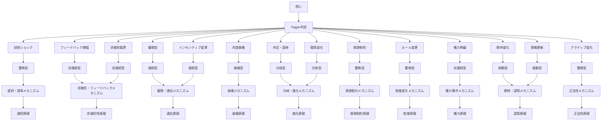

# Definition

Routing = Trigger → Transition → Mechanism → Kernel

---
# Purpose
問いを適切なKernel / Structure / Mechanismにルーティングする

---
# Flow
Question
→ Trigger特定
→ Transition特定
→ Mechanism選択
→ Kernel到達
→ Solution
→ Case
→ Pattern生成

---
# Kernel Routing

---

# Usage
1. 問いを分類
2. Kernelを特定
3. Structureを特定
4. Mechanismを選択
5. ContextとしてAIに渡す

---

