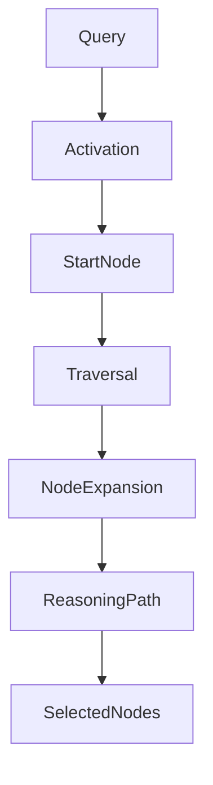
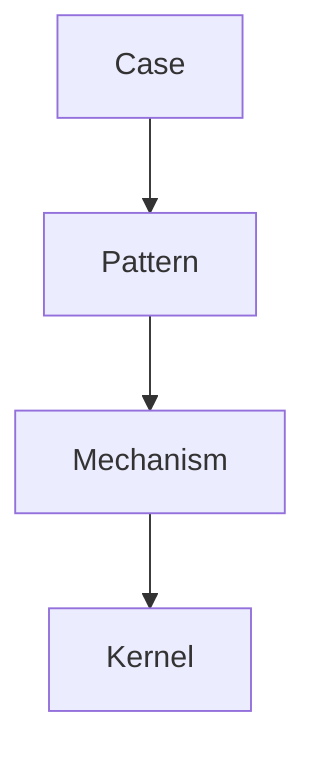
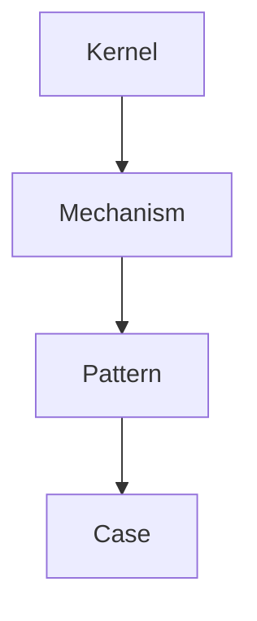
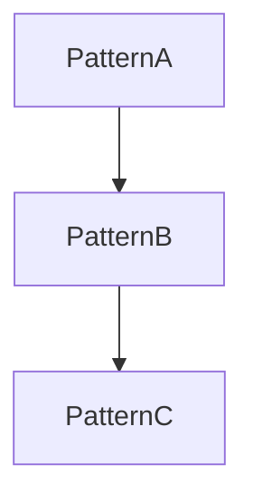
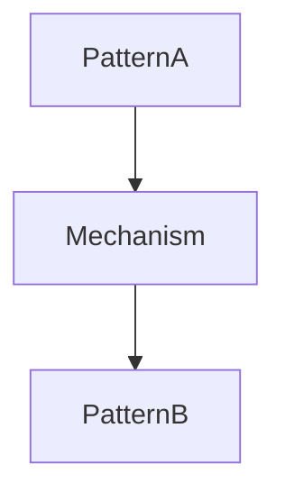

# Graph Traversal Rule

Graph Traversal Rule は  
Vault の Knowledge Graph を **推論のために探索する規則**である。

LLM はノートリンクを単なる参照ではなく

```
推論経路
```

として扱う。

---

# Traversal Architecture



---

# Traversal Nodes

探索対象ノード。

```
Kernel
Concept
Structure
Mechanism
Pattern
Case
Method
Domain
```

---

# Edge Types

ノート間関係。

| Edge | 意味 |
|----|----|
is_a | 概念分類 |
instance_of | 具体例 |
part_of | 構成要素 |
causes | 因果 |
related_to | 関連 |

---

# Traversal Strategies

Vault探索には **4つの戦略**を使う。

```
Upward Traversal
Downward Traversal
Lateral Traversal
Bridge Traversal
```

---

# Upward Traversal

抽象概念へ向かう探索。



目的

```
原理理解
```

---

# Downward Traversal

具体例へ向かう探索。



目的

```
説明具体化
```

---

# Lateral Traversal

同レベル探索。



目的

```
類似パターン発見
```

---

# Bridge Traversal

異なる Domain を接続する探索。



目的

```
クロスドメイン推論
```

---

# Traversal Priority

探索優先順位。

```
Mechanism
↓
Pattern
↓
Case
↓
Concept
↓
Structure
```

理由

```
Mechanism = 推論の中心
```

---

# Activation Score

ノードはスコアで優先度を決める。

```
Activation Score =
 relevance
 + mechanism_match
 + pattern_match
 + graph_distance
```

---

# Traversal Depth

最大探索深度。

```
3 hops
```

理由

```
4以上でノイズ増大
```

---

# Node Expansion

探索ノードは次の条件で拡張。

```
Mechanismノード
Patternノード
Conceptノード
```

Caseは基本的に末端ノード。

---

# Reasoning Path

LLMが構築する推論経路。

```
Case
↓
Pattern
↓
Mechanism
↓
Kernel
```

または

```
Concept
↓
Structure
↓
Pattern
↓
Case
```

---

# Traversal Stop Rule

探索は以下で停止。

```
Kernel + Mechanism + Pattern
```

が揃った時。

または

```
12ノード
```

到達。

---

# Traversal Output

出力。

```
Activated Nodes
Reasoning Path
Selected Context
```

---

# Traversal Template

LLM内部探索形式。

```
Start Node:

Upward:

Downward:

Lateral:

Bridge:

Reasoning Path:

Activated Nodes:
```

---

# Related Notes

- [[02_zettelkasten/00_hub/Vault Knowledge Graph Architecture]]
- [[Knowledge Activation Rule]]
- [[Reasoning Strategy Rule]]
- [[Inference Engine Hub]]