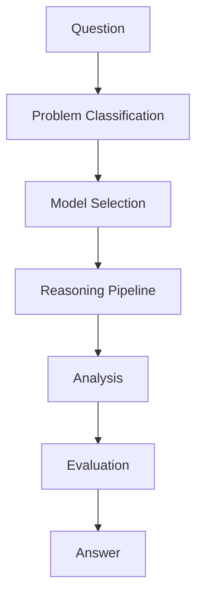

# Inference Hub

Inference Layer は、質問に対してAIがどの知識をどの順序で使用するかを定義する推論制御層である。

---

# 目的

- 問題分類
- 理論選択
- 推論手順の指定
- 結果評価

---

# 推論構造

---

# 構成ノート

## 推論制御

- [[Problem Classification]]
- [[モデル選択]]
- [[Reasoning Pipeline]]

## 評価

- [[評価基準]]
- [[出力構造]]

# ルール
- [[Context Construction Rule]]
- [[Knowledge Activation Rule]]
- [[Memory Injection Rule]]
- [[Reasoning Strategy Rule]]
- [[Self Reflection Rule]]