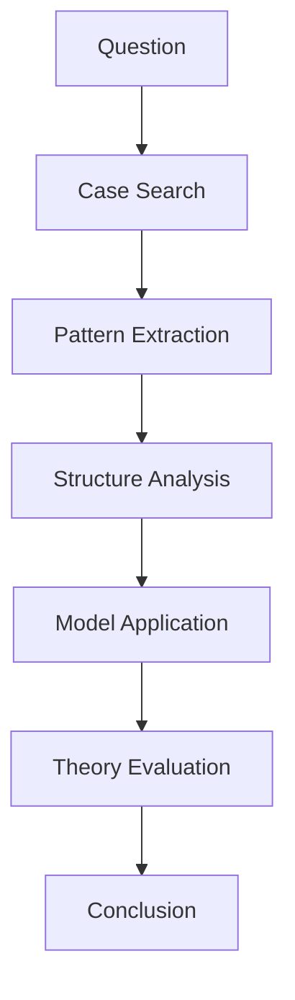

# Reasoning Pipeline

AIが分析を行う手順。

---

# 推論手順

---

# 手順説明

## Case Search

関連事例を探索する。

---

## Pattern Extraction

繰り返し現れるパターンを抽出する。

---

## Structure Analysis

現象の構造を分析する。

---

## Model Application

適切なモデルを適用する。

---

## Theory Evaluation

理論による説明を評価する。