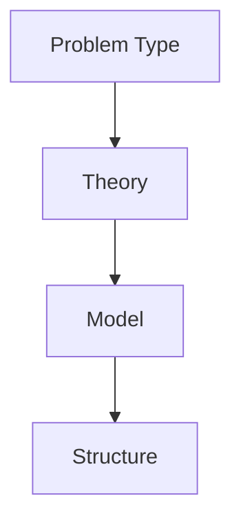

# Model Selector

問題タイプに応じて使用する理論・モデルを選択する。

---

# 選択構造

---

# 選択例

## 行動問題

- [[限定合理性理論]]
- [[期待価値モデル]]

---

## 社会問題

- [[社会規範形成理論]]
- [[権力集中理論]]

---

## 組織問題

- [[官僚制理論]]
- [[組織サイロ理論]]

---

## 歴史問題

- [[制度進化理論]]
- [[帝国拡張理論]]