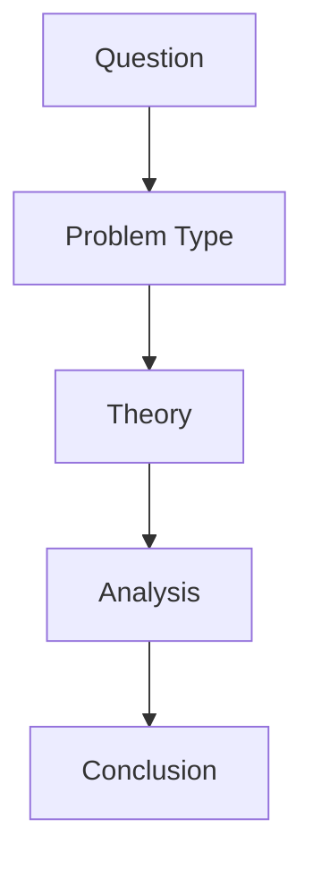

# Output Structure

AIの回答構造を定義する。

---

# 回答構造

```mermaid
graph TD

A[Question] --> B[Problem Type]
B --> C[Theory]
C --> D[Analysis]
D --> E[Conclusion]
```

---

# 出力形式

## 問題

質問内容

---

## 分析

使用した理論とモデル

---

## 結論

推論結果