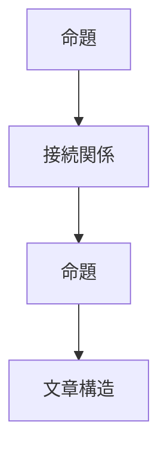

# 命題構造

命題とは、ある対象について 何かを主張する文のこと。

例
- 水は100℃で沸騰する
命題は文章の最小論理単位である。

---

# 命題の基本構造

命題は次の構造を持つ。
1. 主体
2. 性質 / 行為
3. 対象

---
# 命題の構造図

# 種類
## 1 存在命題
存在を主張する。
### 例
日本には富士山がある
### 構造
場所
↓
存在
↓
対象
## 2 属性命題
対象の性質を述べる。
### 例
富士山は高い
### 構造
主体
↓
属性
↓
性質
## 3 因果命題
原因と結果。
### 例
雨が降ったので川が増水した
### 構造
原因
↓
結果
## 4 行為命題
主体の行動。
### 例
彼は本を読んだ
### 構造
主体
↓
行為
↓
対象

文章は命題の列である。
### 例

命題1
↓
命題2
↓
命題3
この命題同士をつなぐのが接続関係である。
→ [[接続関係構造]]

# 完全構造
命題
↓
接続関係
↓
文章構造

## 思考OSとの関係
この構造は次の層の基礎になる。

命題
↓
文章
↓
議論
↓
理論
↓
世界モデル

命題構造を理解すると、論理の分解、議論の分析、知識整理、AIプロンプト設計が可能になる。