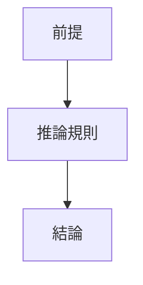
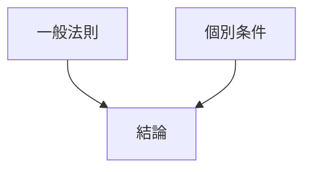
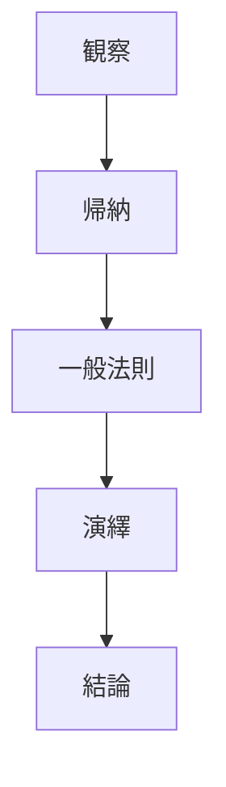

# 推論構造

推論とはある命題から 別の命題を導く過程である。

---

# 推論の基本構造

推論は次の形を持つ。
前提 ↓ 推論規則 ↓ 結論
コードをコピーする

---

# 構造図

# 類型
推論は大きく3種類ある。
## 1 演繹（Deduction）
一般原理から個別結論を導く。
### 構造
一般法則
↓
個別条件
↓
結論
### 例
コードをコピーする

すべての人は死ぬ
↓
ソクラテスは人である
↓
ソクラテスは死ぬ

### 特徴
論理的必然性
- 数学
- 法律
- 規則適用
## 2 帰納（Induction）
個別事例から一般法則を導く。
### 構造

事例1
事例2
事例3
↓
一般化
### 例
カラスAは黒い
カラスBは黒い
カラスCは黒い
↓
カラスは黒い
### 特徴
- 科学
- 統計
- 経験知
## 3 仮説推論（Abduction）
観察結果を説明する仮説を立てる。
### 構造
観察
↓
仮説
### 例
地面が濡れている
↓
雨が降ったのかもしれない
### 特徴
- 探偵推理
- 医療診断
- 科学仮説
推論構造の全体図

### 命題との関係
推論は
命題
↓
命題
↓
命題
の関係である。つまり、推論 = 命題ネットワーク
である。
### 文章との関係
文章は命題の列である。
議論は推論の連鎖である。
# 思考OSの構造
このstructureは次の階層を形成する。
命題構造
↓
接続関係
↓
文章構造
↓
推論構造
### 意味
推論構造を理解すると
- 議論の正当性検証
- 説明構造の設計
- AIプロンプト設計
- 思考の分解
が可能になる。