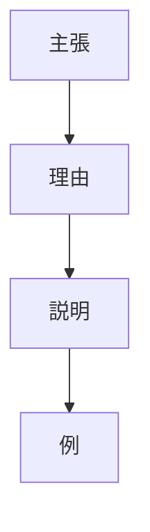
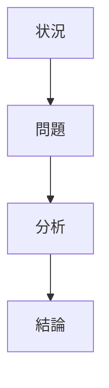

# 論理展開構造

文章は、どの順序で命題を配置するかによって構造が決まる。
論理展開構造 ×接続関係によって構成要素される
基本的には次の2型が存在する。

---
# 類型
## 1 結論先行型

結論を最初に提示し、その後で理由や説明を行う。

### 構造

### 特徴
- ビジネス文章
- 論文
- プレゼン
- 報告書
### 例
- 私はAが必要だ。
- なぜならBだからだ。
- 例えばCである。
## 2 説明先行型
状況や背景を説明してから結論を提示する。
### 構造

### 特徴
- エッセイ
- 歴史叙述
- 講義
- 物語
### 例
1. Aという問題がある。
2. その原因はBである。
3. したがってCが必要になる。