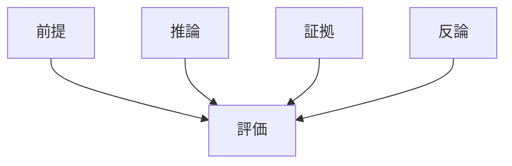
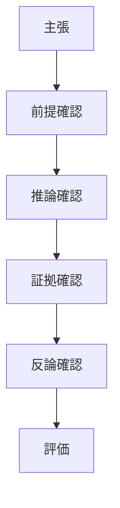

# 論証評価構造

論証評価とは、議論の妥当性と強度を評価する方法である。

---

# 評価の基本構造

議論は次の要素で評価できる。
- 前提の真偽
- 推論の妥当性
- 証拠の強さ
- 反論への耐性

---

# 構造図

# 要素
## 1 前提の妥当性
前提が正しいか。
### 例
人間はすべて利己的である
のような前提は疑う必要がある。
### 評価視点
- 事実か
- 仮定か
- 偏見か
## 2 推論の妥当性
論理が成立しているか。
### 例
誤った推論
AならB
BだからA
これは後件肯定の誤謬である。
## 3 証拠の強さ
証拠がどれほど信頼できるか。
### 評価要素
データ量
- 再現性
- 出典
- バイアス
## 4 反論への耐性
反論が成立するか。強い議論は
反論
↓
再反論
を持つ。
議論の強さ = 前提の確かさ × 推論の妥当性 × 証拠の強さ
# 典型的な誤謬
## 1 権威への訴え
例
専門家が言っている。だから正しい
## 2 感情への訴え
例
かわいそうだから正しい
## 3 藁人形論法
相手の主張を弱くして攻撃する。
## 4 偽の二分法
AかBかしかない
# 評価フロー

# 思考OSとの関係
この構造は
命題
↓
推論
↓
議論
↓
論証評価
の層にある。
# 意味
論証評価を理解すると
- 議論の強弱判定
- 誤謬の発見
- AI回答評価
- 論文レビュー
が可能になる。