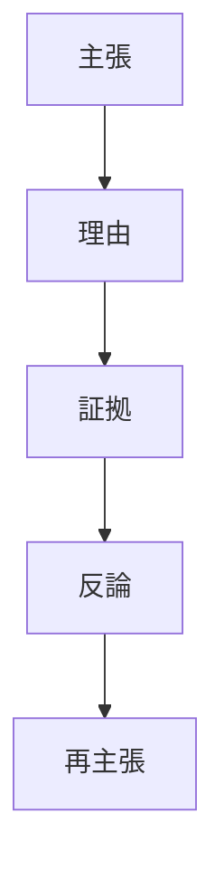
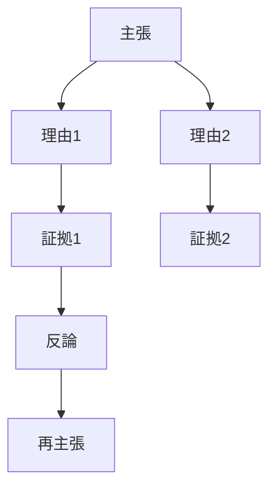

# 議論構造

議論とは、ある主張を理由と証拠によって正当化する構造である。

---

# 議論の基本構造

議論は次の要素から構成される。
主張 
↓
理由
↓
証拠
↓
反論 
↓ 
再主張

---

# 構造図

# 要素
## 1 主張（Claim）
議論の結論。
例
都市は公共交通中心で設計するべきだ
# 2 理由（Reason）
主張を支持する論理。
例
自動車中心都市は交通渋滞と環境問題を生む
## 3 証拠（Evidence）
理由を裏付ける事実。
例
多くの都市で公共交通中心都市の方が渋滞が少ない
## 4 反論（Counterargument）
主張に対する批判。
例
公共交通は建設費が高い
## 5 再主張（Rebuttal）
反論への回答。
例
長期的には交通コストを削減する
# 議論の完全構造

# 推論との関係
推論は
前提
↓
結論
である。

議論は
主張
↓
推論
↓
証拠
である。
# 思考OSでの位置
議論構造は次の階層にある。

命題
↓
推論
↓
議論
↓
理論
# 応用
議論構造は次の分野で使われる。
- 論文
- 法律
- 政策
- ビジネス
- AIプロンプト