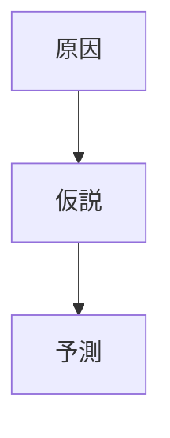

  
# 仮説構造  
  
仮説とは原因と解決の仮定である。  
  
---  
  
# 構造  

原因  
↓  
仮説  
↓  
予測

  
---  
  
# 構造図  
  

```mermaid  
flowchart TD  
  
A[原因]  
B[仮説]  
C[予測]  
  
A --> B  
B --> C
```

---

# 方法
- 実験    
- 観察    
- 統計