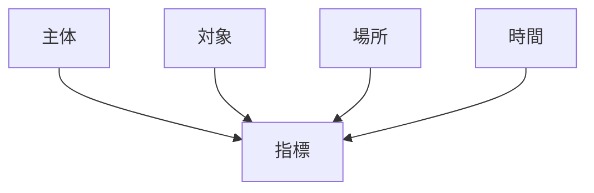

# 問題定義構造
問題を明確化するプロセス。

---

# 基本構造
- 主体  
- 対象  
- 場所  
- 時間  
- 指標

---

# 構造図

```mermaid
flowchart TD

A[主体]
B[対象]
C[場所]
D[時間]
E[指標]

A --> E
B --> E
C --> E
D --> E
```

---

# 例
主体：観光客  
対象：滞在時間  
場所：京都  
指標：平均滞在時間