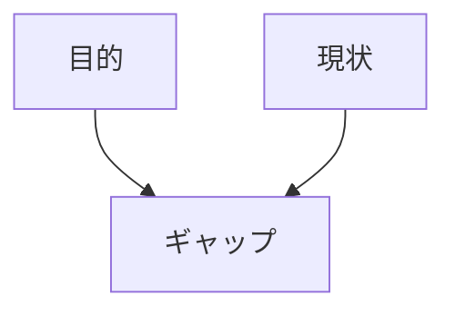

 # 問題構造  
問題とは目的と現状の差（ギャップ）である。  
目的− 現状 = 問題
  
---  
  
# 構造  

```mermaid  
flowchart TD  
  
A[目的]  
B[現状]  
C[ギャップ]  
  
A --> C  
B --> C
```
---

# 問題解決プロセス
問題  
↓  
原因  
↓  
仮説  
↓  
検証  
↓  
解決

---

# 意味
問題を定義しない限り、
- 分析
- 仮説  
- 解決
は成立しない。