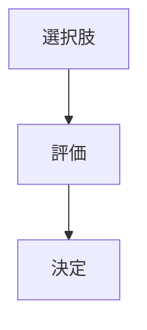

# 意思決定構造  
  
複数の選択肢から最適を選ぶプロセス。  
  
---  
  
# 基本構造

選択肢  
↓  
評価  
↓  
決定

---  
  
# 構造図  
  

```mermaid  
flowchart TD  
  
A[選択肢]  
B[評価]  
C[決定]  
  
A --> B --> C
```

---

# 評価基準

- コスト    
- 効果    
- リスク