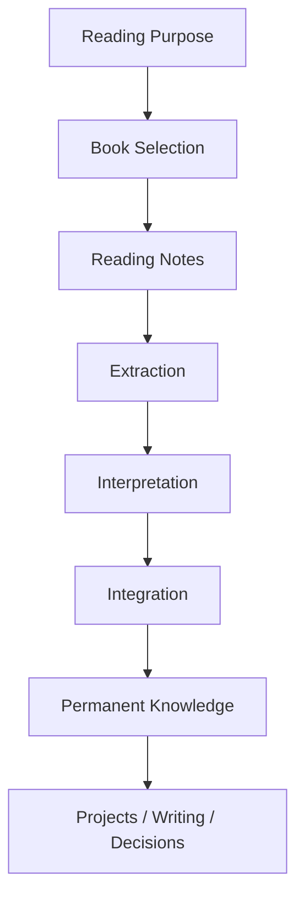
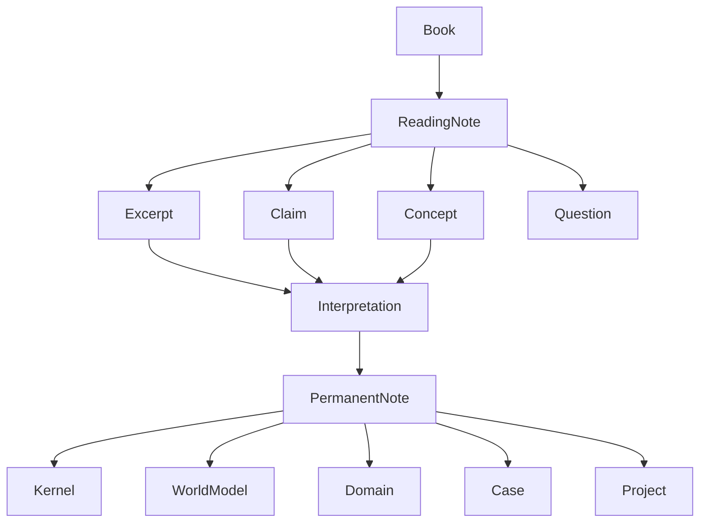

# Reading System Hub

読書OSの中心ノード。

目的は  
**本を「読む」ことではなく、知識を抽出・構造化し、思考OSへ統合すること。**

---

# Reading Philosophy

読書は次のプロセスで行う。

1. **Purpose**
2. **Reading**
3. **Extraction**
4. **Interpretation**
5. **Integration**
6. **Output**

# Reading Structures
読書OSの構造ノート
- [[読書目的構造]]
- [[Reading Workflow]]
- [[Extraction Structure]]
- [[Argument Structure]]
- [[Interpretation Structure]]
- [[Integration Structure]]
- [[Reading Evaluation Structure]]
# Reading Pipeline

# Reading Library
## Reading Now
現在読んでいる本
- 
## Reading Queue
これから読む本
- 
## Completed Books
読了した本
- 
# Knowledge Extraction
読書から生成された知識
## Permanent Notes
- 
## Concepts
- 
## Kernels
- 
## World Models
- 
# Reading Questions
読書を通じて検討する問い
- 

# Reading Principles
このVaultにおける読書原則
- 引用だけで終わらない
- 主張と根拠を分解する
- 概念を定義する
- 他の知識と接続する
- 行動や思考へ転用する
# Good Reading Criteria
良い読書とは次を満たすもの
- 本の中心問いを説明できる
- 著者の結論を説明できる
- 根拠を説明できる
- 前提と限界を説明できる
- 自分のOSへ接続できる
# Related Systems
- [[old zettelkasten/hub/Knowledge System]]
- [[World Model]]
- [[Kernel]]
- [[Problem Structure]]
- [[Observation Structure]]