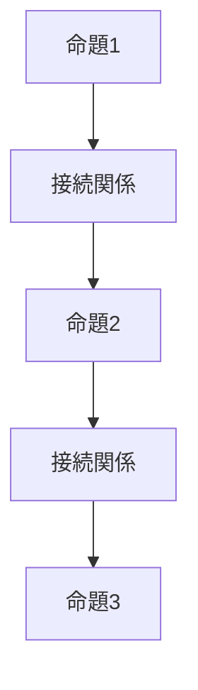
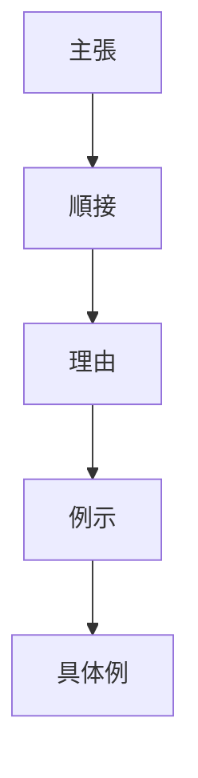

# 文章構造

文章は次の要素から構成される。
1. 命題
2. 論理関係
3. 文章構造

---

# 文章構造の基本モデル

# 構造要素
文章は次の二つの構造の組み合わせで成立する。
## 1 論理展開構造
命題をどの順序で配置するか。
→ [[論理展開構造]]
例
- 結論先行型
- 説明先行型
## 2 接続関係構造
命題と命題の論理関係。
→ [[接続関係構造]]
例
- 順接
- 逆接
- 対比
- 例示
# 完全モデル
文章は次の構造になる。

意味
文章は、命題の列 + 論理関係で構成される。
つまり、文章 = 論理展開構造 × 接続関係である。
# 応用
このモデルは
- 論文
- 説明文
- 議論
- AIプロンプト
- 知識整理
に利用できる。