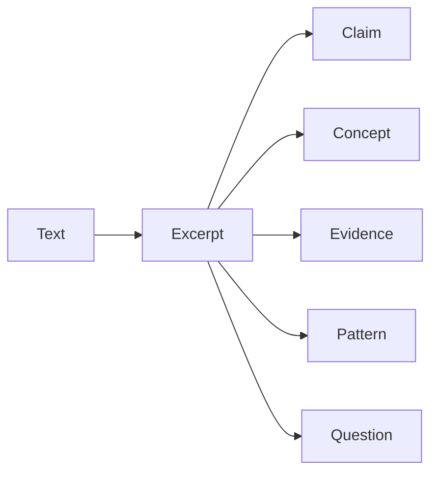
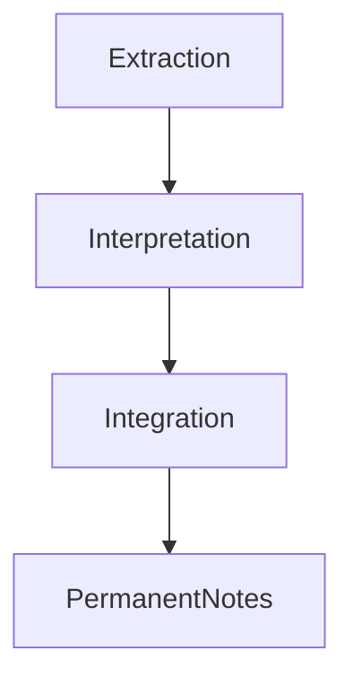
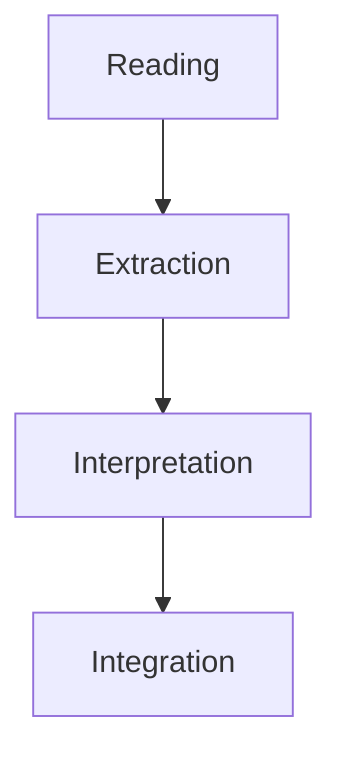

# Extraction Structure

読書における知識抽出の構造。

目的は  
**本文を再利用可能な知識単位へ分解すること。**

読書OSでは本文を次の要素へ分解する。

- Excerpt
- Claim
- Concept
- Evidence
- Pattern
- Question

---

# Extraction Pipeline


# Extraction Units
## Excerpt
本文の重要引用。
### 目的
- 原文保存
- 文脈保持
### 例
- 定義
- 印象的な文
- 重要命題
### 注意
Excerptは 知識ではない。ただの素材である。
## Claim
著者の主張。
### 定義
著者が 正しいと主張している命題
### 例
- 国家は戦争を通じて形成された
- 市場は情報を分散的に処理する
- 官僚制は効率と硬直を同時に生む
## Concept
概念。
### 定義
現象を説明するためのカテゴリー。
### 例
- 官僚制
- 近代国家
- 集団心理
- 市場競争
概念は、定義・使用方法・適用範囲を記録する。
## Evidence
主張の根拠。
### 種類
- 歴史事例
- 統計
- 実験
- 観察
## Pattern
現実の構造パターン。
### 定義
複数事例に共通する構造。
###例
- 帝国の意思決定硬直
- 組織の自己保存
- 戦争による国家形成
Patternは Kernel候補になる。
## Question
疑問。
### 種類
- 未解決問題
- 反例
- 前提疑
- 他理論との矛盾
# Extraction Depth
抽出の深さは5段階ある。 

|Level|内容|
|---|---|
|L1|重要引用|
|L2|主張|
|L3|概念|
|L4|論証|
|L5|構造|
# Claim Decomposition
主張は次の要素に分解する。
```Mermaid
flowchart TD

Claim --> Assumption
Claim --> Evidence
Claim --> Mechanism
Claim --> Scope
```

|要素|内容|
|---|---|
|Assumption|前提|
|Evidence|根拠|
|Mechanism|因果|
|Scope|適用範囲|

# Concept Extraction
概念抽出では次を記録する。
- 定義
- 使用文脈
- 他概念との差
- 適用範囲
# Pattern Detection
パターンは次の方法で見つかる。
-  事例比較
- 因果分析
- 繰り返し観察
PatternはKernel、World Modelへ接続する。
# Question Extraction
疑問は知識成長の起点。
## 種類

|Type|内容|
|---|---|
|Clarification|定義不明|
|Challenge|反例|
|Extension|他分野応用|
|Research|未解決問題|
# Extraction Example
### 例
本文：官僚制は効率的だが硬直化しやすい
### Extraction

|type|記録例|
|---|---|
|Excerpt|官僚制は効率的だが硬直化しやすい|
|Claim|官僚制は効率と硬直性のトレードオフを持つ|
|Concept|官僚制|
|Pattern|組織は効率化と柔軟性のトレードオフを持つ|

## Extraction Output
抽出結果は次へ進む。


## BadExtraction
よくある失敗
- 引用だけ保存
- 感想を書く
- 要約するだけ
これでは知識が再利用できない。
## Good Extraction
良い抽出は次を含む。
- 主張
- 概念
- 根拠
- 因果
- パターン
- 疑問
# Role in Reading OS
Extractionは読書OSの中心。


Extractionの質が読書の価値を決める。