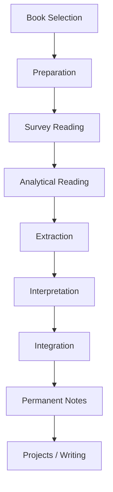
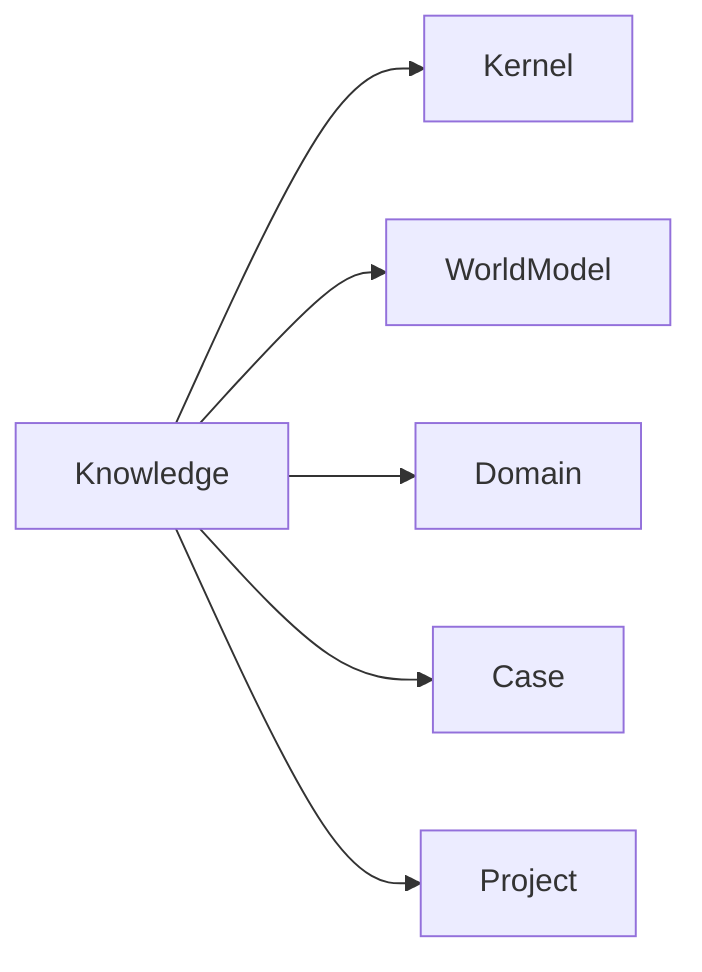

# Reading Workflow

読書OSの実行フロー。

目的は  
**本の情報を再利用可能な知識へ変換すること。**

読書は次の段階で行う。

1. Preparation  
2. Survey  
3. Reading  
4. Extraction  
5. Interpretation  
6. Integration  
7. Output

---

# Reading Pipeline

# 読書フェーズ
## Phase 1 Preparation
読む前に行う準備。
### Purpose Definition
何のために読むかを定義する。
参照
[[読書目的構造]]
例
- knowledge acquisition
- conceptual understanding
- argument analysis
- pattern discovery
- practical application
## Context Check
本の位置づけを確認する。
### 確認項目
- 著者
- 出版年
- 学派
- 対立理論
## Reading Questions
読む前に問いを作る。
### 例
- この本の中心問いは何か
- 著者の主張は何か
- どの理論と対立しているか
## Phase 2 Survey Reading
本の全体構造を把握する。
### 読む対象
- 目次
- 序章
- 結論
- 各章の冒頭
- 目的
- 本の主題
- 問い
- 結論
- 構造
を把握する。
## Survey Output
- 読書ノートに記録
- 主題
- 中心問い
- 著者の結論
- 章構造
## Phase 3 Analytical Reading
本文を読む段階。
### 目的
著者の論理構造を理解する。
- 対象
- 主張
- 根拠
- 事例
- 概念
### Analytical Questions
読む際の質問
- 著者は何を主張しているか
- 何を根拠にしているか
- どの概念を使っているか
- どの前提に立っているか
- どの反論を想定しているか
## Phase 4 Extraction
本文から知識要素を抽出する。
参照
[[Extraction Structure]]
### 抽出対象
- Excerpts
- Claims 
- Concepts
- Evidence
- Questions
- Extraction Units
### 抽出単位
- Unit（内容）
- Excerpt（重要引用）
- Claim（著者の主張）
- Concept（概念）
- Pattern（構造）
- Question（疑問)
## Phase 5 Interpretation
抽出した内容を自分の言葉で再記述する。
### 目的
- 理解の確認
- 再利用可能な知識化
### Interpretation Questions
- 要するに何を言っているか
- どの範囲で正しいか
- 前提は何か
- 他理論とどう違うか
## Phase 6 Integration
抽出した知識を思考OSへ接続する。
### 参照
[[Integration Structure]]
### 接続先
- Kernel
- World Model
- Domain
- Case
- Project
- Integration Map

## Phase 7 Output
読書結果を外部化する。
### 生成物
- Permanent Notes
- Concept Notes
- Argument Notes
- Writing Ideas
- Project Ideas
- Reading Artifacts
### 読書OSで生成されるノート
- Artifact（内容）
- Book Note（本の読書ノート）
- Excerpt（重要引用）
- Concept Note（概念）
- Claim Note（主張）
- Permanent Note（知識）
### Minimal Workflow
最小構成の読書フロー
1. Purpose
2. Survey
3. Reading
4. Extraction
5. Integration
### Failure Patterns
読書の典型的失敗
- 目的なし読書
- 引用だけメモ
- 感想で終わる
- 構造を見ない
- OSへ接続しない
## Good Reading
良い読書とは
- 問いを理解する
- 主張を理解する
- 根拠を理解する
- 構造を理解する
- 自分の体系へ統合する