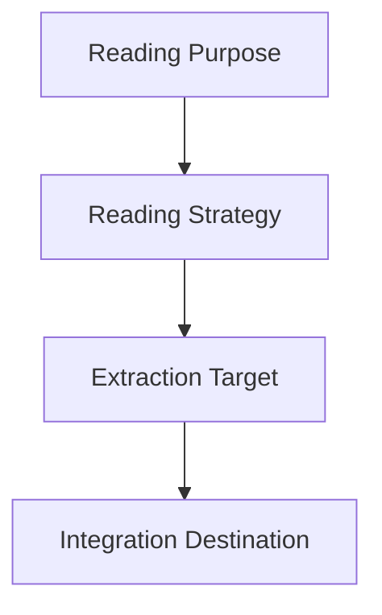
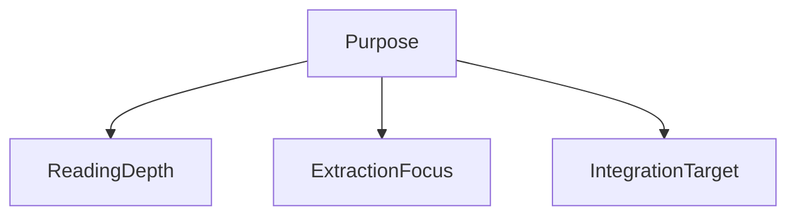

# Reading Purpose Structure

読書の目的を定義する構造。
本は同じでも、目的によって読む深さ・抽出対象・処理方法が変わる。
そのため読書は、必ず **Purpose → Reading → Extraction → Integration** の順に設計する。

---

# Purpose in Reading OS

読書OSにおける基本構造

| 層           | 内容       |
| ----------- | -------- |
| Purpose     | なぜ読むのか   |
| Strategy    | どの粒度で読むか |
| Extraction  | 何を抽出するか  |
| Integration | どこに接続するか |
# Purpose Types
読書目的は大きく6種類に分類される。
## 1 Knowledge Acquisition
知識獲得型読書
### 目的
知識・事実・概念を増やす
### 例
- 教科書
- 入門書
- 概説書
### 抽出対象
- 用語
- 定義
- 基礎概念
### 接続先
- Domain
- World Model
## 2 Conceptual Understanding
概念理解型読書
### 目的
概念体系や理論構造を理解する
### 例
- 社会科学
- 哲学
- 思想
### 抽出対象
- 概念
- 定義
- 理論構造
### 接続先
- Kernel
- World Model
## 3 Argument Analysis
議論分析型読書
### 目的
著者の論理構造を理解する
### 例
- 歴史研究
- 学術書
- 政治論
### 抽出対象
- 主張
- 根拠
- 前提
- 反論
### 接続先
- Kernel
- Analytical Structures
## 4 Pattern Discovery
パターン探索型読書
### 目的
現実の構造パターンを見つける
### 例
- 歴史書
- 経済書
- 社会分析
### 抽出対象
- 因果
- パターン
- 繰り返し構造
### 接続先
- World Model
- Kernel
## 5 Practical Application
実務転用型読書
### 目的
仕事・事業・実務に使う
例
- ビジネス書
- マニュアル
- 法律
### 抽出対象
- 手法
- フレームワーク
- 手順
### 接続先
- Domain
- Project
## 6 Intellectual Exploration
思考拡張型読書
### 目的
思考の幅を広げる
### 例
- 文学
- エッセイ
- 思想書
### 抽出対象
- 視点
- 問い
- 比喩
### 接続先
- Question
- Case
- Concept
# Reading Depth
目的によって読む深さが変わる。

|Level|読書深度|
|---|---|
|L1|概要把握|
|L2|章構造理解|
|L3|主張理解|
|L4|論証理解|
|L5|構造抽出|
# Purpose → Strategy

例

|Purpose|Depth|Extraction|
|---|---|---|
|Knowledge|L2|概念|
|Conceptual|L4|理論|
|Argument|L5|論証|
|Pattern|L5|因果|
|Practical|L3|手法|
# Reading Modes
読書OSでは次の3モードを使い分ける。
## Survey Mode
全体を把握する
- 対象
- 目次
- 序章
- 結論
## Analytical Mode
論理を分解する
- 対象
- 主張
- 根拠
- 構造
## Integration Mode
自分のOSへ接続する
対象
- Kernel
- World Model
- Domain
- Case
## Purpose Declaration
各本の読書ノートでは必ず目的を宣言する。
これにより読書方法が決まる。
# Misreading Problem
読書の失敗の多くは
目的が未定義のまま読むことで起きる。
例
- 面白い本だった
- 勉強になった
これは知識として再利用できない。
# Good Reading
良い読書は次の条件を満たす
- 本の問いを言える
- 著者の結論を言える
- 根拠を言える
- 前提を言える
- OSへ接続できる
