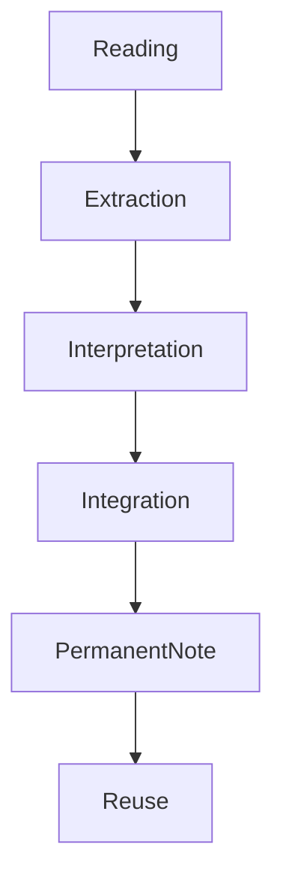
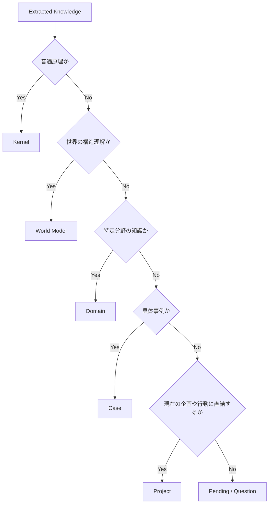
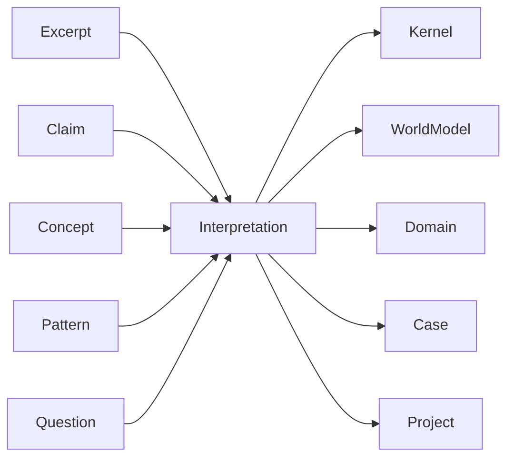
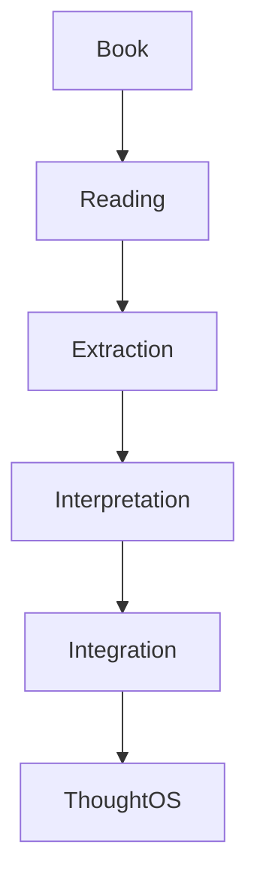

# Integration Structure

読書で抽出した知識を、思考OS全体へ接続する構造。
目的は、読んだ内容を一時的なメモで終わらせず、再利用可能な知識として配置すること。
読書OSにおいて統合とは、
- 抽出した主張
- 概念
- 根拠
- パターン
- 疑問
を、適切な知識層へ振り分ける作業である。

---

# Position in Reading OS

Integration は、読書OSと思考OSの接続点である。
# Integration Targets
読書で得た知識は、主に次の層へ接続される。
## 1 Kernel
普遍性の高い原理・作用・傾向。
### 接続するもの
- 因果パターン
- 制約構造
- インセンティブ構造
- 情報構造
- 権力構造
- 認知バイアス
- トレードオフ
### 例
- 官僚制は効率と硬直性を同時に生む
- 組織は自己保存に傾く
- 情報の非対称性は判断を歪める
### 判断基準
- 分野を越えて再利用できるか
- 他事例にも適用できるか
- 現象の背後にある作用として読めるか
## 2 World Model
世界の構造理解。
### 接続するもの
- 国家
- 組織
- 市場
- 社会
- 個人
- 技術
- 制度
- 文化
### 例
- 近代国家は徴税・徴兵・官僚制により統合される
- 市場は価格を通じて分散情報を処理する
- 組織は階層化によって調整コストを下げる
### 判断基準
- 現実世界の構造理解に資するか
- 特定分野ではなく世界理解の部品になるか
- 構造モデルとして保持する価値があるか
## 3 Domain
特定分野の知識。
### 接続するもの
- 法律知識
- 観光知識
- 経営知識
- 歴史知識
- デザイン知識
- 交通実務知識
### 例
- 旅行業法における媒介と募集の区別
- バス運行管理における点呼と記録義務
- 観光地評価における探索難易度の考え方
### 判断基準
- 特定分野に依存するか
- 普遍理論より実務知識に近いか
- その分野のストックとして保持すべきか
## 4 Case
具体的な事例・出来事・個別分析。
### 接続するもの
- 歴史事件
- 企業事例
- 政策事例
- 失敗事例
- 成功事例
- 人物事例
### 例
- デイリー・テレグラフ事件
- 1918年春季攻勢
- ある会社の離職事例
- 特定観光地の開発事例
###判断基準
- 一般理論ではなく具体例か
- 時間・場所・主体が特定できるか
- 比較材料として残す価値があるか
## 5 Project
現在の課題・企画・実装対象。
### 接続するもの
- 事業仮説
- 実務改善案
- 執筆テーマ
- 学習計画
- OS改善案
### 例
- バス会社向け業務OSへの反映
- 観光地評価モデルへの反映
- 営業OSの提案設計改善
- 法律テンプレ整備への反映
- 判断基準
- 今の行動や設計に直結するか
- 具体的な次の一手を変えるか
- 実装・執筆・判断に使う予定があるか
# Integration Logic
統合は次の問いで判断する。

# Integration Questions
統合時には次を問う。
## Kernel 判定
- これは分野を越えて使えるか
- 作用原理として言い換えられるか
- 他の事例でも成立しそうか
## World Model 判定
- これは世界のどの層の構造を説明しているか
- 個人・組織・市場・社会・国家のどこに属するか
- 現実理解の地図として機能するか
## Domain 判定
- これは特定分野に閉じた知識か
- 実務や制度の知識として保持すべきか
- 分野ハブから参照されるべきか
## Case 判定
- これは時と場所が特定された事例か
- 他の原理を観察する素材か
- 比較対象として保存すべきか
## Project 判定
- これは今の自分の企画や課題に使うか
- すぐに設計や判断へ影響するか
- アクションへ接続する必要があるか
# Integration Flow

# Multi-Placement Principle
一つの知識が複数層に関係することはある。
 例「官僚制は効率と硬直性を同時に生む」
- Kernel: 効率と柔軟性のトレードオフ
- World Model: 組織構造の一般理解
- Domain: 行政学・組織論
- Case: 特定官庁や軍組織の事例
原則として主配置を1つ決め、他は related で接続する。
# Primary Placement Rule
主配置は次で決める。
- 最も再利用価値が高い層
- 最も自然に参照される層
- 最も粒度が適切な層
例
- 特定の歴史本から得た知識でも、内容が普遍原理なら主配置は Kernel に置く。
# Integration Outputs
統合の結果、生成されるノート。

|Output|内容|
|---|---|
|Permanent Note|再利用可能な知識ノート|
|Kernel Note|普遍原理|
|World Model Note|世界構造理解|
|Domain Note|分野知識|
|Case Note|事例|
|Project Note|企画・課題への反映|

### Example 1
本文「官僚制は明確な規則により効率を上げるが、環境変化に対して硬直化しやすい」

| | |
|---|---|
|Kernel|効率化は柔軟性低下を伴いやすい|
|World Model|組織は標準化によって調整コストを下げる|
|Domain|組織論 / 行政学|
|Project|業務OS設計では標準化と例外処理を分ける必要がある|

### Example 2
本文
「1918年春季攻勢は戦術的成功を収めたが、戦略的講和可能性を破壊した」

| | |
|---|---|
|Case|1918年春季攻勢|
|Kernel|短期的優勢の追求が長期交渉力を失わせる|
|World Model|戦争では軍事合理性と外交合理性が衝突する|
|Project|競争戦略ノートへの反映|
# Pending Zone
統合先がまだ決まらない知識は保留してよい。
## 保留対象
- 定義が曖昧
- 重要だが位置づけ未確定
- 追加読書が必要
- 他ノートとの比較待ち
この場合は、
- Question
- Pending
- To Integrate
などの一時ノートに置く。
## Failure Patterns
統合の失敗例
- すべて読書ノートの中に閉じ込める
- 何でも Domain に入れてしまう
- Case と Kernel を区別しない
- Project への接続がない
- 主配置を決めずに重複させる
## Good Integration
良い統合は次を満たす。
- 知識の置き場が明確
- 再利用先が明確
- 粒度が適切
- 他ノートと接続されている
- 行動や理解に変化を与える
# Role in Reading OS
Integration は、読書をストックへ変換する最終工程である。

