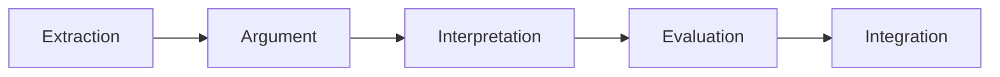
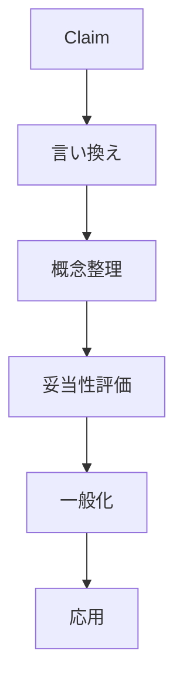
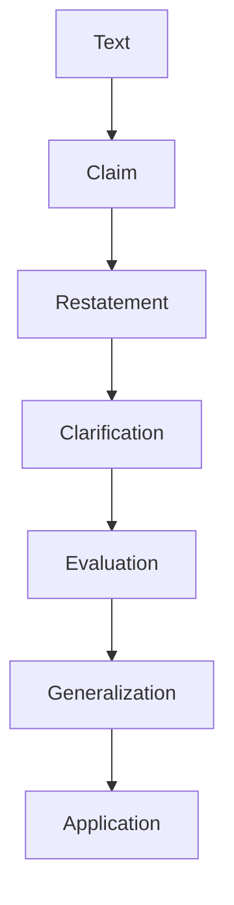
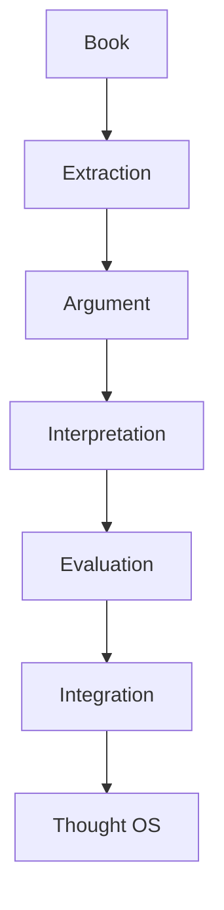

# Interpretation Structure（解釈構造）

読書で抽出された知識を、自分の理解へ変換する構。
読書OSでは次の順序で処理される。

Extraction → Argument → Interpretation → Evaluation → Integration

Interpretation の役割は
- 著者の主張を自分の言葉で理解する
- 概念を整理する
- 論理の妥当性を確認する
- 一般化できる原理を抽出する
- 自分の課題へ応用する

ことである。

---

# 読書OSにおける位置

Interpretation は、著者の思考を自分の思考へ変換する工程である。

---

# 解釈プロセス

Interpretation は次の5段階で行う。

| 段階 | 内容 |
|---|---|
|言い換え | 主張を自分の言葉で書く |
|概念整理 | 概念の定義と関係を整理 |
|妥当性評価 | 論理や証拠を確認 |
|一般化 | 原理・パターンを抽出 |
|応用 | 自分の問題へ適用 |

---

# Interpretation Flow

---

# 1 言い換え（Restatement）

著者の主張を **自分の言葉で書く**。

目的
- 理解確認
- 思考の内面化

例
著者  「官僚制は効率的だが硬直化する」
↓
言い換え  「組織は規則化されるほど柔軟性を失う」

---

# 2 概念整理（Clarification）

重要概念を整理する。

## 確認する項目
- 定義
- 境界
- 類似概念
- 対立概念

## 例
- 概念 
- 官僚制

## 整理
- 階層構造
- 規則支配
- 専門分化

---

# 3 妥当性評価（Evaluation）

議論の強さを確認する。

確認項目
- 論理の整合性
- 根拠の強さ
- 前提の妥当性
- 反例の存在

---

# 4 一般化（Generalization）

個別主張を 一般原理へ変換する。

例

主張「官僚制は硬直化する」
↓
一般化「組織は標準化すると適応能力が低下する」

この段階で、Kernel候補が生まれる。

---

# 5 応用（Application）

自分の問題へ適用する。

例

業務OS設計

- 標準手順
- 例外処理

を分離する必要がある

---

# 解釈時の質問

解釈の際には次を問う。

### 主張

著者は何を言っているか

### 概念

この概念は何を意味するか

### 根拠

根拠は十分か

### 一般化

これは他の分野でも成立するか

### 応用

自分の課題に使えるか

---

# 解釈マップ

---

# 解釈の成果

Interpretation によって生まれる知識。

| 出力 | 内容 |
|---|---|
|概念ノート | Concept |
|Kernel候補 | 原理 |
|World Model | 世界理解 |
|Project示唆 | 応用 |

---

# 要約との違い

| 要約 | 解釈 |
|---|---|
|内容整理 | 理解変換 |
|著者中心 | 読者中心 |
|文章要約 | 思考変換 |

---

# 解釈の失敗

典型的失敗。
- 要約で終わる
- 評価しない
- 一般化しない
- 応用しない

---

# 良い解釈

良い解釈は次を含む。
- 言い換え
- 概念整理
- 妥当性評価
- 一般化
- 応用

---

# 読書OSでの役割

Interpretation により、知識は理解へ変わる。