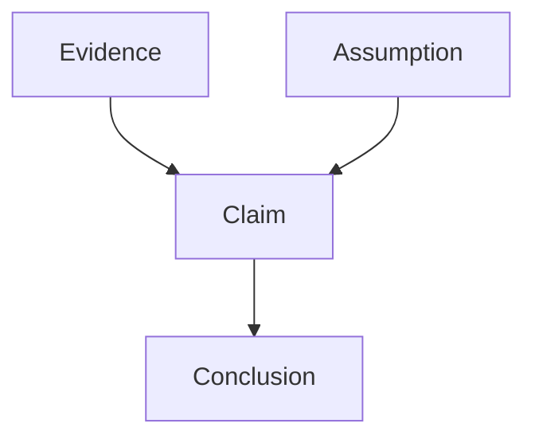
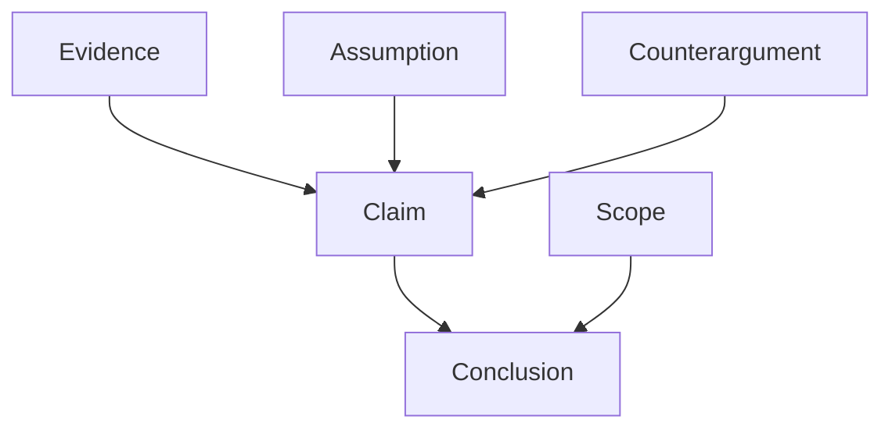
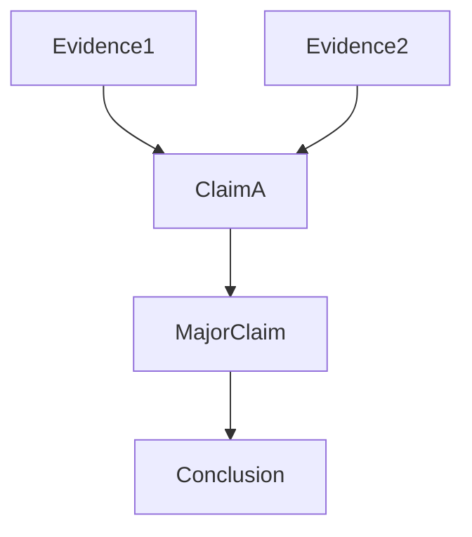
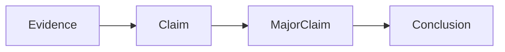
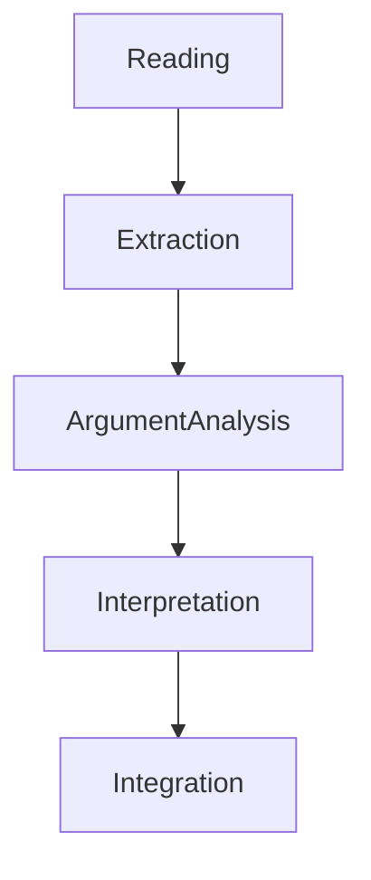

# Argument Structure

著者の議論を分解する構造。
読書OSでは、本を「情報」ではなく「論証構造」として読む。
つまり、
- 何を主張しているか
- 何を根拠にしているか
- どの前提に立っているか
- どこまで有効か
を分析する。

---

# Basic Argument Model

すべての議論は次の構造を持つ。

| 要素         | 内容  |
| ---------- | --- |
| Evidence   | 根拠  |
| Claim      | 主張  |
| Conclusion | 結論  |
| Assumption | 前提  |
# Extended Argument Model
実際の議論はもっと複雑になる。

| 要素              | 内容   |     |
| --------------- | ---- | --- |
| Evidence        | 根拠   |     |
| Claim           | 主張   |     |
| Conclusion      | 結論   |     |
| Assumption      | 前提   |     |
| Counterargument | 想定反論 |     |
| Scope           | 適用範囲 |     |
# Argument Layers
議論には階層がある。

|Layer|内容|
|---|---|
|Conclusion|本の最終結論|
|Major Claims|中核主張|
|Supporting Claims|補助主張|
|Evidence|根拠|
# Argument Hierarchy

本では通常、
- 多数の Evidence
- 複数の Claim
- 少数の Major Claim
- 1つの Conclusion
という構造になる。
# Argument Components
## Conclusion
本の最終的結論。
### 例
- 国家は戦争を通じて形成された
- 市場は情報処理機構である
- 官僚制は効率と硬直を同時に生む
## Major Claims
結論を支える中核主張。
### 例
- 戦争は国家の徴税能力を高める
- 国家は軍事動員のため制度を整備する
## Supporting Claims
中核主張を支える補助主張。
### 例
- 戦争は中央集権化を促進する
- 徴税制度は軍事費調達のため整備される
## Evidence
主張の根拠。
### 種類
- 歴史事例
- 統計
- 観察
- 実験
## Assumptions
議論の前提。
### 例
- 国家は合理的主体である
- 市場参加者は利益を追求する
- 組織は効率を求める
## Scope
議論の適用範囲。
### 例
- 近代国家のみ
- 西欧社会のみ
- 特定時代のみ
# Argument Extraction
本文から議論を抽出する手順。
1. Conclusionを特定
2. Major Claimを特定
3. Supporting Claimを特定
4. Evidenceを特定
5. Assumptionを特定
# Argument Map

# Argument Questions
議論を読むときの質問。
|　|　|
|---|---|
|Claim|著者は何を主張しているか|
|Evidence|何を根拠にしているか|
|Assumption|どんな前提を置いているか|
|Scope|どこまで成立するか|
|Counterargument|反例はあるか|

# Weak / strong Argument Patterns
弱い /強い 議論の典型。

|Pattern|弱い議論|強い議論|
|---|---|---|
|Anecdotal|事例だけ|明確な結論|
|Correlation|相関を因果と誤認因果関係||
|Hidden Assumption|前提を隠す|前提の明示|
|Overgeneralization|過度な一般化|適用範囲の限定|

# Argument Analysis Example
例
本文「戦争は国家形成を促進した」
Argument

| | |
|---|---|
|Conclusion|国家は戦争を通じて形成された|
|Major Claim|戦争は徴税制度を強化した|
|Evidence|ヨーロッパ近代国家の歴史|
|Assumption|国家は軍事動員を優先する|
|Scope|近代ヨーロッパ|
# Argument vs Extraction

|Structure|役割|
|---|---|
|Extraction|要素を抜く|
|Argument|議論を理解する|

Extractionだけだと知識の断片になる。
Argument Structureにより、著者の思考モデルが再現される。
# Role in Reading OS

Argument Structureは、読書OSにおける理解の中心工程である。