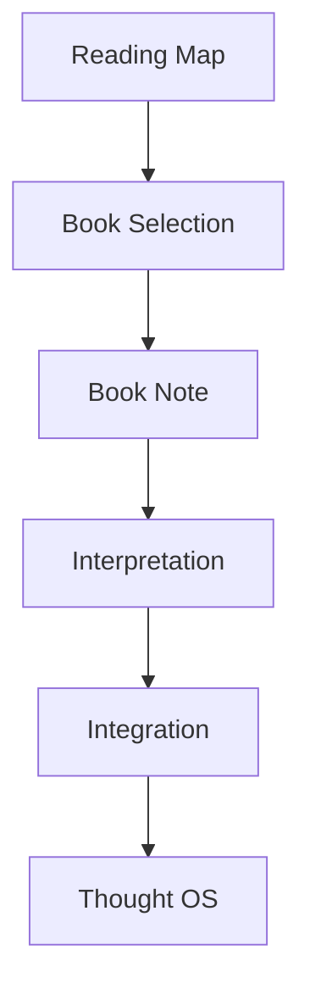
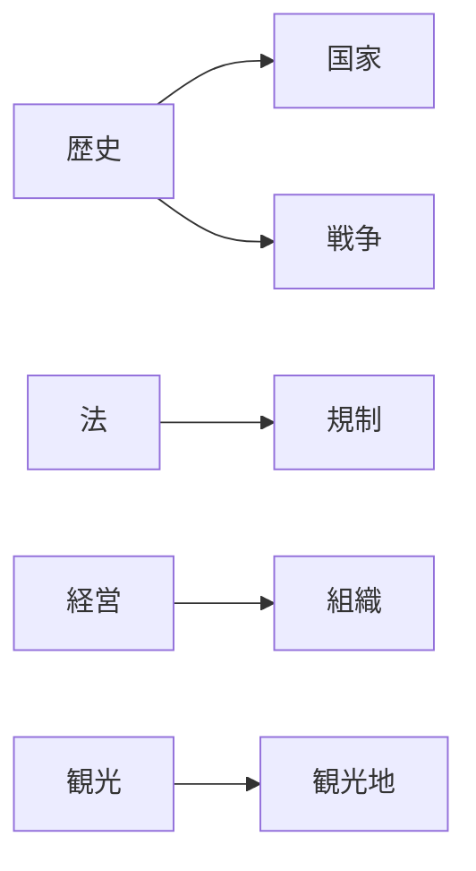
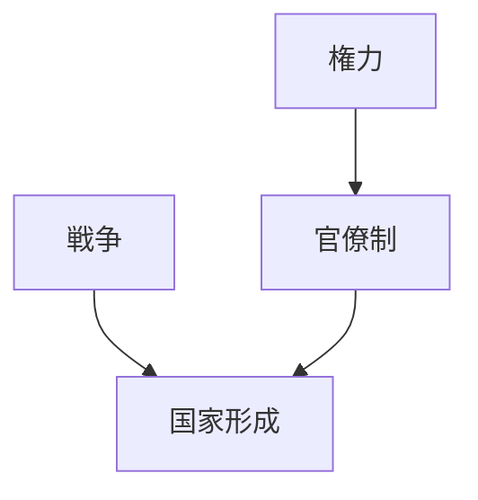
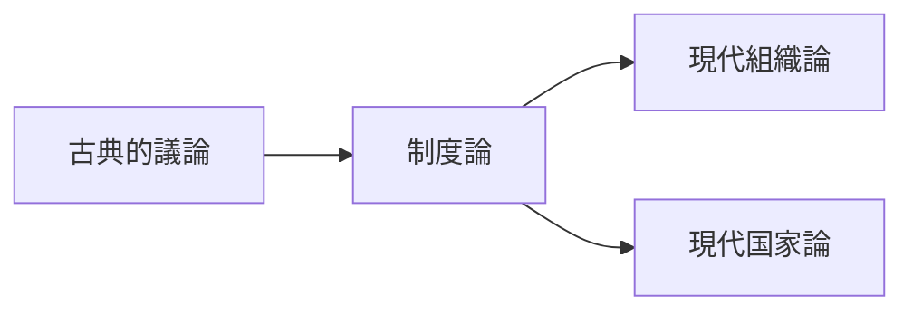
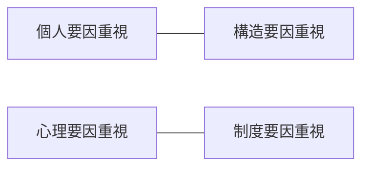
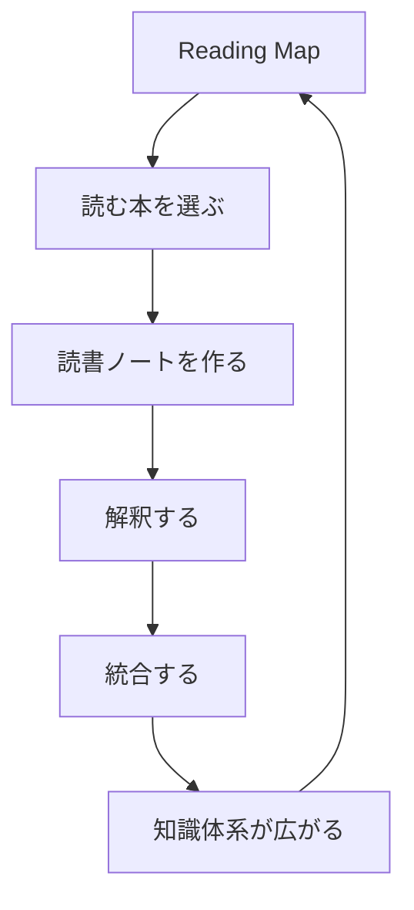

# Reading Map

読書対象全体を地図として把握するためのノート。

目的は、

- 本と本の関係を見る
- 理論の位置を知る
- 学派・論点・分野の構造を把握する
- 次に何を読むか判断する

ことである。

読書OSにおいて、個別の読書ノートが「点」なら、Reading Map は「面」である。

---

# Reading Map の役割

Reading Map は次を可視化する。

1. 分野の全体像  
2. 本同士の関係  
3. 理論の対立  
4. 系譜と発展  
5. 未読領域  
6. 次に読むべき位置  

---

# Position in Reading OS

Reading Map は  
**個別読書の前提となる全体地図**である。

---

# Reading Map の基本単位

## 1 Book
個別の本。

例

- 竹中亨『ヴィルヘルム二世』
- E.H. Carr『歴史とは何か』
- Weber 関係文献

---

## 2 Theme
本を束ねる論点。

例

- 国家形成
- 官僚制
- 組織硬直
- 歴史叙述
- 市場構造

---

## 3 School / Perspective
学派・立場・視点。

例

- 実証史学
- マルクス主義
- 自由主義
- 制度論
- 社会学

---

## 4 Contrast
対立関係。

例

- 構造要因 vs 個人要因
- 制度要因 vs 心理要因
- 実証記述 vs 規範理論

---

## 5 Gap
まだ読めていない空白領域。

例

- 制度史は読んだが外交史が弱い
- 実証研究はあるが理論書が少ない

---

# Reading Map の見方

Reading Map は少なくとも次の3軸で整理する。

| 軸 | 内容 |
|---|---|
| 分野軸 | 歴史、法、経営、観光など |
| 論点軸 | 国家、組織、競争、認知など |
| 立場軸 | 学派、方法論、視点の違い |

---

# Map Type 1 分野地図

分野ごとに本を配置する地図。

これは  
**どの分野にどの本が属するか**を見るための地図である。

---

# Map Type 2 論点地図

論点ごとに本を配置する。

これは  
**本そのものではなく、論点の関係**を見る地図である。

---

# Map Type 3 系譜地図

理論や著者の流れを見る。

これは  
**思想や理論の発展順序**を見るための地図である。

---

# Map Type 4 対立地図

立場の違いを整理する。

これは  
**どの本がどの立場に立っているか**を整理するための地図である。

---

# Map Type 5 読書進捗地図

既読・未読・再読候補を管理する。

| 状態 | 意味 |
|---|---|
| 未読 | まだ読んでいない |
| 読中 | 読んでいる |
| 読了 | 一通り読み終えた |
| 要再読 | 再読価値が高い |
| 比較待ち | 他文献と比較が必要 |

---

# Reading Map の作り方

## Step 1 分野を決める
まず扱う分野を決める。

例

- 歴史
- 法
- 経営
- 観光
- 思想

---

## Step 2 中心論点を出す
その分野の中心論点を列挙する。

例（歴史）

- 国家形成
- 戦争
- 官僚制
- 外交
- 世論
- 指導者

---

## Step 3 本を配置する
各本をどの論点に属するかで置く。

例

- 竹中亨『ヴィルヘルム二世』 → 指導者・制度・政治文化
- 『歴史とは何か』 → 歴史叙述・方法論
- 組織論の本 → 官僚制・意思決定

---

## Step 4 対立と接続を書く
本同士の関係を書く。

- 補完関係
- 対立関係
- 先行 / 後続
- 理論 / 事例
- 抽象 / 具体

---

## Step 5 空白を確認する
どこが埋まっていないか確認する。

- 理論はあるが事例が少ない
- 近代はあるが中世がない
- 日本はあるが欧州比較がない

---

# Reading Map の接続ルール

Reading Map では、各本に対して最低でも次を記録する。

| 項目 | 内容 |
|---|---|
| 分野 | どの分野か |
| 論点 | 何の論点か |
| 立場 | どの視点か |
| 種類 | 理論書 / 事例研究 / 概説書 など |
| 状態 | 未読 / 読中 / 読了 / 要再読 |

---

# 読書判断にどう使うか

Reading Map は次の判断に使う。

## 1 次に読む本を決める
- 空白領域を埋める
- 対立文献を追加する
- 理論と事例の偏りを補正する

## 2 読んだ本の位置づけを確認する
- これは中心文献か周辺文献か
- これは理論書か事例書か
- これは補助線か土台か

## 3 知識の偏りを検出する
- 具体例ばかりで理論が弱い
- 理論ばかりで実証が弱い
- 一学派に偏っている

---

# 読書地図テンプレート

## 分野別整理

### 歴史
- 国家形成:
- 戦争:
- 官僚制:
- 外交:
- 指導者:

### 法
- 制度:
- 規制:
- 責任:
- 実務運用:

### 経営
- 組織:
- 競争:
- 戦略:
- インセンティブ:

### 観光
- 観光地:
- 探索難易度:
- 観光者認知:
- 地域ブランド:

---

# 本の配置テンプレート

## 書名
- 分野:
- 論点:
- 立場:
- 種類:
- 状態:
- 関連本:
- 次に接続する本:

---

# 比較テンプレート

## 比較軸
- 問い:
- 主張:
- 方法:
- 根拠:
- 前提:
- 適用範囲:

## 比較対象
- 本A:
- 本B:
- 本C:

## 比較結果
- 一致点:
- 相違点:
- 補完関係:
- 次に読むべき本:

---

# Reading Map と Book Note の違い

| ノート | 役割 |
|---|---|
| Book Note | 1冊の内部を読む |
| Reading Map | 複数冊の外部関係を見る |

Book Note は「点」のノート、  
Reading Map は「点をつないだ地図」である。

---

# Reading Map と Integration の違い

| 構造 | 役割 |
|---|---|
| Integration | 抽出知識を Thought OS に置く |
| Reading Map | 本そのものの相互配置を見る |

---

# 失敗パターン

- 読んだ本をただ列挙するだけ
- 著者名だけ並べて論点がない
- 分野分類だけで対立関係がない
- 空白領域が見えない
- 次に何を読むか決まらない

---

# 良い Reading Map

良い Reading Map は次を満たす。

- 本の位置が明確
- 論点が見える
- 対立が見える
- 空白が見える
- 次の読書判断に使える

---

# Role in Reading OS

Reading Map は  
**読書OS全体を循環させる地図**である。