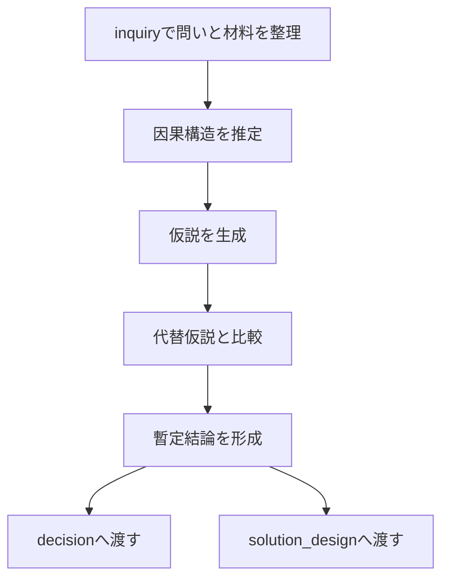

---

layer: hub
folder: thinking_engine/reasoning
status: stable
updated: 2026-03-14

---

# Reasoning Hub

reasoning は、inquiry で整えられた問い・論点・読解結果・問題構造をもとに、説明・予測・仮説・解釈を構築する層である。

inquiry が「何を問うか」「どこが論点か」を整える層なら、reasoning は「その問いにどう答えるか」「どの説明がもっとも筋が通っているか」を構築する層である。

この層の役割は、単なる情報の要約ではなく、情報間の関係を明示し、説明可能な形へ変換することにある。

---

## 役割

- 問いに対して説明モデルを作る
- 観察・資料・論点を因果や仮説の形に再編成する
- 複数の説明候補を比較する
- 不確実な部分を不確実なまま明示する
- decision に渡す判断材料を作る
- solution_design に渡す構造的理解を作る

---

## 下位フォルダ

### [[00 Causual Reasoning Hub]]
現象・結果・出来事を、因果の連鎖、条件、媒介、比較、反実仮想から説明する層。

### [[00 Hypothesis Hub]]
不完全情報下で、暫定的な説明を立て、比較し、更新し、棄却し、検証可能な形にする層。

---

## inquiry との関係

- argument は主張と論証を整える
- problem は問題の形を整える
- reading は資料から意味を引き出す

reasoning はこれらを素材にして、説明・仮説・見通しを作る。

---

## 出力

- 因果説明
- 有力仮説
- 代替仮説の整理
- 予測
- 判断材料
- 未確定箇所の明示

---

## 全体フロー

## 収録ノート

- [[因果連鎖推論]]    
- [[必要条件推論]]    
- [[十分条件推論]]    
- [[媒介要因推論]]    
- [[多因子因果推論]]    
- [[時系列因果推論]]    
- [[反実仮想推論]]    
- [[比較事例推論]]    
- [[仮説生成]]    
- [[仮説分解]]    
- [[代替仮説比較]]    
- [[仮説評価]]    
- [[02_zettelkasten/00_head/thinking_engine/02_reasoning/hypothesis/仮説更新]]    
- [[仮説棄却]]    
- [[検証計画]]