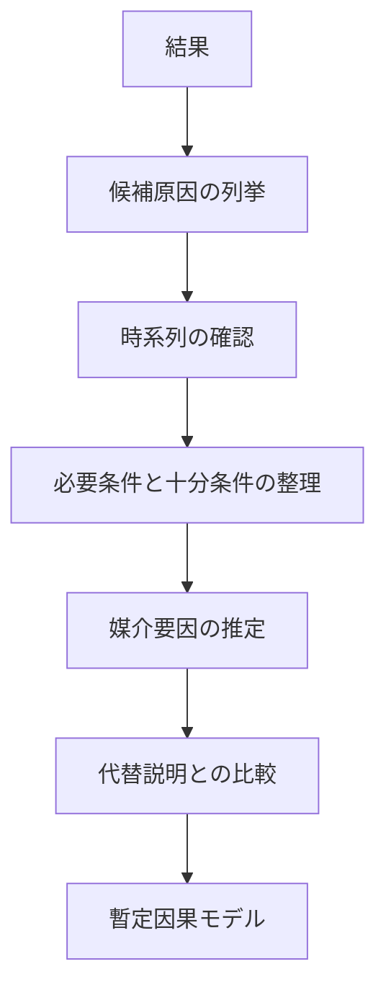

---  
layer: hub  
folder: thinking_engine/reasoning/causual_reasoning  
status: stable  
updated: 2026-03-14 

---  
  
# Causual Reasoning Hub  
  
causual_reasoning は、ある結果・変化・現象が、何によって、どのような経路で生じたのかを説明するための推論群である。  
  
主眼は「原因探し」そのものではなく、原因・条件・媒介・比較・反事実の関係を整理し、説明力の高い因果モデルを構築することにある。  
  
---  
  
## 役割  
  
- 何が結果を生んだかを推定する  
- 単なる相関を因果と取り違えない  
- 必要条件と十分条件を区別する  
- 原因と結果の間の媒介を捉える  
- 介入可能点を見つける  
- 複雑事象を多段階の連鎖として理解する  
  
---  
  
## 基本原則  
  
1. 相関と因果を区別する  
2. 単因子説明に飛びつかない  
3. 時系列を必ず確認する  
4. 条件と原因を分ける  
5. 代替説明を残す  
6. 介入可能性を考える  
  
---  
  
## 因果推論の基本図式  
  

---

## 収録ノート

- [[因果連鎖推論]]    
- [[必要条件推論]]    
- [[十分条件推論]]    
- [[媒介要因推論]]    
- [[多因子因果推論]]    
- [[時系列因果推論]]    
- [[反実仮想推論]]    
- [[比較事例推論]]