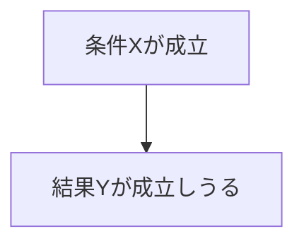

---  
layer: note  
folder: thinking_engine/reasoning/causual_reasoning  
status: stable  
updated: 2026-03-14  

---  
  
# 十分条件推論  
  
十分条件推論とは、その条件が成立すれば結果が成立しうる、と考えられる要素を特定する推論である。  
  
十分条件は「それがあれば結果が起きる」条件であり、「それしか道がない」ことを意味しない。  
同じ結果に至る複数の十分条件が存在する場合も多い。  
  
---  
  
## 何を見るか  
  
- その条件だけで結果を説明できるか  
- 他の条件の補助が要るか  
- 同じ結果に至る別ルートがあるか  
- 十分条件がいつ成立するか  
  
---  
  
## 基本図式  
  

---

## テンプレート

- 結果:    
- 候補十分条件:    
- 成立メカニズム:    
- 補助条件:    
- 別の十分条件:    
- 範囲条件:    
- 根拠:    
- 反例の有無:    

---

## 注意点

- 十分条件が唯一の経路とは限らない    
- 条件の成立範囲を狭く見積もりすぎない    
- 実際には複合十分条件である場合が多い