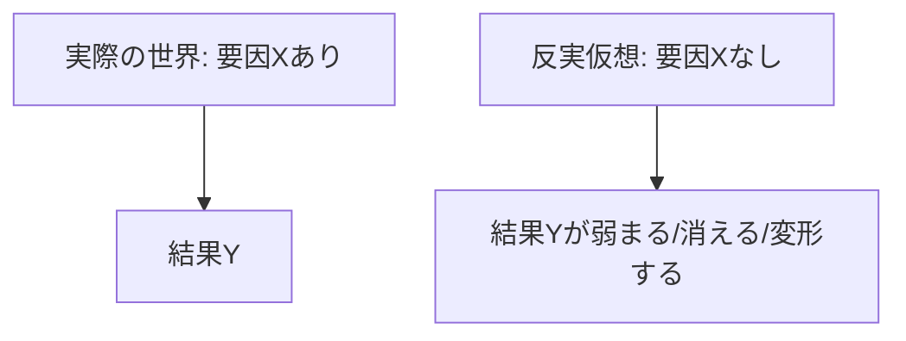

---  
layer: note  
folder: thinking_engine/reasoning/causual_reasoning  
status: stable  
updated: 2026-03-14  

---  
  
# 反実仮想推論  
  
反実仮想推論とは、「もしこの要因がなかったら、結果はどうなっていたか」を考えることで因果の強さを検討する推論である。  
  
これは完全な証明ではないが、原因らしさを確かめるうえで有力である。  
特に歴史・政策・組織分析では、直接実験できないため、反実仮想が重要になる。  
  
---  
  
## 何を見るか  
  
- 要因Xがなかった場合、結果は維持されたか  
- 結果の大きさは変わったか  
- 時期は変わったか  
- 別の要因が代替したか  
- Xは結果の必要条件だったか、寄与要因だったか  
  
---  
  
## 基本構造  
  

---

## テンプレート

- 実際の結果:    
- 焦点要因:    
- 反実仮想:    
- 想定される差:    
- 代替経路:    
- 因果寄与の評価:    
- 不確実性:    
- 比較根拠:    

---

## 注意点

- 反実仮想は自由な空想ではない    
- 既知の条件や類似事例に基づいて構成する    
- 「完全に起きなかった」と「形を変えて起きた」を区別する