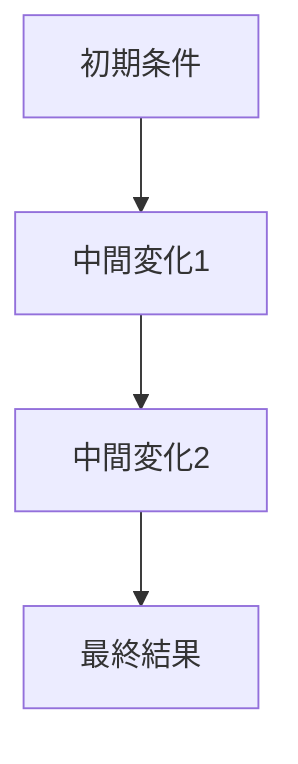

---  
layer: note  
folder: thinking_engine/reasoning/causual_reasoning  
status: stable  
updated: 2026-03-14  

---  
  
# 因果連鎖推論  
  
因果連鎖推論とは、ある結果を単一原因で説明するのではなく、複数の段階を経た連鎖として捉える推論である。  
  
複雑な出来事は、しばしば一発の原因ではなく、「条件の形成 → 認識の変化 → 行動の変化 → 二次的結果」という連鎖で生じる。  
そのため、この推論は「結果の近くにある直接原因」だけでなく、その前段階にある形成過程まで追う。  
  
---  
  
## 何を見るか  
  
- 起点は何か  
- 中間段階は何か  
- どこで増幅が起きたか  
- どこで減衰が起きたか  
- どこが介入可能点か  
- どの段階がもっとも脆いか  
  
---  
  
## 基本構造  
  

---

## 使う場面

- 問題の真因を探すとき    
- 組織・制度・心理が絡む複雑事象を扱うとき    
- 解決策のレバーを見つけたいとき    
- 表層説明を避けたいとき    

---

## テンプレート

- 結果:    
- 起点:    
- 中間段階1:    
- 中間段階2:    
- 中間段階3:    
- 連鎖全体の説明:    
- 増幅点:    
- 減衰点:    
- 介入可能点:    
- 不確実な部分:    

---

## 注意点

- 連鎖を長く書きすぎると物語化しやすい    
- 各段階に根拠を置く    
- 起きた順と効いた順を混同しない