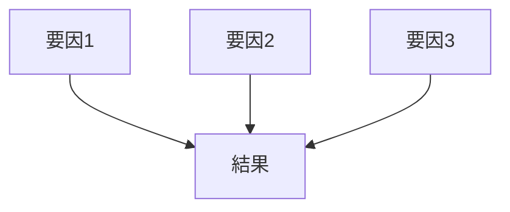

---  
layer: note  
folder: thinking_engine/reasoning/causual_reasoning  
status: stable  
updated: 2026-03-14  

---  
  
# 多因子因果推論  
  
多因子因果推論とは、ある結果が複数要因の相互作用によって生じたと考える推論である。  
  
現実の複雑問題では、単一の原因よりも、「AとBが同時に存在し、そのうえでCが引き金になった」という構造の方が一般的である。  
この推論は、相互作用・複合条件・因果の重みづけを扱う。  
  
---  
  
## 何を見るか  
  
- 関与した要因は何か  
- 主因と従因は何か  
- 要因間の相互作用は何か  
- どの組み合わせが致命的だったか  
- どの要因がなくても結果が起きえたか  
  
---  
  
## 基本構造  
  

---

## テンプレート

- 結果:    
- 要因1:    
- 要因2:    
- 要因3:    
- 主因:    
- 補助因:    
- 引き金:    
- 相互作用の説明:    
- 重みづけの暫定判断:    
- 不確実性:    

---

## 注意点

- 何でも多因子にすると説明責任がぼやける    
- 主因・引き金・背景条件を分ける    
- 重みづけを放棄しない