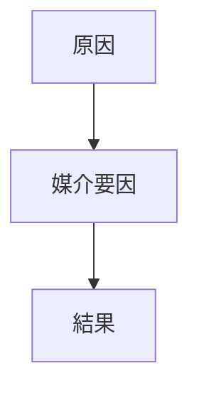

---  
layer: note  
folder: thinking_engine/reasoning/causual_reasoning  
status: stable  
updated: 2026-03-14  

---  
  
# 媒介要因推論  
  
媒介要因推論とは、原因と結果のあいだに存在する中間メカニズムを特定する推論である。  
  
直接因果のように見える関係も、実際には「情報」「認知」「制度」「資源配分」「行動変化」などの媒介を通じて生じることが多い。  
媒介を捉えることで、なぜその原因が効くのかを説明できる。  
  
---  
  
## 何を見るか  
  
- 原因は何を変えたのか  
- その変化がどう結果に繋がったのか  
- 媒介要因は一つか複数か  
- 媒介のどこが切れれば結果は変わるか  
  
---  
  
## 基本構造  
  

---

## テンプレート
- 結果:    
- 原因:    
- 媒介要因:    
- 媒介の説明:    
- 媒介が欠けた場合:    
- 追加媒介の可能性:    
- 介入点:    
- 根拠:    

---

## 注意点

- 媒介と背景条件を混同しない    
- 「なんとなく効いている」で済ませない    
- 媒介を明示すると解決策設計がしやすくなる