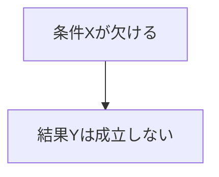

---  
layer: note  
folder: thinking_engine/reasoning/causual_reasoning  
status: stable  
updated: 2026-03-14  

---  
  
# 必要条件推論  
  
必要条件推論とは、その条件が欠けていれば結果が成立しえなかった、と考えられる要素を特定する推論である。  
  
必要条件は「それだけで結果を生む要因」ではない。  
むしろ「それがなければ、他の要因が揃っても結果は成立しない」という意味で重要である。  
  
---  
  
## 何を見るか  
  
- その条件が欠けた場合、結果は起きえたか  
- 他の条件が代替できるか  
- その条件は常に必要か、特定条件下のみ必要か  
- 結果の成立にどの段階で必要か  
  
---  
  
## 基本図式  
  

---

## テンプレート

- 結果:    
- 候補必要条件:    
- 欠如時の帰結:    
- 代替可能性:    
- 必要である範囲:    
- 根拠:    
- 反例の有無:    

---

## 注意点

- 必要条件を十分条件と誤認しない    
- 常に必要か、一部条件下のみ必要かを分ける    
- 見落とされやすい基盤条件に注意する
