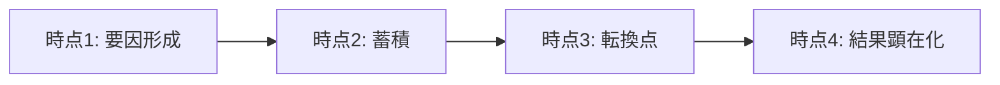

---  
layer: note  
folder: thinking_engine/reasoning/causual_reasoning  
status: stable  
updated: 2026-03-14  

---  
  
# 時系列因果推論  
  
時系列因果推論とは、因果を時間順序、遅延、転換点、累積効果の観点から理解する推論である。  
  
因果関係は、単に前後していればよいわけではないが、前後関係を無視しても成立しない。  
特に、遅れて効く要因、蓄積して効く要因、転換点で一気に表面化する要因を見落とさないことが重要である。  
  
---  
  
## 何を見るか  
  
- 原因は結果より前に生じているか  
- どのくらいのタイムラグがあるか  
- 転換点はどこか  
- 徐々に効いたのか、一気に効いたのか  
- 蓄積と閾値はあるか  
  
---  
  
## 基本構造  
  

---

## テンプレート

- 結果:    
- 先行要因:    
- 中間時点の変化:    
- 転換点:    
- タイムラグ:    
- 蓄積要因:    
- 閾値の有無:    
- 根拠:    
- 代替説明:    

---

## 注意点

- 先後関係だけで因果を断定しない    
- 長期蓄積型の問題を単発要因に還元しない    
- 近接原因だけで結論を出さない